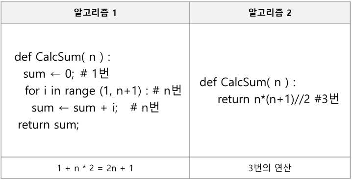
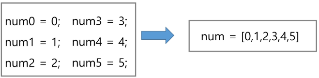
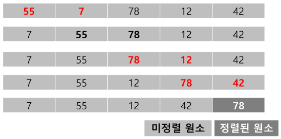
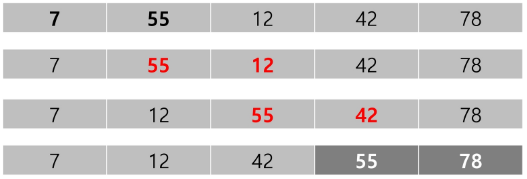
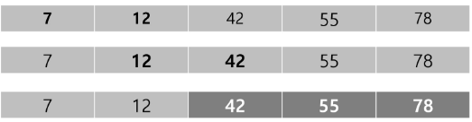
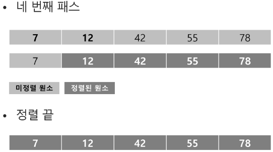

SWEA - Learn - Course - 파이썬(linked list 제외)

- 알고리즘 : 문제를 해결하기 위한 절차나 방법
  - 컴퓨터 분야에서 알고리즘을 표현하는 방법: 의사코드(Pseudocode), 순서도

- 좋은 알고리즘의 요건
  - 정확성
  - 작업량: 얼마나 적은 연산
  - 메모리 사용량
  - 단순성
  - 최적성: 개선할 여지 없는지

- 시간복잡도(Time Complexity): 작업량을 표현할 때 사용
  - 실제 걸리는 시간 측정
  - 실행되는 명령문의 개수 계산



- 빅-오(O) 표기법(Big-O Notation; O(n)): 최고차항에 대한 식에 대해 계수를 제거해서 표현하는 값
- n개의 데이터를 입력받아 각 데이터에 1증가 시킨 후 출력할 경우의 시간복잡도? : O(n)  (n개의 데이터에 모두 접근)

# Array

- 배열: 일정한 "자료형"의 변수들을 하나의 이름으로 열거하여 사용하는 자료구조



- 배열의 경우 실제 메모리 상에서 값이 순서대로 위치 함.(배열이 아니면 메모리상에서 임의로 배정)

## 배열의 필요성

1. 프로그램 내에서 여러 개의 변수가 필요할 때, 일일이 다른 변수명을 이용하여 자료에 접근하는 것은 비효율적일 수 있음.
2. 배열을 사용하면 하나의 선언을 통해서 둘 이상의 변수를 선언할 수 있음
3. 단순히 다수의 변수 선언을 의미하는 것이 아니라, 다수의 변수로는 하기 힘든 작업을 배열을 활용해 쉽게 할 수 있다.

## 1차원 배열
### 1. 1차원 배열 선언
- 별도의 선언 방법이 었으면 변수에 처음 값을 할당할 때 생성
- 선언 방법
  - Arr = list()
  - Arr = []
  - Arr = [1, 2, 3]
  - Arr = [0] * 10
- append의 경우 계산하는데 시간이 오래 걸림 -> 크기가 커질 수록 속도가 느림

### 2. 1차원 배열의 접근
- Arr[0] = 10
- Arr[idx] = 20

- 예시: 입력받은 정수를 1차원 배열에 저장하기
    첫 줄에 양수의 개수 N이 주어진다. (5 <= N <= 1000)
    다음 줄에 빈칸으로 구분된 N개의 양수 Ai가 주어진다. (1 <= Ai <= 1000000)

```python
N = int(input())
arr = list(map(int,input().split()))
```

#### 연습문제
1. N개의 양의 정수에서 가장 큰 수와 가장 작은 수의 차이를 출력

[ 입력 ]

첫 줄에 테스트 케이스의 수 T가 주어진다. (1 <= T <= 50)
각 케이스의 첫 줄에 양수의 개수 N이 주어진다 (5 <=  ㅡ>)

[ 출력 ]


[pseudocode]
가장 큰 값  = max_v
모든 값과 max_v를 비교해서 항상 큰 값
-> 가장 앞 값으로 초기화 후 비교
가장 작은 값 = min_v

max_v <- arr[0]
for i : 1 -> N - 1
    if max_v < arr[i]
        max_v <- arr[i]
print(max_v);

min_v <- arr[0]
for i : 1 -> N - 1
    if min_v > arr[i]
        min_v <- arr[i]
print(min_v);

2. Gravity
   옆에 나보다 작은 값의 갯수 -> 가장 큰 값 반환


## 정렬

- 정렬: 2개 이상의 자료를 특정 기준에 의해 작은 값부터 큰 값 또는 그 반대의 순서대로 재배열하는 것

### 정렬의 종류
- 버블 정렬 (Bubble Sort)
- 카운팅 정렬 (Counting Sort)
- 선택 정렬 (Selection Sort)
- 퀵 정렬 (Quick Sort)
- 삽입 정렬 (Insertion Sort)
- 병합 정렬 (Merge Sort)

### 1. 버블 정렬(Bubble Sort)
- 버블 정렬 : 인접한 두 개의 원소를 비교하며 자리를 계속 교환하는 방식

- 정렬 과정
  1. 첫 번째 원소부터 인접한 원소끼리 자리를 교환하면서 맨 마지막 자리까지 이동
  2. 한 단계가 끝나면 가장 큰 원소가 마지막 자리로 정렬
  3. 교환하며 자리를 이동하는 모습이 물 위에 올라오는 거품과 같다고 해서 버블 정렬

- 시간 복잡도: O(n**2)









풀이 시 기준 인덱스가 있어야 함(비교하는 기준)

'''
pseudocode

BubbleSort(a, N)
0 -> N-1
0 -> N-2
...
0 -> 1

    for i : N-1 -> 1
        for j : 0 -> i-1 # 구간의 끝 보다는 1 작음
            if a[j] > a[j+1]:
                a[j] = a[j+1]

'''

```python

def BubbleSort(a, N):
    for i in range(N-1, 0, -1): # 몇 번째 시도?
        for j in (0, i): # 몇 번 시도?
            if a[j] > a[j+1]:
                a[j], a[j+1] = a[j+1], a[j] # 비교 후 교체
```