* 참고 : sys 모듈
```python
import sys
sys.stdin = open("./input/txt", "r")
#==> 인풋 파일을 받아두고 동작하면, 자동으로 테스트 해줌 -> 연습할 때 유용!
```
SWEA - Learn - Course - 파이썬(linked list 제외)

- 알고리즘 : 문제를 해결하기 위한 절차나 방법
  - 컴퓨터 분야에서 알고리즘을 표현하는 방법: 의사코드(Pseudocode), 순서도

- 좋은 알고리즘의 요건
  - 정확성
  - 작업량: 얼마나 적은 연산
  - 메모리 사용량
  - 단순성
  - 최적성: 개선할 여지 없는지

- 시간복잡도(Time Complexity): 작업량을 표현할 때 사용
  - 실제 걸리는 시간 측정
  - 실행되는 명령문의 개수 계산

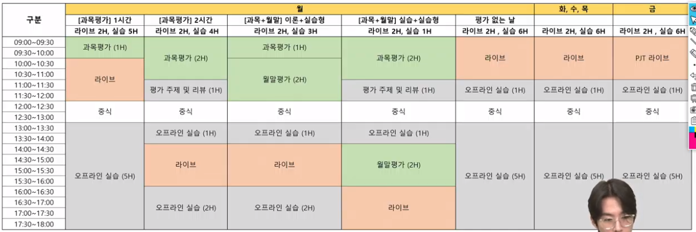

- 빅-오(O) 표기법(Big-O Notation; O(n)): 최고차항에 대한 식에 대해 계수를 제거해서 표현하는 값
- n개의 데이터를 입력받아 각 데이터에 1증가 시킨 후 출력할 경우의 시간복잡도? : O(n)  (n개의 데이터에 모두 접근)


- 파이참 디버깅
  원하는 위치에 breaking point 부여 - f11로 함수 안으로 들어감 - step over 활용하여 내부 순환

# Array

- 배열: 일정한 "자료형"의 변수들을 하나의 이름으로 열거하여 사용하는 자료구조

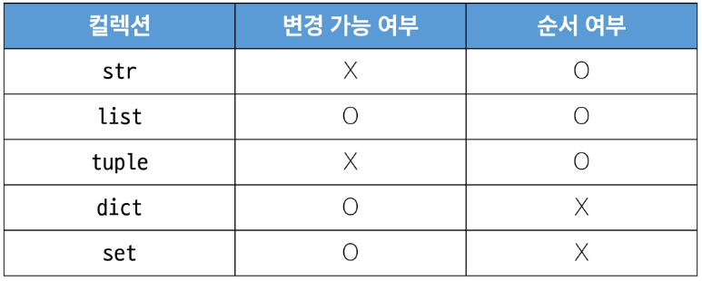

- 배열의 경우 실제 메모리 상에서 값이 순서대로 위치 함.(배열이 아니면 메모리상에서 임의로 배정)

## 배열의 필요성

1. 프로그램 내에서 여러 개의 변수가 필요할 때, 일일이 다른 변수명을 이용하여 자료에 접근하는 것은 비효율적일 수 있음.
2. 배열을 사용하면 하나의 선언을 통해서 둘 이상의 변수를 선언할 수 있음
3. 단순히 다수의 변수 선언을 의미하는 것이 아니라, 다수의 변수로는 하기 힘든 작업을 배열을 활용해 쉽게 할 수 있다.

## 1차원 배열
### 1. 1차원 배열 선언
- 별도의 선언 방법이 었으면 변수에 처음 값을 할당할 때 생성
- 선언 방법
  - Arr = list()
  - Arr = []
  - Arr = [1, 2, 3]
  - Arr = [0] * 10
- append의 경우 계산하는데 시간이 오래 걸림 -> 크기가 커질 수록 속도가 느림

### 2. 1차원 배열의 접근
- Arr[0] = 10
- Arr[idx] = 20

- 예시: 입력받은 정수를 1차원 배열에 저장하기
    첫 줄에 양수의 개수 N이 주어진다. (5 <= N <= 1000)
    다음 줄에 빈칸으로 구분된 N개의 양수 Ai가 주어진다. (1 <= Ai <= 1000000)

```python
N = int(input())
arr = list(map(int,input().split()))
```

#### 연습문제
1. N개의 양의 정수에서 가장 큰 수와 가장 작은 수의 차이를 출력

[ 입력 ]

첫 줄에 테스트 케이스의 수 T가 주어진다. (1 <= T <= 50)
각 케이스의 첫 줄에 양수의 개수 N이 주어진다 (5 <=  ㅡ>)

[ 출력 ]


[pseudocode]
가장 큰 값  = max_v
모든 값과 max_v를 비교해서 항상 큰 값
-> 가장 앞 값으로 초기화 후 비교
가장 작은 값 = min_v

max_v <- arr[0]
for i : 1 -> N - 1
    if max_v < arr[i]
        max_v <- arr[i]
print(max_v);

min_v <- arr[0]
for i : 1 -> N - 1
    if min_v > arr[i]
        min_v <- arr[i]
print(min_v);

2. Gravity
   옆에 나보다 작은 값의 갯수 -> 가장 큰 값 반환


## 정렬

- 정렬: 2개 이상의 자료를 특정 기준에 의해 작은 값부터 큰 값 또는 그 반대의 순서대로 재배열하는 것

### 정렬의 종류
- 버블 정렬 (Bubble Sort)
- 카운팅 정렬 (Counting Sort)
- 선택 정렬 (Selection Sort)
- 퀵 정렬 (Quick Sort)
- 삽입 정렬 (Insertion Sort)
- 병합 정렬 (Merge Sort)

### 1. 버블 정렬(Bubble Sort)
- 버블 정렬 : 인접한 두 개의 원소를 비교하며 자리를 계속 교환하는 방식

- 정렬 과정
  1. 첫 번째 원소부터 인접한 원소끼리 자리를 교환하면서 맨 마지막 자리까지 이동
  2. 한 단계가 끝나면 가장 큰 원소가 마지막 자리로 정렬
  3. 교환하며 자리를 이동하는 모습이 물 위에 올라오는 거품과 같다고 해서 버블 정렬

- 시간 복잡도: O(n**2)

풀이 시 기준 인덱스가 있어야 함(비교하는 기준)

```
pseudocode

BubbleSort(a, N)
0 -> N-1
0 -> N-2
...
0 -> 1

    for i : N-1 -> 1
        for j : 0 -> i-1 # 구간의 끝 보다는 1 작음 # n-1 개
            if a[j] > a[j+1]: n 개
                a[j] = a[j+1]
```

```python
def BubbleSort(a, N):
    for i in range(N-1, 0, -1): # 몇 번째 시도? 
        for j in (0, i): # 몇 번 시도? 
            if a[j] > a[j+1]:
                a[j], a[j+1] = a[j+1], a[j] # 비교 후 교체
```

### 2. 카운팅 정렬

- 카운팅 정렬: 항목들의 순서를 결정하기 위해 각 항목이 몇 개씩 있는지 세는 작업을 하여, 선형 시간에 정렬하는 효율적인 알고리즘
- 시간 복잡도 : O(n + k)
  n: 리스트 길이 / k: 정수의 최댓값

#### 카운팅 정렬의 제한사항

- 정수나 정수로 표현할 수 있는 자료에 대해서만 가능
  각 항목의 발생 횟수를 기록하기 위해, 정수 항목으로 인덱스되는 카운트들의 배열 사용하기 때문
- 카운트들을 위한 충분한 공간을 할당하려면 집합 내의 큰 정수를 알아야 함

#### 카운팅 정렬 과정
1. 빈 배열 만들기
2. DATA에서 각각의 갯수 빼온 후 COUNT에 저장
3. 다시 순회하며 TEMP에 Data를 순서대로 정렬하여 정렬된 결과 저장


--> 앞 뒤로 훑어 TEMP 배열을 반환하는 것이 최종

* 빈 배열 작성 시 크기를 정한 배열 생성 습관 가지기

- Data에서 각 항목들의 발생 회수를 세고, 정수 항목들로 직접 인덱스 되는 카운트베열 counts에 저장한다.

카운팅을 어디다 기록할 지를 먼저 생각
-> 카운트의 배열을 먼저 준비 -> 찾고자하는 항목의 갯수 만큼의 요소로 배열
counts = [0] * 5


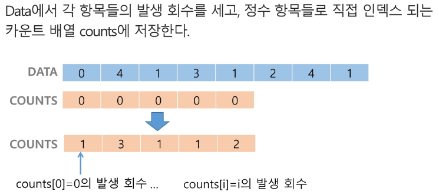

해당 횟수가 늘 때마다, count[i] += 1

- for문으로 data 순회하여 카운트 배열에 반영

* for i in data -> i or j와 같은 변수는 값 자체를 가지고 올 때는 사용을 덜 하는 게 좋음, 인덱스가지고 올 때 주로 사용하기

- 정렬된 집합에서 각 항목의 앞에 위치할 항목의 개수를 반영하기 위해 counts의 원소 조정
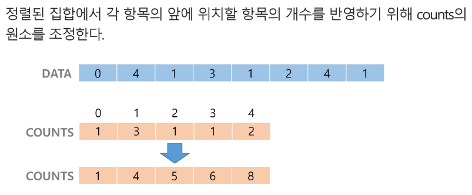

현재까지의 갯수를 더하기 위해 counts 조정

i까지의 누적 개수 저장
for i : 1 -> N - 1
counts[i] <- counts[i-1] + counts[i]
counts[i] += counts[i-1]

- counts[1]을 감소시키고 Temp에 1을 삽입한다.
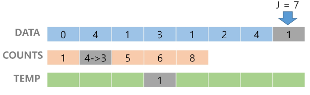

정렬된 결과를 저장하기 위한 Temp

가장 마지막 원소부터 처음으로 순회
1까지의 값은 총 몇 개 있었지? -> COUNTS에서 총 4개 => 각각 몇 개인지는 모르겠지만, 시작점에서 1이 있었을 때, 적어도 하나의 1은 있었을 것 -> TEMP에 적어도 4번째 숫자는 1이라는 것이 확정적임

카운트의 1 하나를 TEMP에 하나 배치 => COUNTS 1 감소, TEMP 1 증가

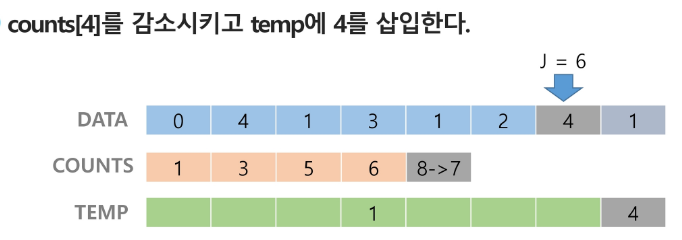

4가 나올 경우 적어도 1개 이상의 4가 있으므로 4를 가장 마지막 배치

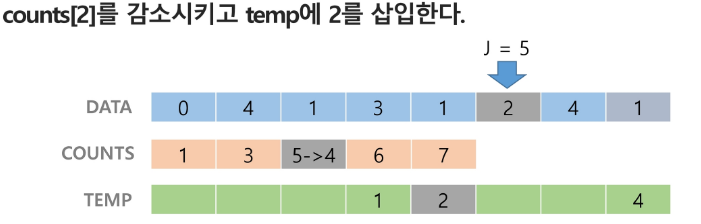

2는 적어도 하나 있기 때문에 5번에 2 집어 넣음

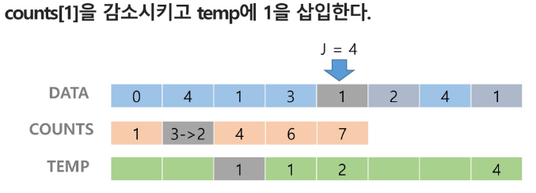

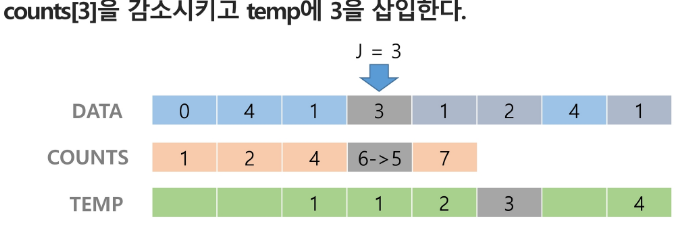

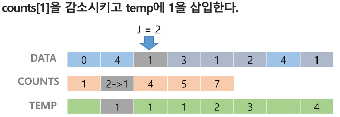

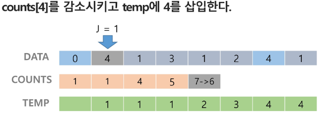

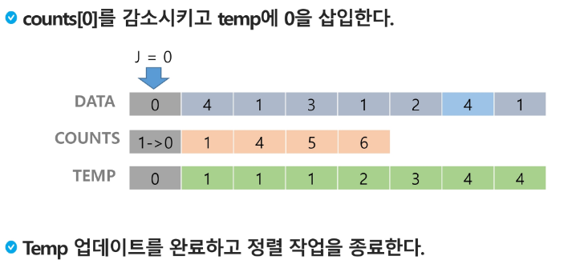

 * 역순으로 순회하는 이유: 뒤에있는 데이터의 인덱스를 뒤에 두기 위함 stable 정렬


```python
DATA = [0, 4, 1, 3, 1, 2, 4, 1]
COUNTS = [0] * 5                # DATA가 0~4까지의 정수

N = len(DATA)                   # DATA의 크기
TEMP = [0] * N                  # 정렬 결과 저장

# 1단계 : DATA 원소 별 개수 세기
# DATA의 원소 x를 가져와서 COUNTS[x]에 개수 기록
for x in DATA:                  # N번 반복
    COUNTS[x] += 1              # N번 반복

# 2단계 : 각 숫자까지의 누적 개수 구하기
for i in range(1, 5):           # COUNTS[1] ~ COUNTS[4]까지의 누적 개수 #k 번 반복
    COUNTS[i] = COUNTS[i-1] + COUNTS[i] # k번 반복

# 3단계 : DATA의 맨 뒤부터 앞으로 순회하여 TEMP에 정렬
for i in range(N-1, -1, -1):    # n-1 ~ 0까지             # N번 반복
    COUNTS[DATA[i]] -= 1 # COUNTS에서 i의 누적 개수 하나 감소 # N번 반복
    TEMP[COUNTS[DATA[i]]] = DATA[i]                       # N번 반복

print(*TEMP) # 언패킹 하여 결과 확인

## 시간복잡도 O(5n + 2k)
```

#### 버블과 카운팅의 비교

- 버블정렬 : 코드가 간결함, 복잡도가 높음
- 카운팅정렬 : 코드가 어렵지만 복잡도가 낮음
    카운팅에서의 k도 제약이 있음, 효율이 좋으나 항상 쓸 수 없음(100만개 정도까진 돌아 감)

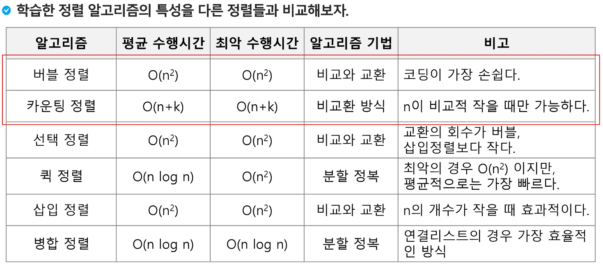


### 3. 완전 검색(Exhaustive Search)

- 문제의 해법으로 생각할 수 있는 모든 경우의 수를 나열하고 확인하는 기법
- Brute-force 혹은 generate-and-test 기법이라고도 함
- 모든 경우의 수를 테스트한 후 최종 해법 도출
- 일반적으로 경우의 수가 작을 때 유용
- 수행 속도는 느리지만 해답을 찾아내지 못할 확률이 작음
- 문제 해결 시 완전 검색 후 다른 알고리즘으로 성능 개선을 하는 것이 좋음


#### 완전 검색을 활용한 접근
  1) 고려할 수 있는 모든 경우의 수 생성
  2) 해답 테스트
  3) 순열(Permutation)
      - 순열 생성 함수
      - nPr = n! / (n-r)!
        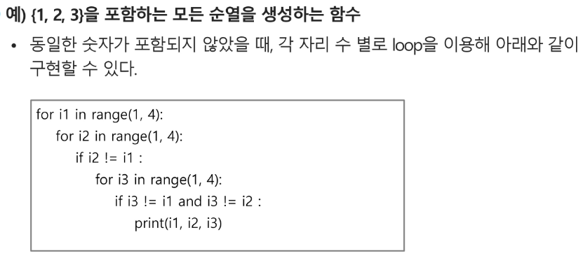
  ```python
  for i1 in range(1, 4):
    for i2 in range(1, 4):
      if i2 != i1:
        for i3 in range(1, 4):
          if i3 != i1 and i3 != i2:
            print(i1, i2, i3)
  ```

### 4. Greedy Algorithm
- 최적해를 구하는 데 사용되는 근시안적인 방법
- 여러 경우 중 하나를 결정해야 할 때마다 그 순간에 최적이라고 생각되는 것을 선택해 나가는 방식
- 각 선택의 시점에서 이루어지는 결정은 지역적으로 최적이지만, 최종적인 해답이 최적이라고 보기는 어려움
- 머릿속에 떠오르는 생각을 검증 없이 구현하면 Greedy 접근이 됨

#### Greedy Algorithm의 동작 과정
- 해 선택: 현재 상태에서 부분 문제의 최적해를 구하고 부분해집합(Solution Set)에 추가한다.
- 실행 가능성 검사: 새로운 부분해 집합이 실행 가능한 지를 확인(문제의 제약 조건 위번 검사)
- 해 검사: 새로운 부분해 집합이 문제의 해가 되는지 확인, 아니라면 해 선택부터 다시

### 문제 예시

#### 거스름돈 줄이기
- 어떻게 하면 손님에게 거스름돈으로 주는 지폐와 동전의 개수를 최소한으로 줄일 수 있을까?
- 1) 해선택: 큰 단위 부터 거스름돈
- 2) 실행가능성: 실제 거스름돈보다 거스름돈으로 줄 화폐단위가 큰지 아닌지를 검사
- 3) 해 검사: 실제 거스름돈과 계산한 거스름돈의 일치를 확인

#### Baby-gin Game
- 0 ~ 9 사이의 숫자카드에서 임의의 카드 6장을 뽑았을 때, 3장의 카드가 연속적인 번호를 갖는 경우를 run, 3장의 카드가 동일한 번호를 갖는 경우를 triplet
- 6장의 카드가 run과 triplet로만 구성된 경우를 baby-gin으로 부른다.
- 6자리 숫자를 받아 baby-gin 여부를 판단하는 프로그램 작성

1) 완전 검색
2) greedy

```python

```


#### 참고: 문자열로 숫자를 제시할 경우 각각의 숫자로 저장하는 방법(띄어서 입력할 필요 x)
예: 4 4 4 3 4 5 -> 444345
```python
data = list(map(int,input()))
```


## 2차원 배열
- 1차원 List를 묶어놓은 List
- 다차원 List는 차원에 따라 Index 선언
- 2차원 List 선언: 세로길이(행의 개수), 가로 길이(열의 개수)를 필요로 함

```python
arr = [[0,1,2,3],[4,5,6,7]]


N = int(input())
'''
3
1 2 3
4 5 6
7 8 9
'''
arr = [list(map(int, input().split())) for _ in range(N)]
'''
3
123
456
789
'''
arr = [list(map(int, input())) for _ in range(N)]

arr2 = [[0] * N for _ in range(N)]

arr2 = [[0] * 3 for _ in range(2)]
```

```python
for i in range(2):
  print(arr2[i]) # 행 전체 호출

print(arr2[1])


for i in range(2): # 각 행렬에 대한 값으로 보여줌
    for j in range(3):
        print(arr2[i][j], end=' ')
    print()


print(len(arr)) # 행 개수
print(len(arr[0])) # 열 개수
```

* 주의사항
```python
arr = [[0]*3]*2
print(arr)
#[[0, 0, 0], [0, 0, 0]]

arr[0][0] = 1
print(arr)
# [[1, 0, 0], [1, 0, 0]]
# 1, 2 행이 동시에 바뀜
```

### 배열 순회
- nXm 배열의 n*m개의 모든 원소를 빠짐없이 조사하는 방법

1) 행 우선 순회
```python
arr2 = [[0] * 3 for _ in range(2)]

# 행 우선 순회
for i in range(2):
    for j in range(3):
        print(arr2[i][j], end=' ')
    print()
```

2) 열 우선 순회

```python
arr2 = [[0] * 3 for _ in range(2)]
# 열 우선 순회
for j in range(2):
    for i in range(3):
        print(arr2[i][j], end='')
    print()
```

3) 지그재그 순회
```python
arr2 = [[1,2,3],[4,5,6]]

# 지그재그 순회

for i in range(2):
    if i % 2 == 0:
        for j in range(3):
    else:  
        for j in range(2,-1,-1)


for i in range(N):
    for i in range(M):
        print(arr2[i][j + (M-1-2*j)*(i%2)]) #i가 짝수 -> 0/ 홀수 -> 1
```


- 배열 순회 예시
```python
# 모든 요소의 합
s = 0
for i in range(2):
    for j in range(3):
        s += arr2[i][j]
print(s)


# 행의 합 중 최댓값?
max_v = float('-inf') # 문제에 맞는 적절한 작은 값, -inf는 너무 큰 느낌
for i in range(2):
    s = 0 # s값 초기화
    for j in range(3):
        s += arr2[i][j]
        if max_v > s:
            max_v = s
print(max_v)
```

### 델타를 이용한 2차 배열 탐색 (방향 배열)
- 2차 배열의 한 좌표에서 4방향의 인접 배열 요소를 탐색하는 방법(상대적임)
- 인덱스 (i,j)인 칸의 상하좌우 칸(ni,nj)


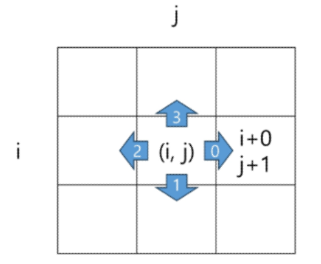
***방향 번호에 따라 편할 때가 있지만 보통 한 방향을 정해서 di,dj를 정의해두는 것이 좋음***


```python
# 오른쪽: a[i+0][j+1]
# 아래: a[i+1][j+0]
# 왼쪽: a[i+0][j-1]
# 위 : a[i-1][j+0] 

arr = [[0] * N for _ in range(M)] 

di = [0, 1, 0, -1] # i가 클 수록 밑으로 감
dj = [1, 0, -1, 0]

#dij = [(0,1)...] 이렇게 하는 경우도 있음

방향 튜플
direction = [(0, 1), (1, 0), (0, -1), (-1, 0)]

for di, dj in direction:
    ni, nj = y + di, x + dj


for i in range(M):
    for j in range(N):
        for k in range(4): # 방향 계산 배열 배열
            ni = di[k]
            nj = dj[k]
            0 <= ni < M and 0 <= nj < N # 인덱스 유효한지 검사
```
* 방향 배열 사용법
- 현재 위치(y, x) i 번째 방향으로 이동
  ny, nx = y + dy[i], x + dx[i]


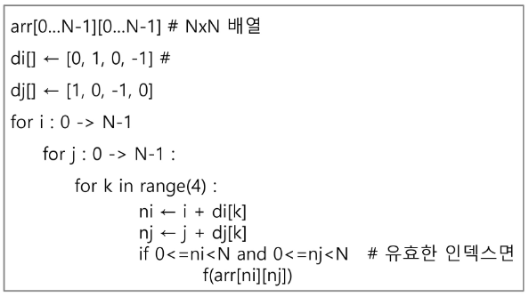

### 전치 행렬 (대각선에 있는 자료 변경)
- 대각선 기준 오른쪽으로 있는 것과 왼쪽에 바꾸는 것
```python
arr = [[1,2,3],[4,5,6],[7,8,9]] # 3*3행렬

for i in range(3) :
    for j in range(3) :
        if i < j:
            arr[i][j], arr[j][i] = arr[j][i], arr[i][j]
```

### i,j의 크기에 따라 접근하는 원소 비교
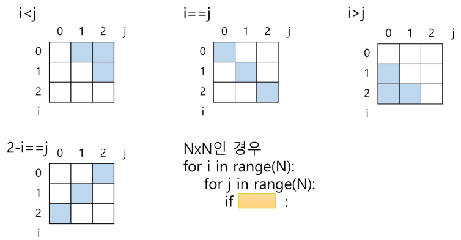

대각선
for i: 0 -> N-1
    arr[i][i]

역 대각선
for i: 0 -> N-1
    arr[i][N-1-i]


### 연습문제

- 1-2
```python
# 연습문제 1-2
N = int(input()) # 행과 열에 대해 주는 값 확실히 이해하기
arr = [list(map(int, input().split())) for _ in range(N)]

di = [0, 1, 0, -1]
dj = [1, 0, -1, 0]

total = 0
for i in range(N):
    for j in range(N): # N*N의 배열의 모든 원소에 대해
        s = 0           # 원소와 주변 인접 원소의 차의 절댓값의 합
        for k in range(4): # i, j 원소의 네 방향 원소에 대해
            ni = i + di[k]
            nj = j + dj[k]
            if 0 <= ni < N and 0 <= nj < N: # 실존 여부 유효성 검사
                s += abs(arr[i][j] - arr[ni][nj]) # 실존하는 인접원소
        total += s # 총합에 반영
print(total)
```


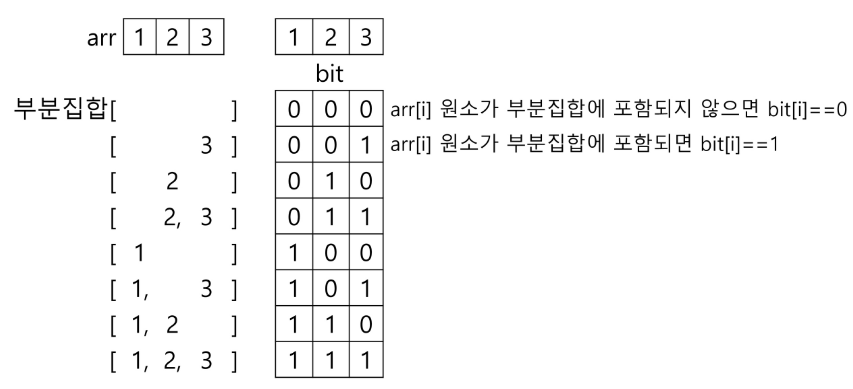

부분집합의 경우 각 요소에 대해 들어간다/ 들어가지 않는다 의 2가지 경우로 나뉨
들어간다 / 아니다를 0,1의 값을 가진 bit라는 배열로 생성

```python
# 부분집합 생성하기

bit = [0, 0, 0, 0]
for i in range(2):
    bit[0] = i
    for j in range(2):
        bit[1] = j
        for k in range(2):
            bit[2] = k
            for l in range(2):
                bit[3] = l
                # print_subset(bit)

# 간결하게 생성하기

arr = [3, 6, 7, 1, 5, 4]
n = len(arr) #  n : 원소의 개수

for i in range(1 << n): # 1 << n : 부분집의 개수
    for j in range(n): # 원소의 수만큼 비트 비교
        if i & (1 << j): # i의 j번 비트가 1인 경우
            print(arr[j], end=",") # j번 원소 출력
    print()
print()


```

### 비트 연산자
- "&" : 비트 단위로 AND 연산
- "|" : 비트 단위로 OR 연산
- "<<" : 피연산자의 비트열을 왼쪽으로 이동
- ">>=" : 피연산자의 비트열을 오른쪽으로 이동

연산 기본
1) 비트 이동 연산(<<)
    1 << 3 --> 이진수 1을 왼쪽으로 3칸 밀기 --> 2진수 1000, 10진수 8
2) 비트 AND 연산(&)
    두 이진수의 각 자리를 비교하여, 둘 다 1이면 1, 그렇지 않으면 0
    ex) 1100 & 0101 == 0100

#### << 연산자(쉬프트 연산자)
- 1 << n : 2**n 즉, 원소가 n 개인 경우의 모든 부분집합의 수

#### & 연산자
- i & (1 << j) : i의 j번째 비트가 1인지 아닌지 검사


### 검색(Search)
1) 저장되어 있는 자료 중에서 원하는 항목을 찾는 작업
2) 목적하는 탐색 키를 가진 항목을 찾는 것
  - 탐색 키(search key): 자료를 구별하여 인식할 수 있는 키

#### 순차 검색(sequential search)

1) 일렬로 되어 있는 자료를 순서대로 검색하는 방법
  - 가장 간단하고 직관적
  - 배열, 리스트 등 순차구조에 유용
  - 알고리즘이 단순하지만, 검색 대상의 수가 많으면 수행시간이 급격히 증가하여 비효율적

  
**1. 정렬되어 있지 않은 경우**

1) 검색 과정
   - 첫 원소부터 순서대로 검색 대상과 키 값이 같은 원소가 있는지 비교
   - 키 값이 동일한 원소를 찾으면 그 원소의 인덱스 반환
   - 마지막에 이를 때까지 검색 대상을 찾지 못하면 검색 실패 => 구조를 벗어난 곳을 최종으로 지정하여 멈추기

2) 구현 식
   - 첫 번째 원소를 찾을 때는 1번 비교, 두 번째는 2번
   - 정렬되지 않은 자료에서의 순차검색의 평균 비교 횟수 => 모든 요소를 한 번씩 다 찾아본다는 의미
     -> (1/n) * (1+2+3+...+n) = (n+1)/2
   - 시간 복잡도 O(n)
```python
def sequential_search(a, n, key):
    # a-검색 대상 / # n-원소 갯수 / key-찾을 값
    i = 0
    while i < n and a[i] != key : # key랑 같으면 다음으로 이동
        i += 1
    if i < n:
        return i
    else: # 배열 끝까지 순회한 경우
        return -1
```
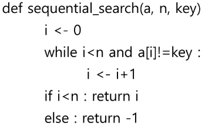

**2. 정렬되어 있는 경우**

1) 검색 과정
   - 자료가 오름차순으로 정렬
   - 순차적으로 검색하면서 키 값을 비교, 원소의 키 값이 검색 대상의 키 값보다 크면 찾는 원소가 없다는 것
2) 구현식
   - 정렬이 되어 있으므로, 검색 실패를 반환시, 평균 비교 횟수가 반으로 줄어듦
   - 시간 복잡도 : O(n)
```python
def sequentialSearch2(a, n, key):
    i = 0
    while i < n and a[i] < key: # 순서가 바뀌지 않는 것이 중요(단축평가 때문)
    # 더 어려운 조건을 또는 에러가 나지 않는 것을 먼저 위치시켜야 함
        i += 1
    if i <n and a[i] == key: # 배열을 벗어나지 않은 상황에서 키가 같으면
        return i
    else :
        return -1
```
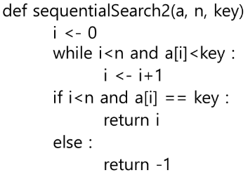

#### 이진 검색(binary search)

- 자료의 가운데에 있는 항목의 키 값과 비교하여 다음 검색의 위치를 결정하고 검색을 계속 진행하는 방법
- "정렬된 상태"에서만 가능
- 정수형 데이터일 때 대부분 사용

1) 검색 과정
- 목적 키를 찾을 때까지 이진 검색을 순환적으로 반복 수행하여 검색 범위를 반으로 줄여 빠르게 검색 수행 => 업다운 느낌

2) 구현식
- 검색 범위의 시작점과 종료점을 이용하여 검색 반복 수행
- 자료에 삽입이나 삭제가 발생했을 때 배열의 상태를 항상 정렬 상태로 유지하는 작업 필요
```python
def binarySearch(a, N, key):
    start = 0
    end = N-1 # 시작/종료점 index
    while start <= end: # 남은 구간이 있으면(남은 구간이 하나만 있어도 확인해야해 =도 포함)
        middle = (start + end)//2 
        if a[middle] == key: # 검색 성공
            return True
        elif a[middle] > key :
            end = middle - 1
        else:
            start = middle + 1
    return False            # 검색 실패
```
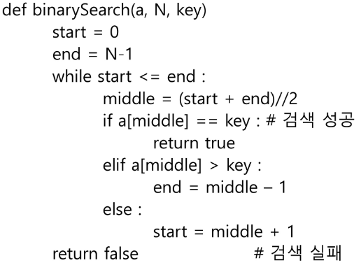

- 재귀함수 활용
```python
def binarySearch2(a, low, high, key):
    if low > high: # 검색 실패
        return False
    else:
        middle = (low + high)//2
        if key == a[middle]: # 검색 성공
            return True
        elif key < a[middle]:
            return binarySearch2(a, low, middle-1, key)
        elif a[middle] < key:
            return binarySearch2(a, middle+1, high, key)
```

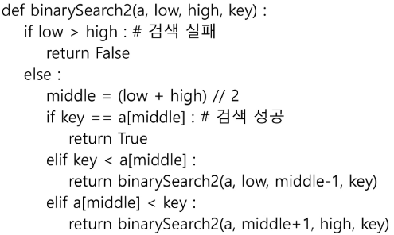


#### 참고: 인덱스
- 인덱스: Database에서 유래되어, 테이블에 대한 동작 속도를 높여주는 자료 구조를 일컬음
- Database 분야가 아닌 곳에선 Look up table 등의 용어를 사용하기도 함
- 인덱스를 저장하는 데 필요한 디스크 공간은 보통 테이블과 비교해 작음
  --> 보통 인덱스는 키-필드만 갖고 있는 반면 테이블의 다른 세부 항목들은 갖고 있지 않기 때문
- 대량의 데이터를 매번 정렬시 프로그램은 느려질 수밖에 없기 때문에 배열 인덱스를 활용하면 좋음
  --> 데이터베이스 인덱스는 이진 탐색 트리 구조로 되어있음

#### 선택 정렬

- 선택 정렬: 주어진 자료들 중 가장 작은 원소부터 차례대로 선택하여 위치 교환하는 방식

- 정렬 과정
  - 주어진 리스트 중 최소값 찾음
  - 리스트의 맨 앞에 위치한 값과 교환한다. -> 인덱스로 접근 => min_v보다 min_idx해도 괜찮
  - 맨 처음 위치를 제외한 나머지 리스트틀 대상으로 과정 반복
  - 미정렬 원소가 하나 남은 상황에서는 그 원소가 가장 큰 값이므로 실행 종료

- 시간 복잡도 = O(n**2)

```python
def SelectionSort(a[], n):
    for i in range(n-1): # 기준위치(구간의 시작 인덱스)
        min_idx = i #현재 구간의 맨앞(기준위치)을 최소로 가짐
        for j in range(i+1,n): #비교 구간 원소 j
            if a[min_idx] > a[j]:
                min_idx = j
        a[i], a[min_idx] = d[min_idx], a[i] # 작은 값과 현재 값 바꾸기


def selections_sort(arr):
    n = len(arr)
    for i in range(n):
        min_idx = 1
        for j in range(i+1, n):
            if arr[j] < arr[min_idx]:
                min_idx = 1
        arr[i], arr[min_idx] = arr[min_idx], arr[i]
    
    return arr

arr = [51, 32, 56, 67, 86, 79, 99, 123, 33, 3, 2]
sorted_arr = selections_sort(arr)
print(sorted_arr)
```

# String
## 문자의 표현
- 글자 그대로의 모양을 비트맵으로 저장하는 것은 메모리낭비가 심하기 때문에 숫자로 저장
- 알파벳의 경우 52자이므로 6비트(64가지)면 모두 표현 가능 -> '코드체계'
- 기존엔 각 지역별로 코드체계를 정함 -> 네트워크가 발달하며 코드가 달리 해석되는 문제 확인 -> 표준안 제정 ==> ASCII(American Standard Code for Information Interchange) 코드 제정(1967)
- ASCII는 7-bit 인코딩으로 128문자 표현, "33개의 출력 불가능한 제어 문자"들과 공백을 비롯한 "95개의 출력가능한 문자"들로 이루어짐

- 확장 아스키: 표준 문자 이외의 악센트, 도형, 특수 문자, 특수 기호 등 부가적인 문자 128개 추가한 8-bit(1 byte) 문자열
  - 컴퓨터 생산자와 소프트웨어 개발자가 다양한 문자에 할당할 수 있도록 함 -> 확장부호는 다른 프로그램/컴퓨터와 교환 불가
  - 확장 아스키는 통용되지 않고 프린터가 해독할 수 있도록 설계되어야 해독 가능

- 대부분 컴퓨터는 ASCII 형식을 활용하나 다양한 문자를 표현하기 위해 다양한 코드 체계가 생김 -> 우리나라도 조합형, 완성형 코드

- UNICODE: 다국어 처리를 위한 표준 코드 체계
  - 인터넷이 발전하며 세계 간에 서로의 문자를 잘못된 해석 없이 받기 위한 코드체계 교환이 필요함

- UNICODE Character Set
    - UCS-2(Universal Character Set 2)
    - UCS-4(Universal Character Set 4)
  유니코드를 저장하는 변수의 크기를 정의했으나, 바이트 순서에 대해서 표준화 하지 못함
  파일 인식 시 UCS-2인지 UCS-4인지를 인식하고 각 경우를 구분해서 모두 다르게 구현해야 하는 문제 발생
  --> 유니코드에 대한 적당한 외부 인코딩 필요 

- 유니코드 인코딩(UTF; Unicode Transformation Format)
  - UTF-8(web/ 1 Byte * 2), UTF-16(windows, java/ 2 Byte * 2), UTF-32(unix/ 4 Byte * 1)
  - UTF-16BE 
  - CR/LF -> 제어문자 중 일부, 줄바꿈 후 커서를 젤 앞으로 라는 뜻

## 문자열(string)

- 시퀀스 자료형으로 분류, 시퀀스 자료형에서 사용할 수 있는 인덱싱, 슬라이싱 연산 사용 가능
- 문자열은 튜플과 같이 요소 변경 불가(immutable)

- 문자열 기호 : ', "", ''', """
- '+': 연결
- '*': 반복


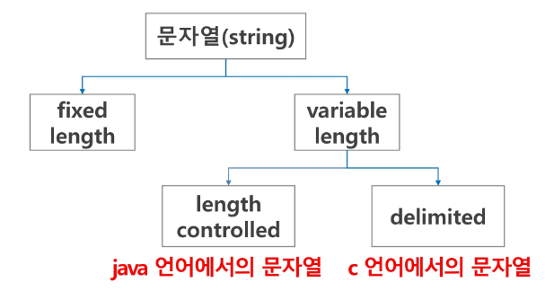

C타입의 strlen 함수 파이썬에서 정의
```python
def my_strlen(a):
    i = 0
    while a[i] == '\0':
        i += 1
```

- C와 Java의 String차이
  - C는 ASCII, Java는 UTF16, 파이썬은 UTF-8

### 문자열 뒤집기
- 문자열에서 뒤집는 방법, 새로운 문자열을 만들어 뒤에서 부터 읽는 방법

1) 자기 문자열 이용 -> swap을 위한 임시 변수 필요 -> 문자열 반만의 길이를 수행(n // m)
```python
for i in (n//2):
    a[i], a[n-1-i] = a[n-1-i], a[i]
```

### 문자열 비교
- 파이썬 문자열 비교에서 "==" 연산자와 is 연산자 제공
*Java 는 메모리참조 비교(파이썬은 단순 내용 비교)

- ord/chr 함수 => 아스키코드로 왔다갔다 
```python
s1 = "A"
print(ord('A'))
print(ord(s1))

print(chr(65)) 
```

### 아스키 코드
ord() -> 문자를 ascii 값으로
chr() -> ascii 값을 문자로

**대문자 A: 65, 소문자 a: 9**
- 대문자보다 소문자의 아스키 코드값이 더 큼
- " "(space)도 아스키 코드값이 있음

- if, 조건 식에서 아스키 코드 값을 사용할 필요는 없음
    예 : if 'a' <= x <= 'z'

- atoi 함수 만들기(int와 같음)
```python
def atoi(s):
    i = 0
    for x in s:
        i = i*10 + (ord(x) - ord('0')) # ord('0')이 ascii 1 기준이므로 가능
    return i
```

### 회문 : string == string[::-1]

### 문자열에서 자주 사용하는 메서드
- split(), strip(): 공백제거, lstrip(), rstrip()
- replace(), join()
- find(), index() : find -> 못 찾으면 -1, index -> error
- isdigit(), isalpha(), isalnum() : 문자열이 숫자, 알파벳 또는 둘 다로 이루어져 있는지 확인

## 패턴 매칭
- 활용 경우: 고지식한 패턴 검색, 카프-라빈, KMP, 보이어-무어
  
### 고지식한 패턴 매칭(Brute Force); 무차별 대입 공격
- 본문 문자열을 처음부터 끝까지 차례대로 순회하면서 패턴 내의 문자들을 일일이 비교
- i를 고정하고 j를 순회하는 방법

```python
i = j = 0
while i < N and j < M:
    if t[i] == p[j]: # 일치하는 경우
        i += 1
        j += 1
    else: # 불일치하는 경우
        j = 0
        i = i - j # 불일치 하는 부분에서 하나 더 가는 것
```

- i와 j를 같이 이동하는 방법(교재)

```python
p # 찾을 패턴
t # 전체 텍스트
M = len(p) # 패턴의 길이
N = len(t) # 텍스트의 길이
def BruteForce(p,t):
    i = 0 # t의 인덱스
    j = 0 # p의 인덱스
    while j < M and i < N:
        if t[i] != p[j]:
            i = i - j
            j = -1
        i += 1
        j += 1
    if j == M:
        return i - M:
    else:
        return -1

```

```python
p # 찾을 패턴
t # 전체 텍스트
M = len(p) # 패턴의 길이
N = len(t) # 텍스트의 길이
cnt = 0
for i in range(N-M+1):
    for j in range(M):
        if t[i + j] != [i]:
            break # for j, 다음 글자부터 비교 시작
    else: # for j가 중단없이 반복되면,
        cnt += 1 #패턴 개수 1 증가
print(cnt)
```

1) 시간복잡도
   - 최악의 경우 모든 위치에서 패턴을 비교하므로 O(MN)이 됨 -> 길이가 길 수 록 기하급수적으로 늘어남

### KMP 알고리즘(Knuth, Morris, Prett)
- 불일치가 발생한 텍스트 스트링의 앞 부분에서 어떤 문자가 있는지를 미리 알고 있으므로, 불일치가 발생한 앞 부분에 대해서 다시 비교하지 않음
- 패턴을 전처리 하여 next[M] 배열을 구해 잘못된 시작 최소화
- 시간복잡도 : O(M+N)


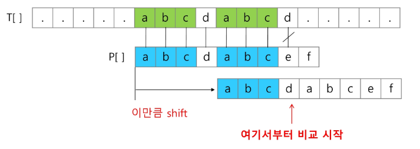

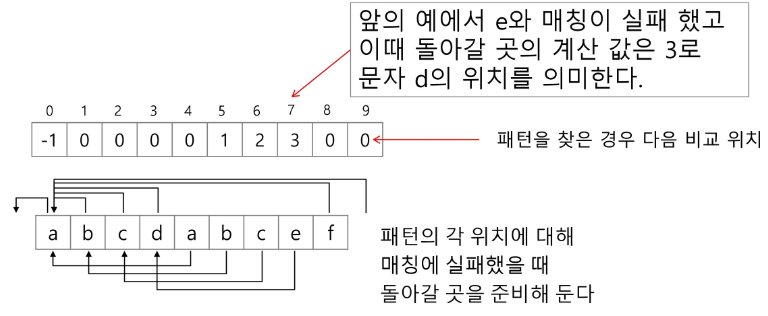

```python

```

### 보이어-무어 알고리즘
- 오른쪽에서 왼쪽 비교
- 대부분의 상용 소프트웨어에서 채택하는 알고리즘
- 오른쪽 끝에 있는 문자가 불일치하고, 이 문자가 패턴 내에 존재하지 않는 경우 이동거리는 패턴의 길이만큼 발생 ==> 가장 끝 문자부터 비교
  불일치했을 때 -> 패턴 안에 없으면 그 다음, 안에 있으면 있는 것이 겹치는 때까지
- 텍스트 문자를 다 보지 않아도 됨


### 문자열 매칭 알고리즘 시간복잡도 비교
- 고지식한 패턴 검색 알고리즘: O(mn)
- 카프-라빈 알고리즘: O(n)
- KMP 알고리즘: O(n)
- 보이어-무어: O(n) ~ O(mn)

## 문자열 암호화

## 문자열 압축


# Stack

## 스택의 특성
- 물건을 쌓아 올리듯 자료를 쌓아 올린 형태의 자료구조
- 스택에 저장된 자료는 선형 구조를 가짐
  - 선형 : 자료 간의 관계가 1대1의 관계
  - 비선형 : 자료 간의 관계가 1대N의 관계(트리형 등)
- 스택에 자료를 삽입하거나 스택에서 자료를 꺼낼 수 있다.
- 후입선출(LIFO; Last In First Out)

그럼 중간 자료를 수정할 경우는...? -> 다 꺼내고 수정하네

## 스택의 구현
- 자료구조: 자료를 선형으로 저장할 저장소
  - 배열을 사용할 수 있음
  - 저장소 자체를 스택이라 부르기도 함
  - 스택에서 마지막 삽입된 원소의 위치를 top이라고 함 
- 연산
  - 삽입(push): 저장소에 자료 저장
  - 삭제(pop): 저장소에 자료 꺼냄(역순)
  - .isEmpty: 공백인지 아닌지
  - .peek: top에 있는 item 반환
- 삽입 삭제 과정
  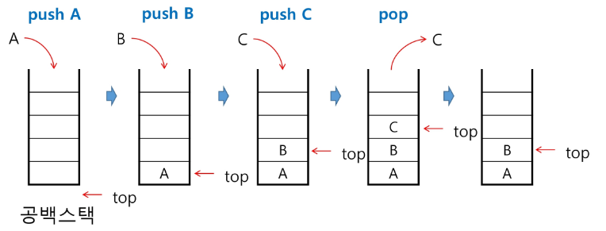
  "push - top 증가 - 새로운 원소 저장"
  "pop - top 감소 - 마지막 원소 꺼냄"
- 스택의 push 알고리즘
  - append 메소드를 통해 리스트의 마지막에 데이터를 삽입

'''
stack =[]
for ~
    for ~
        code..
        if 조건
            stack.append() -> 후입
        else 조건
            stack.pop() -> 선출
'''

참고 : stack
- 재귀, used 가지치기 -> DFS(Depth-First Search)에 활용

참고 : Queue
- 선입 -> append()
- 선출 -> pop(0) ==> 시간복잡도가 O(N)으로 높음
- 해결 방안 : deque 사용 from collections import deque
- 선입 -> append() / 선출 -> popleft()
- + visited 배열 + 재귀 + 백트래킹 ... -> BFS에 활용

참고 : 우선순위 큐
- heapq 모듈 사용, import heapq
- heappush: 가장 작은 요소가 항상 첫 번째 요소에 옴
- heappop: 힙에서 가장 작은 요소를 제거
- 다익스트라 알고리즘에서 활용

참고 : DP => 종이붙이기 문제
- 문제의 최고 부분 구조 파악
- 재귀적 구조
- 점화식이 들어가는 것이 특징
- 작은 문제부터 해결하며 결과에 저장(Bottom-up)
- 큰 문제를 작은 문제로 나누며 해결(Top-down)
- 저장된 결과를 이용해서 문제의 해를 구한다.

```python
s = [] # 빈 스택

def push(item):
    s.append(item)
```
```python
def push(item, size):   # item: 넣을 요소, size: stack 사이즈
    global top          # 읽어오는 건 global로 되지만, 기록하려면 global 필요
    top += 1
    if top == size:     # 디버깅용 성격이 강함 => 스택이 모자라다는 걸 알림
        print('overflow!')
    else:
        stack[top] = item

size = 10
stack = [0] * size
top = -1

push(10, size)
top += 11       # push(20)
stack[top] = 20 # 

```
- 스택의 pop 알고리즘
```python
def my_pop():
    if len(s) == 0:
        #underflow
        return
    else:
        return s.pop()  # 가장 마지막 요소 제거, 아닐 경우 인덱스
```

```python
def my_pop():
    global top
    if top == -1:
        print('underflow')
        return 0            # 형식을 맞춰주기 위함
    else:
        top -= 1            # top을 하나 먼저 낮춘 후
        return stack[top+1] # 그 자리에 있는 요소를 리턴
        # 요소를 지울 필요는 없음
        # top을 낮추는 것과 요소 리턴의 자리를 바꿔도 상관 없음

print(my_pop())

if top > -1:
    top -= 1               
    print(stack[top+1])

```

```python
while top > -1:
    v = stack[top]
    top -= 1
```


## 스택의 응용

### 스택 구현 고려사항
- 1차원 배열 사용하여 구현 시 구현은 용이하나 크기 변경이 어렵다.
  - 저장소를 동적으로 할당하는 스택 구현 => 동적 연결리스트를 이용(추가/삭제 시간이 짧음)
  - 구현은 복잡하지만 메모리를 효율적이로 사용하는 장점

### 괄호 검사
1) 조건
   - 왼쪽 괄호와 오른쪽 괄호의 개수 같음
   - 같은 괄호에서 왼쪽 괄호는 오른쪽 괄호보다 먼저 나옴
   - 괄호 사이에는 포함관계만 존재
2) 스택을 활용한 괄호검사
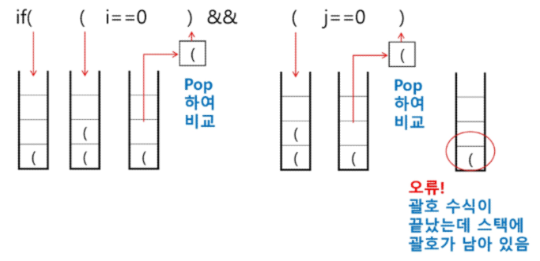
- 여는 괄호 -> 푸쉬
- 닫는 괄호 -> 팝

==> Overflow, Underflow의 에러
3) 괄호 조사 알고리즘 개요
   - 문자열에 있는 괄호 차례대로 조사 - 왼쪽 괄호 만나면 스택 삽입, 오른쪽 괄호 만나면 top 괄호 pop하고 짝 맞는지 검사
   - 스택이 비어있으면 x, 짝이 맞지 않으면 조건 3에 위배
   - 마지막 괄호까지를 조사한 후에도 스택에 괄호가 남아 있으면 조건 1에 위배

### Function Call
- 프로그램에서의 함수 호출과 복귀에 따른 수행 순서 관리
  - 마지막에 호출된 함수가 먼저 실행 
  - 함수호출이 발생하면 호출한 함수 수행에 필요한 지역변수, 매개변수 및 수행 후 복귀할 주소 등의 정보를 stack frame에 저장하여 시스템 스택에 삽입
  - 함수의 실행이 끝나면 시스템 스택의 top원소를 pop하면서 프레임에 저장되어 있던 복귀주소를 확인 및 복귀
  - 함수 호출과 복귀에 따라 이 과정을 반복항 전체 프로그램 수행이 종료되면 시스템 스택은 공백 스택이 됨
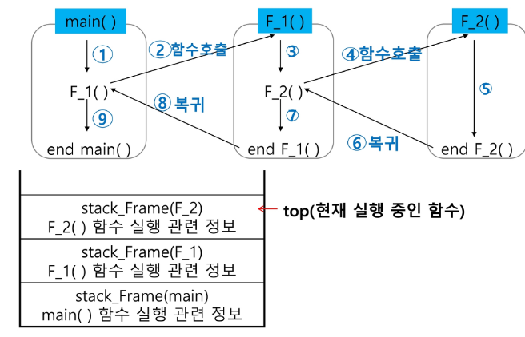


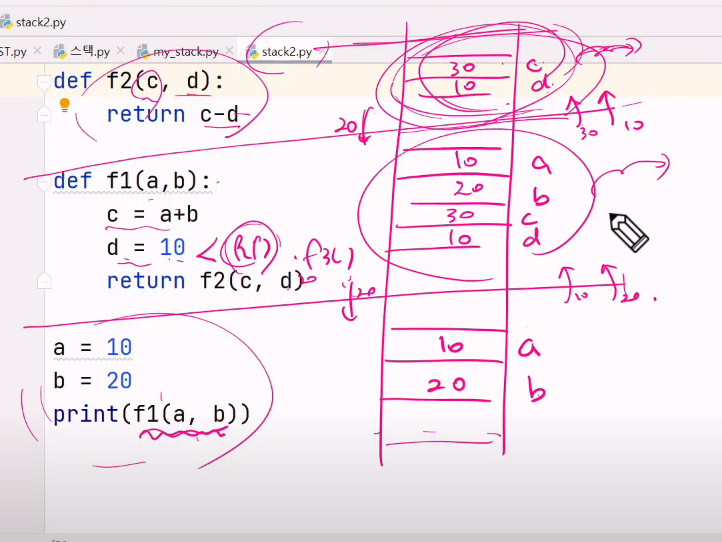

인자 순서를 바꾼 경우

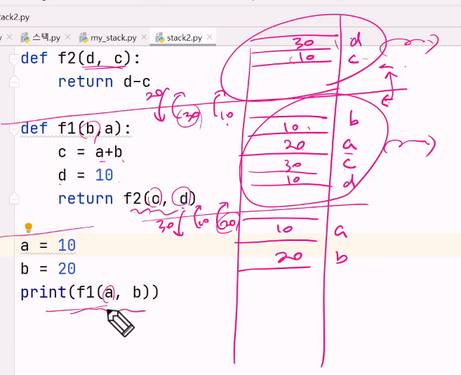

어차피 매개변수와 인자의 차이


### 재귀호출
- 필요한 함수가 자신과 같은 경우 자신을 다시 호출하는 구조
- 재귀호출방식을 사용하여 함수를 만들면 프로그램 크기를 줄이고 간단하게 작성
- 서로 다른 함수를 호출하지만 내용이 같다고 생각하기
- 완전탐색에 유용


1) factorial 함수
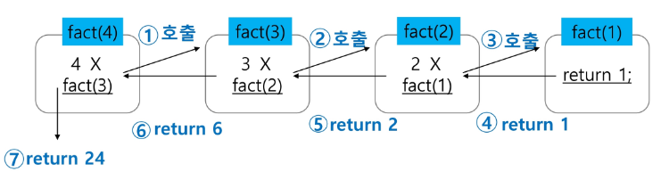
2) 피보나치 수열
```python
def fibo(n):
    if n < 2:               # 종료 조건 설정하기
        return n
    else:
        return fibo(n-1) + fibo(n-2)
```
3) 모든 배열 원소에 접근하기
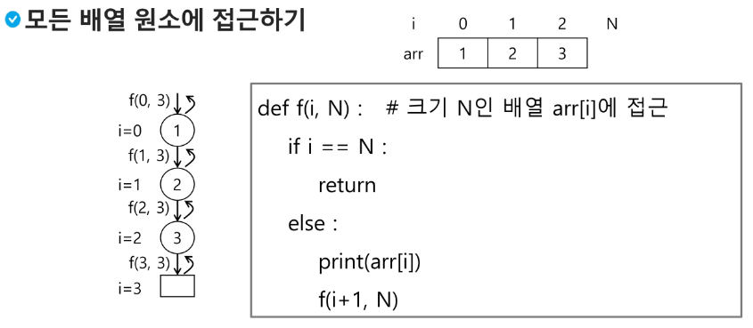
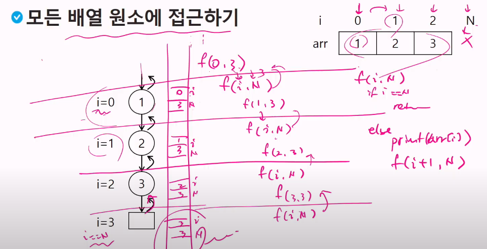

### 모든 배열 원소 접근

```python
def f(i, N):        # i: 접근할 원소 인덱스, N: 크기
    if i == N:      # 배열을 벗어난 경우
        return
    else:           # 그렇지 않은 경우
        print(arr[i])
        f(i+1, N)
        return

arr = [1, 2, 3]
N = 3
f(0, N)
```

4) 배열에 v가 있으면 1 없으면 0을 리턴
```python

```

## Memoization(메모이제이션)


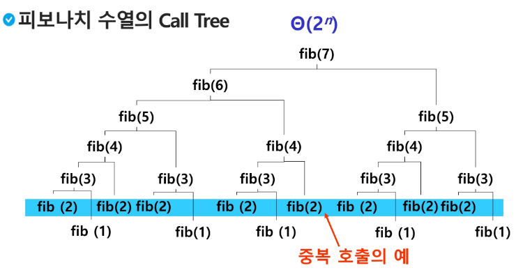
- 피보나치 수열의 경우 중복 호출이 발생
- 처음엔 구현하는 것을 목표 - 이후에 좀 줄일 순 없을까?

### 정의
- Memoization: 컴퓨터 프로그램을 실행할 때 이전에 계산한 값을 메모리에 저장하여 매번 다시 계산하지 않도록 하여 실행속도를 빠르게 하는 기술. "동적 계획법의 핵심"
- 메모리에 넣기(to put in memory)라는 의미, 동사형은 memoize
- fibo(n)의 값을 계산하자 마자 memoize하면 실행시간을 세타(n)으로 줄일 수 있음

### 알고리즘
```python
# memo를 위한 배열을 할당, 0으로 초기화
# memo[0]은 0으로 memo[1]은 1로 초기화
# memo[0] == fibo(0)

def fibo1(n):
    global memo
    if n >= 2 and memo[n] == 0: # fibo1(n)이 계산된 적이 없는 상태
        memo[n] = fibo1(n-1) + fibo1(n-2)
    return memo[n]

n = 7
memo = [0] * (n+1)
memo[0] = 0
memo[1] = 1
fibo1(n)
print(memo) # [0, 1, 1, 2, 3, 5, 8, 13] / 값들에 대한 리스트 출력

## 피보나치 처럼 알려진 것에서는 문제가 되지 않겠지만, 그렇지 않다면 수식에 맞게 해야할 필요 있음

```

## Dynamic Programming(DP; 동적 계획법)
- 그리디 알고리즘과 같이 최적화 문제를 해결하는 알고리즘
- 먼저 입력 크기가 작은 부분 문제들을 모두 해결 -> 그 해들을 이용하여 큰 부분 문제들 해결 --> 최종적으로 원래 주어진 입력 문제를 해결하는 알고리즘

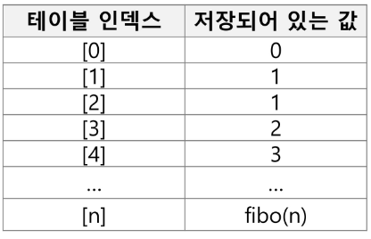

- 재귀의 경우 길이에 비해 호출, 복귀 시간이 오래 걸림 -> 반복이 가능하다면 반복이 더 빠름
- 다만 모든 함수에 적용되는 것은 아니므로 상황에 따라 잘 사용하는 것 필요함
- 코드가 짧은 경우가 많지만 코드를 해석하기가 어려운 경우가 많음

### 피보나치 수 DP 적용
- 피보나치 수는 부분 문제의 답으로 본 문제의 답을 얻을 수 있음 -> 최적 부분 구조(어떤 부분을 보더라도 최적해)
- 큰 값-> 작은 값이 아닌 작은 값 -> 큰 값

1) 문제를 부분 문제 분할
2) 가장 작은 부분 문제부터 해를 구한다.
3) 결과를 테이블에 저장, 부분 문제 해를 통해 상위문제 해를 구함

```python
def fibo2(n):
    f = [0] * (n+1)
    f[0] = 0
    f[1] = 1
    for i in range(2, n+1):
        f[i] = f[i-1] + f[i-2]
    
    return f[n]
```

### DP의 구현 방식
- recursive 방식 or iterative 방식
- memoization을 재귀적 구조에 사용하는 것보다 반복적 구조로 DP를 구현한 것이 성능 면에서 더 효율적
- 재귀적 구조는 내부에 시스템 호출 스택을 사용하는 오버헤드 발생

## Deep First Search(DFS; 깊이우선탐색)
- 비선형구조인 그래프 구조는 그래프로 표현된 모든 자료를 **"빠짐없이 검색"**하는 것이 중요
  깊이우선탐색 또는 너비우선탐색(Breadth First Search; BFS) 활용 가능
  시작 정점의 한 방향으로 갈 수 있는 경로가 있는 곳까지 깊이 탐색 -> 더 이상 갈 곳이 없으면 -> 가장 마지막에 만난 갈림길 간선이 있는 정점으로 되돌아 옴 -> 다른 방향의 정점으로 탐색을 계속 반복 -> 결국 모든 정점을 방문
- **가장 마지막에 만났던 갈림길의 정점**으로 되돌아가서 다시 깊이우선탐색을 반복해야 하므로 **후입선출 구조 스택 사용**
     - 재귀의 경우 직전 함수의 값을 저장하고 다음 연산을 하므로 거의 유사

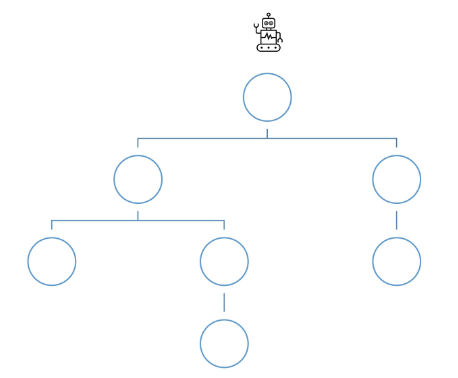
- 로봇이 오른쪽으로 우선 이동한다고 할 때 -> 지나갔던 곳은 표식을 남김 -> 도달하지 않으면 뒷걸음질 침 -> 표식있는 곳은 지나쳐 더 이전으로 되돌아옴 -> 표식이 없는 다른곳으로 이동 -> 도달하지 않으면 다시 뒷걸음질 -> 갈림길이 없을 때 다시 돌아옴

### DFS 알고리즘

1) 시작 정점 v를 결정하여 방문
2) 정점 v에 인접한 정점 중에서
   1) 방문하지 않은 정점 w가 있으면, 정점 v를 스택에 push하고 정점 w를 방문
   2) w를 v로 하여 다시 반복
   3) 방문하지 않은 정점이 없으면, 탐색의 방향을 바꾸기 위해서 스택을 pop하여 받은 가장 마지막 정점을 v로 하여 반복
3) 스택이 공백이 될 때까지 2번을 반복

-- 로봇 그림 그려 보기!

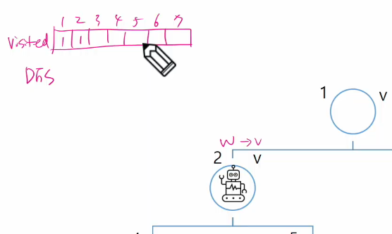
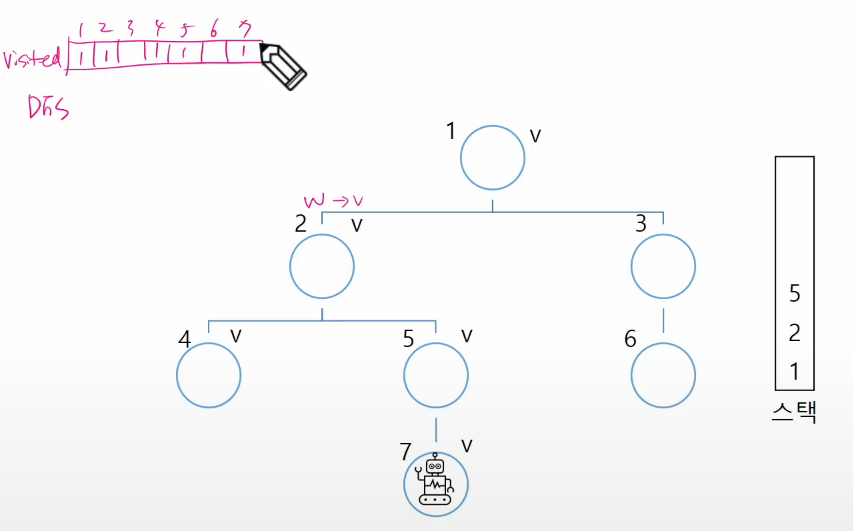
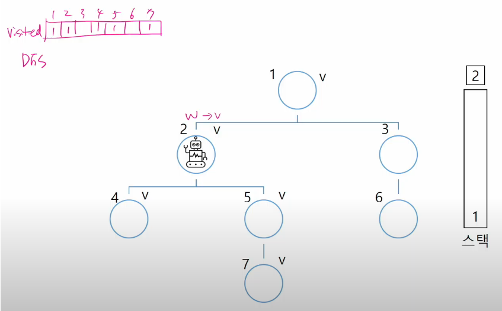

```pseudo
# visited, stack 초기화
visited = []
stack = []

DFS(v):
    시작점 v 방문
    visited[v] <- true;
    while {
        if v의 인접 정점 중 방문 안 한 정점 w가 있으면
            push(v);
            v <- w; (w 방문)
            visited[w] <- true;
        else
            if 스택이 비어있지 않으면
                v <- pop(stack);
            else
                break
    }
end DFS
```

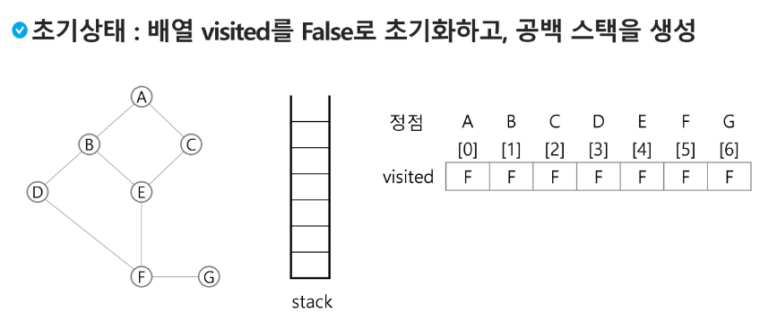
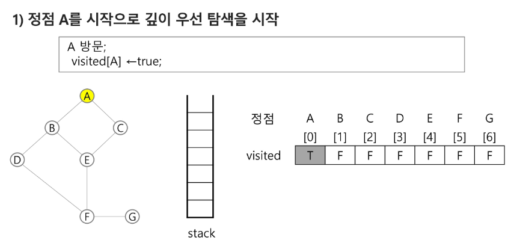
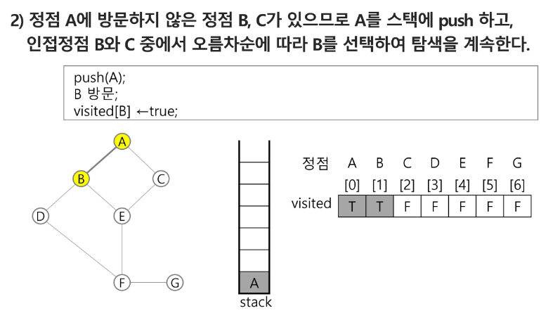
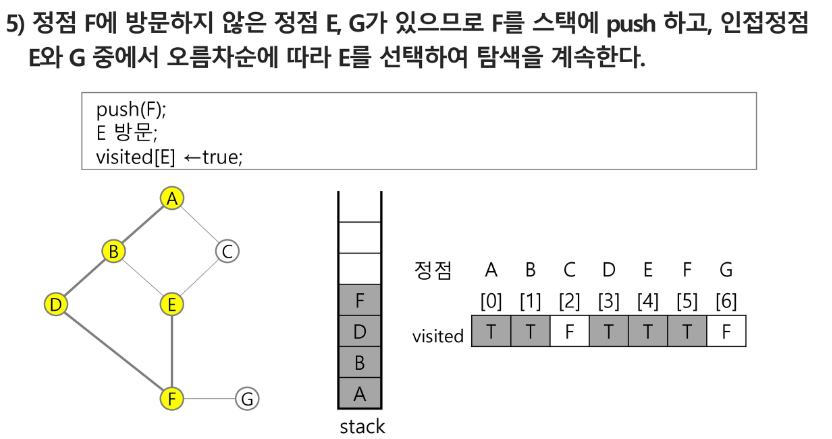


```python
'''
1
7 8
1 2 1 3 2 4 2 5 4 6 5 6 6 7 3 7
'''

def DFS(s, n):                          # s: 시작정점 n: 정점개수(1번부터인 정점의 마지막)
    visited = [0]*(n+1)                 # 방문한 정점을 표시
    stack = []                          # 스택 생성
    print(s)
    visited[s] = 1                      # 시작 정점 방문 표시
    v = s                               # 지점 설정
    while True:
        for w in adjL[v]:               # v에 인접하고 방문 안 한 w 가 있으면
            if visited[w] == 0:
                stack.append(v)         # 현재 정점 push
                v = w                   # w에 방문
                print(v)
                visited[w] = 1          # 방문 표시
                break                   # for w... v부터 다시 탐색
        else:                           # 남은 인접 정점이 없어서 break 없는 경우 => 요소를 다 돌고 나서
            if stack:                   # 스택에 남은 게 있으면
                v = stack.pop()         # 이전 갈림길을 스택에서 꺼내서
            else:                       # 되돌아갈 곳이 없으면(남은 갈림길이 없으면)
                break                   # while True... 탐색 종료

T = int(input())
for tc in range(1, T+1):
    v, E = map(int, input().split())    # v: 현재정점 E: 간선 수 (연결된 길)
    adjL = [[] for _ in range(v+1)]     # 인접 정점 리스트를 구하기 위함
    arr = list(map(int, input().split()))
    for i in range(E):                  # 간선에서 두 개씩 가져오는 작업
        v1, v2 = arr[i*2], arr[i*2+1]
        adjL[v1].append(v2)             # adjL이 비어있는 상테에서 1번행의 2번 열에 append --> 가는 방향
        adjL[v2].append(v1)             # 오는 방향 추가
        # [[], [2, 3], [1, 4, 5], [1, 7], [2, 6], [2, 6], [4, 5, 7], [6, 3]] 각 요소 index가 출발점
    DFS(1, 7)
```

- 그래프 : 노드(정점)와 노드들을 연결하는 간선으로 구성된 자료구조
          탐색(DFS, BFS), 최단 경로 찾기(다익스트라), 최소 신장 트리

- Adv : 완전 탐색을 기반으로 어느 상황에서든 "에러 없이" 돌아가는 프로그램을 작성할 수 있는가

- DFS : 한 경로를 끝까지 탐색한 후 다음 경로로 넘어가는 방식
        '모든 경로'를 돌려보는 게 가능 --> 모든 경우의 수를 확인
- BFS : 시작점에서 가까운 노드부터 차례대로 탐색하는 방식
        '최대한 적은 노드'를 돌려서 가는 경로 --> 퍼져나가는 형태 구현 경우

- path(흔적) 배열 --> used 배열, visited 배열
  - 목적 : '이미 방문한 노드'를 기록하는 역할 - 미로 탐험 시 지나온 길 표시
    1. 무한 루프 방지 : 같은 노드 계속 방문 방지
    2. 중복 방문 방지 : 불필요한 연산 줄임
  - 구현 : boolean 배열을 구현하고, 각 노드에 대해 True(1) or False(0)를 표시

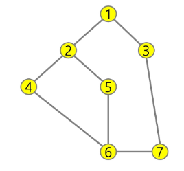

1 2 1 3 2 4 2 5 6 5 6 6 7 3 7

- 단방향 그래프와 양방향 그래프
  - 단방향: 한 방향으로만 전진 가능(백 트래킹은 가능)
  - 양방향: 다양한 방향으로 전진 가능(예: 밑에서 위로)

1) 단방향
1 : 루트 노드
1의 첫 번째 자식 2
2의 첫 번째 자식 4
4의 첫 번째 자식 6 -> 자식 끝

6에서 더 이상 방문하지 않은 자식이 없는 상황

돌아가야함 -> 백 트래킹

2로 백 트래킹
2의 두 번째 자식 5
2로 백 트래킹
1로 백 트래킹
1의 두 번째 자식 3
3의 첫 번째 자식 7

1 2 4 6 2 5 2 1 3 7

2) 양방향
1 : 루트 노드
1의 첫 번째 자식 2
2의 첫 번째 자식 4
4의 첫 번째 자식 6 -> 자식 끝

6 -> 5
5 -> 6
6 -> 7
7 -> 3

1 2 4 6 5 7 3 


* 재귀호출과 n중 반복문

ex1. 숫자 출력 - 2중 for문 => 순열 코드
```python
for a in range(1,4):
    for b in range(1,4):
        print(a, b)
```

ex2. 숫자 출력 - 4중 for 문 => 순열 코드
```python
for a in range(1, 4):
    for b in range(1, 4):
        for c in range(1, 4):
            for d in range(1, 4):
                print(a, b, c, d) # 경로
```

N = 2 일때 2중
3일때 3중 ... 식으로 적을 수 있을까?
--> 적을 수 있지만 횟수가 너무 많아짐 ---> 재귀호출로 가능


함수 특징1: 함수를 호출할 때 int 타입 객체를 전달하면 값만 복사된다.

```python
def KFC(x):
    x = x + 1

x = 3
KFC(x) # x = 4
print(x) # 3 -> 값만 복사한 것


def KFC2(x):
    print(x)
    x += 1
    print(x)

x = 3
KFC(x + 1)
# 4
# 5
print(x)
# 3
```

함수 특징2: 함수가 끝나면 main이 아닌 해당 함수를 호출했던 곳으로 돌아옴

```python
def BTS(x):
    print(x)

def KFC(x):
    print(x)
    x += 1
    BTS(x+5)
    print(x)

x = 3
KFC(x+5)
print(x)

'''
8
14
9
3
'''
```

```python
def BBQ(x):
    x += 10
    print(x)

def KFC(x):
    print(x)
    x += 3
    BBQ(x + 2)
    print(x)

x = 3
KFC(x + 1)
print(x)

'''
4
19
7
3
'''
```

무한 재귀호출 예시
```python
def KFC(x):
    return KFC(x+1)

KFC(0)
# RecursionError: maximum recursion depth exceeded

print('끝')
```
=> 재귀 에러 발생(무한 재귀에 들어감)

무한 재귀호출을 막아야함 -> if 기저조건(base case) 두어야 함

```python
def KFC(x):
    if x == 2:
        return
    print(x)
    KFC(x+1)
    print(x)

KFC(0) # 0 1 1 0
print('끝')
```


```python

def BGK(x):
    if x == 6:
        return
    print(x, end=" ")
    BGK(x+1)
    print(x, end=" ")

BGK(0) # 0 1 2 3 4 5 5 4 3 2 1 0
```

재귀 호출 코드가 늘어날 수록 가짓수가 늘어남

```python
def KFC(x):
    if x == 3:      # 3 : level
        return

    KFC(x + 1)      # 재귀호출의 개수: branch
    KFC(x + 1)
    KFC(x + 1)
    KFC(x + 1)

KFC(0)


def KFC(x):
    if x == 3:
        return
    
    for i in range(4):
        KFC(x + 1)

KFC(0)
```


```python
def run(level):
    if  level == 3:
        return

    for i in range(2):
        run(level+1)

run(0)
```


***순열***
중복 순열: 중복을 허용하고 순서를 고려하여 나열

순열 구현 원리 -> 재귀 호출을 할 때마다 이동 경로 남김 -> 마지막 레벨에 도달했을 때(정점 노드에 도달했을 때) 경로 출력

흔적을 남길 땐 append, 지울 땐 pop


```python
# branch == 3
# level == 2
path = []

def KFC(x):
    if x == 2:
        # 정점 노드에 도달했을 때 출력
        print(path)
        return

    for i in range(3):
        # 재귀호출을 하기 "직전" path에 기록
        path.append(i)
        KFC(x+1)
        # 잘못 됐을 때 함수가 리턴되고 돌아오자마자 기록 삭제
        path.pop()

KFC(0)


# 주사위 3개를 던저 나올 수 있는 모든 경우의 수
# branch == 6
# level == 3

path = []

def outback(x):
    if x == 3: # level ==3
        print(*path)
        return

    for i in range(1, 7): # branch 1 ~ 6
        path.append(i) # 재귀 함수를 호출하기 직전 내 위치 기록
        outback(x+1)
        path.pop() # return 한 직후 기록 삭제

outback(0)


# level == 5
# branch == 4

path = []
def BGK(x):
    if x == 5: #level ==5
        print(*path)
        return

    for i in range(1, 5):
        path.append(i)
        BGK(x+1)
        path.pop()
BGK(0)

```

위 코드에서 중복을 제거하는 코드를 추가하면 순열코드
-> 전역리스트를 사용하면 선택했던 숫자인지 아닌지 구분 가능 --> used 배열(visited배열)
-> used 배열 요소의 갯수는 branch 개수 + 1

```python
path = []
N = 0

def type1(x):
    if x== N:
        return

    for i in range(1, 7):
        path.append(i)
        type(x+1)
        path.pop()

def type2(x):
    if x == N:
        print(*path)
        return

    for i in range(1, 7):
        if used[i] == True:
            continue
        used[i] = 1
        path.append(i)
        type2(x+1)
        path.pop()
        used[i] = False


N, type = map(int, input().split())
used = [False for _ in range(7)] # branch 개수 +1 만큼 초기화

if type == 1:
    type1(0)
else:
    type2(0)
```


***완전탐색***

모든 경우의 수를 다 찾아서 정답을 찾아내는 것

sum <= 10 이하일 때만 출력
- 실제로는 모두 탐색하지만 출력만 하지 않는 방법

- 가지치기 -> 답이 아닌 것에 대해 즉시 되돌아 간다.


## 계산기 1
- 문자열로 된 계산식이 주어질 때, 스택을 이용하여 이 계산식의 값을 계산할 수 있다

1) 중위표기법의 수식을 후위표기법으로 변경한다(스택)
    - 중위 표기법(infix notation): 연산자를 피연산자의 가운대를 표기하는 방법
    - 후위표기법(postfix notation): 연산자를 피연산자 뒤에 표기하는 방법
2) 중위표기식의 후위표기식 변환 방법
    - 수식의 각 연산자에 대해서 우선순위에 따라 괄호를 사용하여 다시 표현
    - 각 연산자를 그에 대응하는 오른쪽 괄호의 뒤로 이동
    - 괄호 제거
    - 예: A*B-C/D -> ((A*B) - (C/D)) -> ((A B)*(C D)/)- -> AB*CD/-
3) 중위 표기법에서 후기표기법으로의 변환 알고리즘
    - 입력받은 중위 표기식에서 토큰을 읽는다,
    - 토큰이 피연산자이면 토큰을 출력
    - 토큰이 연산자(괄호포함)일 때 -> 토큰이 스택의 top에 저장되어 있는 연산자 보다 우선순위 높음 -> 스택에 push -> 그렇지 않다면 -> top의 연산자의 우선순위가 토큰의 우선순위보다 작을 때까지 스택에서 pop g후 연산자 push -> 만약 top에 연산자가 없으면 push한다.
    - 토큰이 '\)'이면 스택 top에 '\('가 나올 때까지 스택에 pop연산 수행 -> pop한 연산자를 출력 -> 왼쪽 괄호를 만나면 pop하나 출력하진 않음
    - 중위 표기식에 더 읽을 것이 없다면 중지, 더 있다면 1부터 다시 반복
    - 스택에 남아있는 연산자를 모두 pop하여 출력
      - 스택 밖의 왼쪽 괄호는 우선순위가 가장 높으나, 안의 왼쪽 괄호는 가장 낮다.
  
  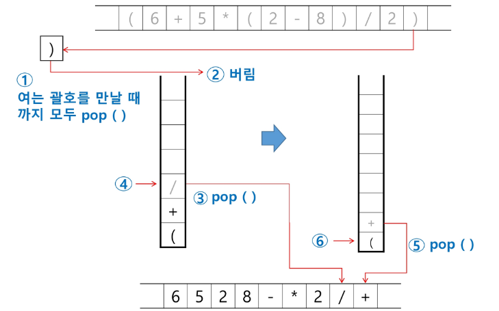

### 연습문제 1 --> 손으로 하는 문제!

- 2 + 3 * 4 / 5
  (2 + ((3*4)/ 5)) -> (2 +(34*/5)) -> (2+34*5/) -> 234*5/+ 

- 2 + 3 * 4 + 5
  (2 + ((3 * 4) + 5)) -> (2 + (34* + 5)) -> (2 + 34*5+) -> 234*+5+

- 2 + 3 * 4 + 5 / 2
  -> 234*+52/+

## 계산기 2

- 후위 표기법의 수식을 스택을 이용하여 계산 -> 중위연산자의 경우 뒤의 우선순위가 마무리 될 때까지 기다려야함

1) 피연산자를 만나면 스택에 push
2) 연산자를 만나면 필요한 만큼의 피연산자를 스택에서 pop하여 연산 -> 연산 결과를 다시 스택에 push
    - 뒤에 pop되는 피연산자를 왼쪽, 먼저 나오는 피연산자를 오른쪽 
3) 수식이 끝나면 스택을 pop하여 출력

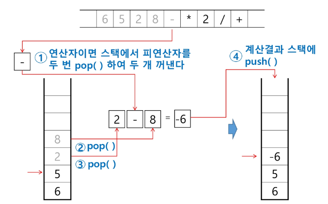

## Backtracking (백트래킹)
- 백트래킹: 해를 찾는 도중에 막히면(해가 아니면) 되돌아가서 다시 해를 찾는 기법
- 최적화(optimization) 문제와 결정(decision) 문제를 해결할 수 있음
  - 결정 문제: 문제의 조건을 만족하는 해가 존재하는지 여부를 'yes' 또는 'no'로 답하는 문제
    - 예: 미로찾기, n-Queen, Map coloring, 부분집합의 합(Subset Sum) 문제 등

### 백트래킹과 깊이우선탐색과의 차이
- 어떤 노드에서 출발하는 경로가 해결책으로 이어질 것 같지 않으면 더이상 그 경로를 따라가지 않음으로써 시도 횟수 줄임(Prunning 가지치기)
- 깊이우선탐색이 모든 경로를 추적하는데 비해 백트래킹은 불필요한 경로 조기 차단
- N!가지의 경우의 수를 가진 문제에 대해 깊이우선탐색을 하면 처리 불가능한 문제에 사용 가능
- 다만 백트래킹의 경우에도 지수함수시간을 요할 수 있으므로 처리 불가능한 문제 있을 수 있음


### 백트래킹 기법
1) 어떤 노드의 유망성을 점검 후 유망(promising)하지 않다고 결정되면 그 노드의 부모로 되돌아가 다음 자식 노드로 감
2) 어떤 노드를 방문하였을 때 그 노드를 포함한 경로가 해답이 될 수 없으면, 그 노드는 유망하지 않으며 반대로 해답의 가능성이 있으면 유망하다고 표현
3) prunning: 유망하지 않는 노드가 포함되는 경로는 더 이상 고려하지 않음 ==> if가 계속 늘어나는 것

### 백트래킹 알고리즘
1) 상태 공간 트리의 깊이 우선 검색 실시
2) 각 노드가 유망한지 점검
3) 만일 그 노드가 유망하지 않으면, 그 노드의 부모 노드로 돌아가 검색 계속


#### 예시1 : 미로찾기
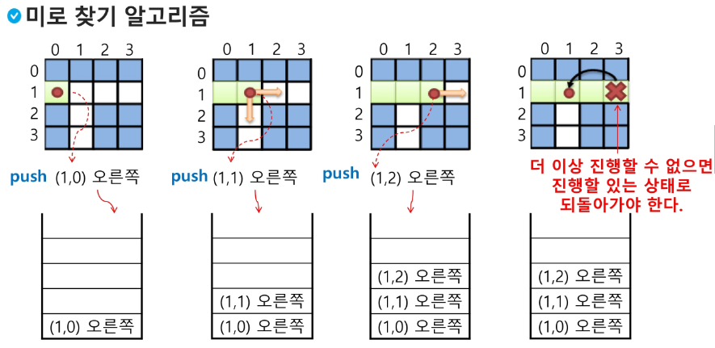
내가 생각했을 때의 유망한 부분에 대한 목록 만듦
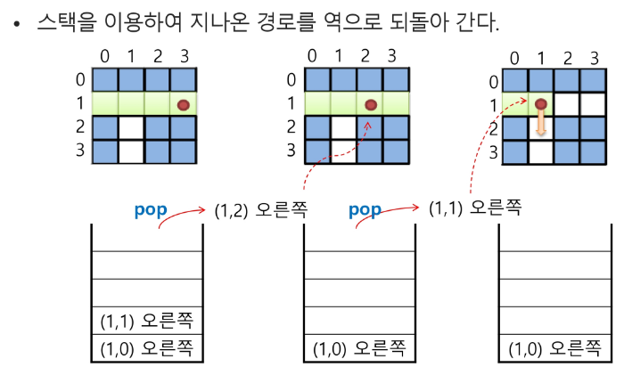

#### 예시2 : n-Queen
- 체스판에 퀸을 놓을 수 있는 자리의 수 -> 깊이우선탐색은 시간초과 가능성
```pseudo
def checknode(v):
    if promising(v):
        if there is a solution at v:
            write the solution
        else:
            for u in each child of v:
                checknode(u)
```
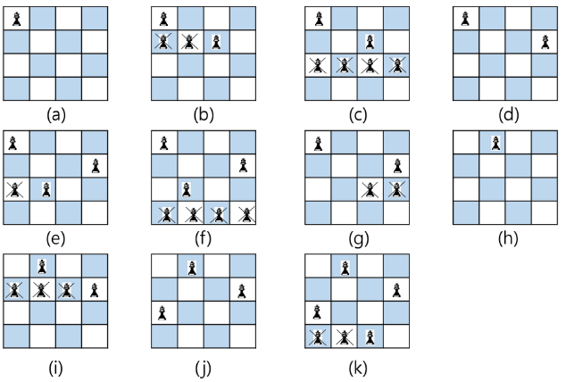

#### 상태 공간 트리
- n-Queen 문제를 상태 공간 트리로 접근
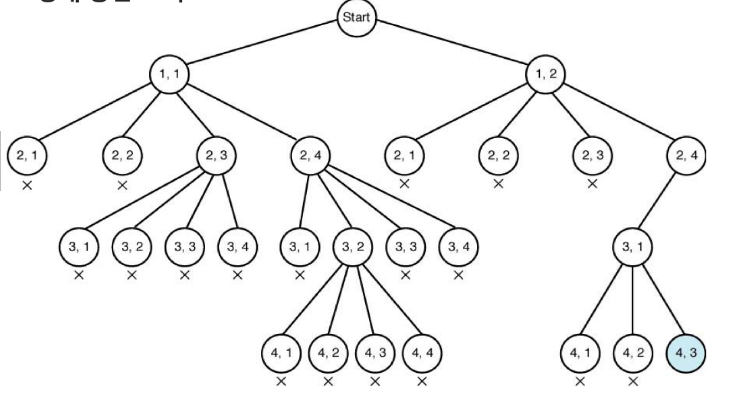

## 부분집합
- powerset: 공집합과 자기 자신을 포함한 모든 부분집합, 2**n개의 원소

```python
# loop 활용
bit = [0, 0, 0, 0]
for i in range(2):              # 0번째 원소
    bit[0] = i
    for j in range(2):          # 1번째 원소
        bit[1] = j
        for k in range(2):      # 2번째 원소
            bit[2] = k
            for m in range(2):  # 3번째 원소
                bit[2] = m
                print(bit)
```

### 백트래킹 활용한 알고리즘
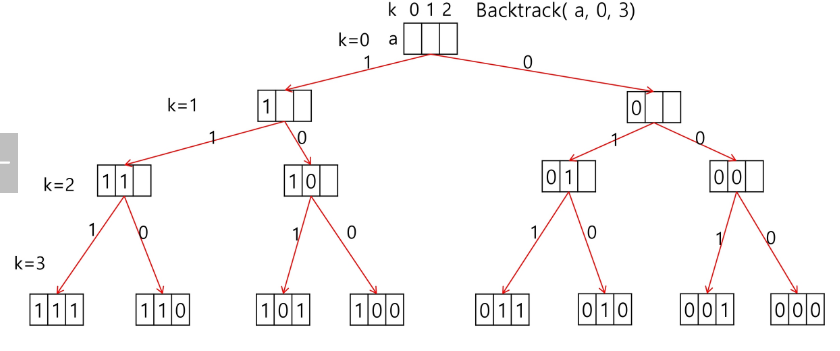

```python
def backtrack(a,k,n): # a: 주어진 배열, k: 결정할 원소(배열 내 인덱스), n: 원소 개수 --> level
    c = [0] * MAXCANDIDATES # 최대 몇 개의 후보(branch)를 가질 수 있는지 저장

    if k == n: 
        process_solution(a, k) # 답이면 원하는 작업을 함
    else:
        # ncandidaes : 추천된 후보 수 --> 남은 branch 수 # c : 후보 추천 및 저장
        ncandidates = construct_candidates(a, k, n, c) # 첫 후보군은 3개
        for i in range(ncandidates):
            a[k] = c[i]
            backtrack(a, k + 1, n)

def construct_candidates(a, k, n, c): # ????
    c[0] = True
    c[1] = False
    return 2

def process_solution(a, k):
    for i in range(k):
        if a[i]:
            print(num[i], end="")
    print()

MAXCANDIDATES = 2
NMAX = 4
a = [0] * NMAX
num = [1, 2, 3, 4]
backtrack(a, 0, 3)
'''
1234
123
124
12
134
13
14
1
234
23
24
2
34
3
4


Process finished with exit code 0
'''
```

## 순열
- 가능한 모든 순서를 늘어놓는 것, 경우의 수 n!
- 조합, 부분집합, 순열을 분별할 것

예: 집합{1, 2, 3}에서 모든 순열을 생성하는 함수
```python
for i1 in range(1, 4):
    for i2 in range(1, 4):
        if i2 != i1: # 중복 제거
            for i3 in range(1, 4):
                if i3 != i1 and i3 != i2: # 중복 제거
                    print(i1, i2, i3)
```
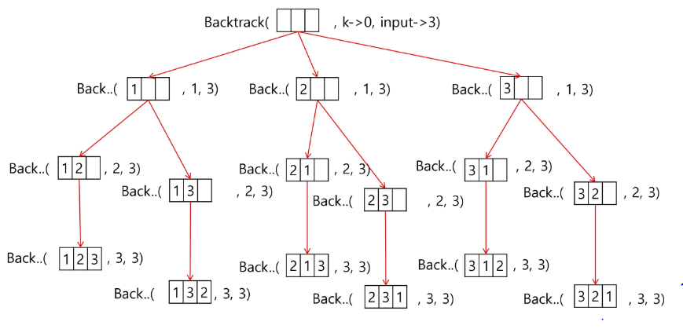

```python
def backtrack(a, k, n):
    c = [0] * MAXCANDIDATES

    if k == n:
        for i in range(0, k):
            print(a[i], end=" ")
        print()
    else:
        ncandidates = construct_candidates(a, k, n, c)
        for i in range(ncandidates):
            a[k] = c[i]
            backtrack(a, k+1, n)

def construct_candidates(a, k, n, c):
    in_perm = [False] * (NMAX + 1)
    # in_perm: 내가 후보군으로 줄 수 있는 것을 최대 크기 -> 예 n -> 4일때 [0, 1, 2, 3, 4]
    # +1 한 이유는 k번째 인덱스 맞춰주기 위함
    # 일종의 카운트 배열, 다만 사용 됐냐 아니냐 이므로 T/F
    # perm -> permutation
    # in_perm = used

    # a[0] ~ a[k-1] 중 한 번도 사용된 적이 없는 후보를 추천해야함
    for i in range(k):
        in_perm[a[i]] = True

    ncandidates = 0
    for i in range(1, NMAX + 1):
        if in_perm[i] == False: # 해당 요소가 사용된 적 있는지 -> 모든 사용한 적 없는 배열에서
            c[ncandidates] = i # 사용된 적 없는 요소를 넣어줌
            ncandidates += 1 # 추천된 후보 갯수 +1
    return ncandidates

MAXCANDIDATES = 3
NMAX = 3
a =[0] * NMAX
backtrack(a, 0, 3) # a: 후보군 부를 배열, 0: 시작점, 3: level
```

## 가지치기(Prunning)

```python
# 부분집합의 합
def f(i, K):    # bit[i]를 결정하는 함수
    if i == K : # 모든 원소에 대해 결정하면
        s = 0   # 부분집합의 합을 저장
        for j in range(K):
            if bit[j]: # 0이 아니면 -> 0이 아닌 모든 것이 참이므로
                print(a[j], end = " ") # 같은 부분집합 원소 한 행에
                s += a[j]
        print(' : ', s) # 줄바꾸기
    else: # i를 쓸 때 아닐 때를 모두 구함
        # bit[i] = 1
        # f(1+i, K)
        # bit[i] = 0
        # f(1+i, K)
        for j in [1, 0]:
            bit[i] = j
            f(i+1, K)


N = 3
a = [1, 2, 3]   # 주어진 원소의 집합
bit = [0] * N   # 원소의 포함여부를 표시하는 배열

f(0, N)         # N개의 원소에 대해 부분집합을 만다는 합수


'''
1 2 3  :  6
1 2  :  3
1 3  :  4
1  :  1
2 3  :  5
2  :  2
3  :  3
 :  0
'''

```

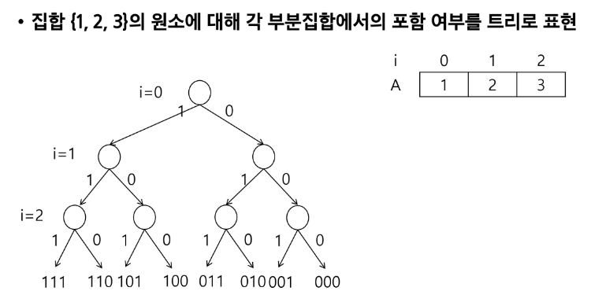

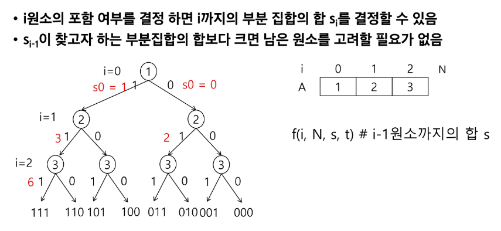

bit[i] 가 1 또는 0이면
-> 포함할지 안 할지가 결정이 되면 그때까지의 부분집합의 합을 구할 수 있음

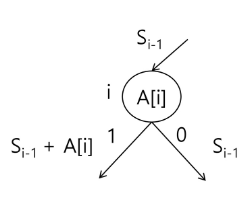

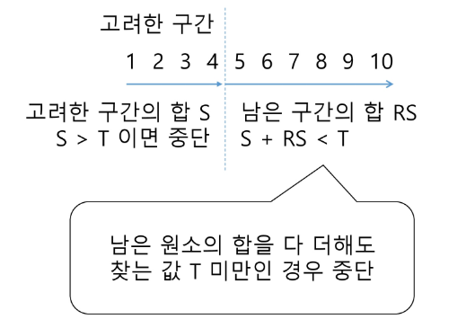

```py
# i-1원소까지 고려한 합 s, 찾으려는 합 t

f(i, N, s, t):
        if s == t # i -1원속까지의 합이 찾는 값인 경우 -> 돌아가
        elif i == N # 모든 원소에 대해 고려가 끝난 경우 -> 못 찾음
        elif s > t # 지난 경우
        elif s + rs < T # 남은 구간의 합이 목표치보다 낮은 경우
        else       # 남은 원소가 있고 s < t인 경우
            subset[i] = 1
            f(i+1, N, s+A[i], t) # i 포함 -> 이전까지의 합에 합을 더함
            subset[i] = 0
            f(i+1, N, s, t) # i 원소 미포함
```

- 가지치기 연습문제

```python
# {1,2,3,4,5,6,7,8,9,10} 중 원소의 합이 10인 부분집합
def f(i, k, s, t): # i: 원소, k 집합의 크기, s -> i-1까지의 합, t: 목표
    global cnt
    global fcnt
    fcnt += 1
    if s > t:
        return
    if s == t:
        cnt += 1
        return
    if i == k: # 다 돌았을 때, 모든 원소 고려
        return
    else:
        bit[i] = 1
        f(i+1, k, s + A[i], t)
        bit[i] = 0
        f(i + 1, k, s, t)

N = 10
A = [i for i in range(1, N+1)]

key = 10 # 찾으려 하는 합계 값
cnt = 0 # 합이 key와 같은 경우인 부분집합의 수
bit = [0] * N
fcnt = 0 # 총 순회 횟수
f(0,N,0,key)
print(cnt, fcnt) # 10 349
# 만약 가지치기 안 했으면 2047ㄴ
```

- 참고: [1, 2, 3] 의 모든 요소를 사용한 순열
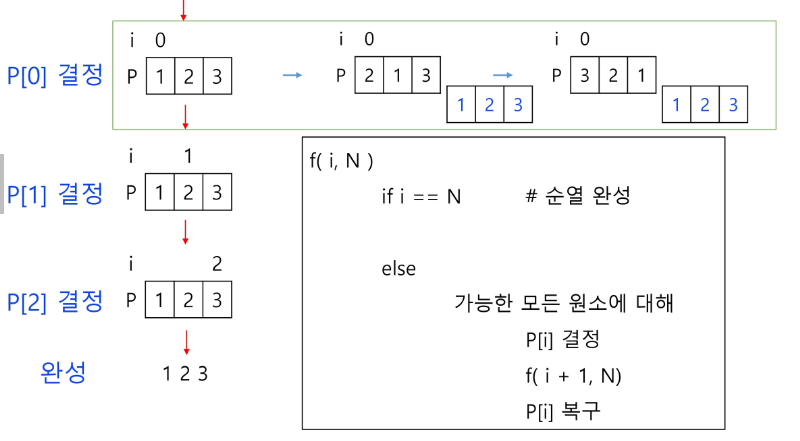


***부분집합***
1. 완전탐색 - 재귀호출 이용, 실전보다는 학습용으로 추천

path 등록 -> path와 원래 배열 연결

2. Binary Counting - 2진수, 비트연산 이용
집합의 총 갯수 -> 2**n ==> 1<<n을 통해 빠르게 구할 수 있음 -> "<<" 해당 진수에서 칸을 옮겨버림


```python
# 문제 : A, B, C로 만들 수 있는 부분집합을 바이너리 카운팅으로 풀기
arr = ['A', 'B', 'C']
n = len(arr)

def get_sub(tar): # tar: 출력하고자 하는 십진수(부분집합의 경우의 수)
    for i in range(n): #집합 원소 갯수만큼
        if tar & 0x1: # 0x1 --> 16진수, 고정(00001)
            print(arr[i], end="")
        tar >>= 1 # target을 오른쪽으로 한 번씩 밀기, 검사를 마친 한 자리 제거

for tar in range(0, 1 << n):
    print('{', end="")
    get_sub(tar)
    print('}')

# 도전문제
arr = ['A','B','C','D','E']
n = len(arr)

# 총 몇 개의 bit가 1로 되어있는지 확인하는 함수
def get_sub(tar):
    cnt = 0
    for i in range(5):
        if tar & 0x1:
            cnt += 1
            # print(arr[i], end="")
        tar >>= 1 # 검사를 마친 후 자리 제거
    return cnt

result = 0
for tar in range(0, 1 <<n):
    if get_sub(tar) >=2 : #bit가 2개 이상 1일이라면
        result += 1
print(result)
```

***조합***

- 조합(combination): 서로 다른 n개의 원소 중 r개를 순서없이 골라 낸 것

{A,B,C,D,E} 중 3명을 뽑을 수 있는 경우
ABC
ABD
ABE
ACD
ACE
ADE
BCD
BCE
BDE
CDE


```python
## 조합

arr = ['A','B','C','D','E']

# level: n, branch: 최대 5개

for a in range(5):
    start1 = a+1
    for b in range(start1, 5):
        start2 = b + 1
        for c in range(start2, 5):
            print(arr[a], arr[b], arr[c])


# 다섯 명 중 n 명 뽑는다 -> branch = 5, level = n

path = []
n = 3
def run(lev, start):
    if lev == n:
        return

    for i in range(start, 5):
        path.append(arr[i])
        run(lev + 1, i + 1) # 중첩 for 문 느낌
        path.pop()

run(0,0)
```


```python
1. 완전탐색(중복순열)
# branch -> 2 (뽑거나 안 뽑거나), level -> n(집합의 원소와 갯수


# 2. binary counting
# n개의 원소를 뽑는 방법 -> 2**n
# 1 << n == 2 ** n

# 문제 : A, B, C로 만들 수 있는 부분집합을 바이너리 카운팅으로 풀기
arr = ['A', 'B', 'C']
n = len(arr)

def get_sub(tar): # tar: 출력하고자 하는 십진수(부분집합의 경우의 수)
    for i in range(n): #집합 원소 갯수만큼
        if tar & 0x1: # 0x1 --> 16진수, 고정(001)
            print(arr[i], end="")
        tar >>= 1 # target을 오른쪽으로 한 번씩 밀기, 검사를 마친 한 자리 제거

for tar in range(0, 1 << n):
    print('{', end="")
    get_sub(tar)
    print('}')

# 도전문제
arr = ['A','B','C','D','E']
n = len(arr)

# 총 몇 개의 bit가 1로 되어있는지 확인하는 함수
def get_sub(tar):
    cnt = 0
    for i in range(5):
        if tar & 0x1:
            cnt += 1
            # print(arr[i], end="")
        tar >>= 1 # 검사를 마친 후 자리 제거
    return cnt

result = 0
for tar in range(0, 1 <<n):
    if get_sub(tar) >=2 : #bit가 2개 이상 1일이라면
        result += 1
print(result)


## 조합

arr = ['A','B','C','D','E']

# level: n, branch: 최대 5개

for a in range(5):
    start1 = a+1
    for b in range(start1, 5):
        start2 = b + 1
        for c in range(start2, 5):
            print(arr[a], arr[b], arr[c])


# 다섯 명 중 n 명 뽑는다 -> branch = 5, level = n

path = []
n = 3
def run(lev, start):
    if lev == n:
        return

    for i in range(start, 5):
        path.append(arr[i])
        run(lev + 1, i + 1) # 중첩 for 문 느낌
        path.pop()

run(0,0)

# 주사위 던지기
# 주사위 N 개를 던져서 나올 수 있는 모든 조합 출력
# level: n개, branch: 6


arr = [1, 2, 3, 4, 5, 6]
n = 3
path = []

def run(lev, start):
    if lev == n:
        print(path)
        return

    for i in range(start, 6):
        path.append(arr[i])
        run(lev+1, i)
        path.pop()

run(0, 0)

## arr 없는 버전
n = 3
path = []

def run(lev, start):
    if lev == n:
        print(path)
        return

    for i in range(start, 7):
        path.append(i)
        run(lev+1, i)
        path.pop()

run(0, 1)
```
