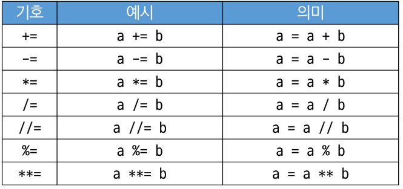
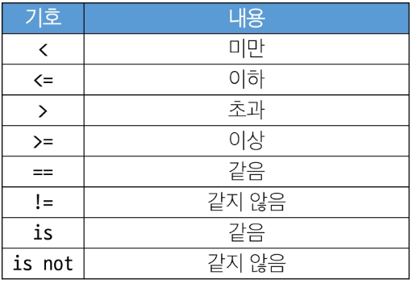

SWEA - Learn - Course - 파이썬(linked list 제외)

- 알고리즘 : 문제를 해결하기 위한 절차나 방법
  - 컴퓨터 분야에서 알고리즘을 표현하는 방법: 의사코드(Pseudocode), 순서도

- 좋은 알고리즘의 요건
  - 정확성
  - 작업량: 얼마나 적은 연산
  - 메모리 사용량
  - 단순성
  - 최적성: 개선할 여지 없는지

- 시간복잡도(Time Complexity): 작업량을 표현할 때 사용
  - 실제 걸리는 시간 측정
  - 실행되는 명령문의 개수 계산


- 빅-오(O) 표기법(Big-O Notation; O(n)): 최고차항에 대한 식에 대해 계수를 제거해서 표현하는 값
- n개의 데이터를 입력받아 각 데이터에 1증가 시킨 후 출력할 경우의 시간복잡도? : O(n)  (n개의 데이터에 모두 접근)


- 파이참 디버깅
  원하는 위치에 breaking point 부여 - f11로 함수 안으로 들어감 - step over 활용하여 내부 순환

# Array

- 배열: 일정한 "자료형"의 변수들을 하나의 이름으로 열거하여 사용하는 자료구조


- 배열의 경우 실제 메모리 상에서 값이 순서대로 위치 함.(배열이 아니면 메모리상에서 임의로 배정)

## 배열의 필요성

1. 프로그램 내에서 여러 개의 변수가 필요할 때, 일일이 다른 변수명을 이용하여 자료에 접근하는 것은 비효율적일 수 있음.
2. 배열을 사용하면 하나의 선언을 통해서 둘 이상의 변수를 선언할 수 있음
3. 단순히 다수의 변수 선언을 의미하는 것이 아니라, 다수의 변수로는 하기 힘든 작업을 배열을 활용해 쉽게 할 수 있다.

## 1차원 배열
### 1. 1차원 배열 선언
- 별도의 선언 방법이 었으면 변수에 처음 값을 할당할 때 생성
- 선언 방법
  - Arr = list()
  - Arr = []
  - Arr = [1, 2, 3]
  - Arr = [0] * 10
- append의 경우 계산하는데 시간이 오래 걸림 -> 크기가 커질 수록 속도가 느림

### 2. 1차원 배열의 접근
- Arr[0] = 10
- Arr[idx] = 20

- 예시: 입력받은 정수를 1차원 배열에 저장하기
    첫 줄에 양수의 개수 N이 주어진다. (5 <= N <= 1000)
    다음 줄에 빈칸으로 구분된 N개의 양수 Ai가 주어진다. (1 <= Ai <= 1000000)

```python
N = int(input())
arr = list(map(int,input().split()))
```

#### 연습문제
1. N개의 양의 정수에서 가장 큰 수와 가장 작은 수의 차이를 출력

[ 입력 ]

첫 줄에 테스트 케이스의 수 T가 주어진다. (1 <= T <= 50)
각 케이스의 첫 줄에 양수의 개수 N이 주어진다 (5 <=  ㅡ>)

[ 출력 ]


[pseudocode]
가장 큰 값  = max_v
모든 값과 max_v를 비교해서 항상 큰 값
-> 가장 앞 값으로 초기화 후 비교
가장 작은 값 = min_v

max_v <- arr[0]
for i : 1 -> N - 1
    if max_v < arr[i]
        max_v <- arr[i]
print(max_v);

min_v <- arr[0]
for i : 1 -> N - 1
    if min_v > arr[i]
        min_v <- arr[i]
print(min_v);

2. Gravity
   옆에 나보다 작은 값의 갯수 -> 가장 큰 값 반환


## 정렬

- 정렬: 2개 이상의 자료를 특정 기준에 의해 작은 값부터 큰 값 또는 그 반대의 순서대로 재배열하는 것

### 정렬의 종류
- 버블 정렬 (Bubble Sort)
- 카운팅 정렬 (Counting Sort)
- 선택 정렬 (Selection Sort)
- 퀵 정렬 (Quick Sort)
- 삽입 정렬 (Insertion Sort)
- 병합 정렬 (Merge Sort)

### 1. 버블 정렬(Bubble Sort)
- 버블 정렬 : 인접한 두 개의 원소를 비교하며 자리를 계속 교환하는 방식

- 정렬 과정
  1. 첫 번째 원소부터 인접한 원소끼리 자리를 교환하면서 맨 마지막 자리까지 이동
  2. 한 단계가 끝나면 가장 큰 원소가 마지막 자리로 정렬
  3. 교환하며 자리를 이동하는 모습이 물 위에 올라오는 거품과 같다고 해서 버블 정렬

- 시간 복잡도: O(n**2)






풀이 시 기준 인덱스가 있어야 함(비교하는 기준)

```
pseudocode

BubbleSort(a, N)
0 -> N-1
0 -> N-2
...
0 -> 1

    for i : N-1 -> 1
        for j : 0 -> i-1 # 구간의 끝 보다는 1 작음 # n-1 개
            if a[j] > a[j+1]: n 개
                a[j] = a[j+1]
```

```python
def BubbleSort(a, N):
    for i in range(N-1, 0, -1): # 몇 번째 시도? 
        for j in (0, i): # 몇 번 시도? 
            if a[j] > a[j+1]:
                a[j], a[j+1] = a[j+1], a[j] # 비교 후 교체
```

### 2. 카운팅 정렬

- 카운팅 정렬: 항목들의 순서를 결정하기 위해 각 항목이 몇 개씩 있는지 세는 작업을 하여, 선형 시간에 정렬하는 효율적인 알고리즘
- 시간 복잡도 : O(n + k)
  n: 리스트 길이 / k: 정수의 최댓값

#### 카운팅 정렬의 제한사항

- 정수나 정수로 표현할 수 있는 자료에 대해서만 가능
  각 항목의 발생 횟수를 기록하기 위해, 정수 항목으로 인덱스되는 카운트들의 배열 사용하기 때문
- 카운트들을 위한 충분한 공간을 할당하려면 집합 내의 큰 정수를 알아야 함

#### 카운팅 정렬 과정
1. 빈 배열 만들기
2. DATA에서 각각의 갯수 빼온 후 COUNT에 저장
3. 다시 순회하며 TEMP에 Data를 순서대로 정렬하여 정렬된 결과 저장


--> 앞 뒤로 훑어 TEMP 배열을 반환하는 것이 최종

* 빈 배열 작성 시 크기를 정한 배열 생성 습관 가지기

- Data에서 각 항목들의 발생 회수를 세고, 정수 항목들로 직접 인덱스 되는 카운트베열 counts에 저장한다.

카운팅을 어디다 기록할 지를 먼저 생각
-> 카운트의 배열을 먼저 준비 -> 찾고자하는 항목의 갯수 만큼의 요소로 배열
counts = [0] * 5


해당 횟수가 늘 때마다, count[i] += 1

- for문으로 data 순회하여 카운트 배열에 반영

* for i in data -> i or j와 같은 변수는 값 자체를 가지고 올 때는 사용을 덜 하는 게 좋음, 인덱스가지고 올 때 주로 사용하기

- 정렬된 집합에서 각 항목의 앞에 위치할 항목의 개수를 반영하기 위해 counts의 원소 조정


현재까지의 갯수를 더하기 위해 counts 조정

i까지의 누적 개수 저장
for i : 1 -> N - 1
counts[i] <- counts[i-1] + counts[i]
counts[i] += counts[i-1]

- counts[1]을 감소시키고 Temp에 1을 삽입한다.


정렬된 결과를 저장하기 위한 Temp

가장 마지막 원소부터 처음으로 순회
1까지의 값은 총 몇 개 있었지? -> COUNTS에서 총 4개 => 각각 몇 개인지는 모르겠지만, 시작점에서 1이 있었을 때, 적어도 하나의 1은 있었을 것 -> TEMP에 적어도 4번째 숫자는 1이라는 것이 확정적임

카운트의 1 하나를 TEMP에 하나 배치 => COUNTS 1 감소, TEMP 1 증가


4가 나올 경우 적어도 1개 이상의 4가 있으므로 4를 가장 마지막 배치


2는 적어도 하나 있기 때문에 5번에 2 집어 넣음


 * 역순으로 순회하는 이유: 뒤에있는 데이터의 인덱스를 뒤에 두기 위함 stable 정렬


```python
DATA = [0, 4, 1, 3, 1, 2, 4, 1]
COUNTS = [0] * 5                # DATA가 0~4까지의 정수

N = len(DATA)                   # DATA의 크기
TEMP = [0] * N                  # 정렬 결과 저장

# 1단계 : DATA 원소 별 개수 세기
# DATA의 원소 x를 가져와서 COUNTS[x]에 개수 기록
for x in DATA:                  # N번 반복
    COUNTS[x] += 1              # N번 반복

# 2단계 : 각 숫자까지의 누적 개수 구하기
for i in range(1, 5):           # COUNTS[1] ~ COUNTS[4]까지의 누적 개수 #k 번 반복
    COUNTS[i] = COUNTS[i-1] + COUNTS[i] # k번 반복

# 3단계 : DATA의 맨 뒤부터 앞으로 순회하여 TEMP에 정렬
for i in range(N-1, -1, -1):    # n-1 ~ 0까지             # N번 반복
    COUNTS[DATA[i]] -= 1 # COUNTS에서 i의 누적 개수 하나 감소 # N번 반복
    TEMP[COUNTS[DATA[i]]] = DATA[i]                       # N번 반복

print(*TEMP) # 언패킹 하여 결과 확인

## 시간복잡도 O(5n + 2k)
```

#### 버블과 카운팅의 비교

- 버블정렬 : 코드가 간결함, 복잡도가 높음
- 카운팅정렬 : 코드가 어렵지만 복잡도가 낮음
    카운팅에서의 k도 제약이 있음, 효율이 좋으나 항상 쓸 수 없음(100만개 정도까진 돌아 감)


### 3. 완전 검색(Exhaustive Search)

- 문제의 해법으로 생각할 수 있는 모든 경우의 수를 나열하고 확인하는 기법
- Brute-force 혹은 generate-and-test 기법이라고도 함
- 모든 경우의 수를 테스트한 후 최종 해법 도출
- 일반적으로 경우의 수가 작을 때 유용
- 수행 속도는 느리지만 해답을 찾아내지 못할 확률이 작음
- 문제 해결 시 완전 검색 후 다른 알고리즘으로 성능 개선을 하는 것이 좋음


#### 완전 검색을 활용한 접근
  1) 고려할 수 있는 모든 경우의 수 생성
  2) 해답 테스트
  3) 순열(Permutation)
      - 순열 생성 함수
      - nPr = n! / (n-r)!
        
  ```python
  for i1 in range(1, 4):
    for i2 in range(1, 4):
      if i2 != i1:
        for i3 in range(1, 4):
          if i3 != i1 and i3 != i2:
            print(i1, i2, i3)
  ```

### 4. Greedy Algorithm
- 최적해를 구하는 데 사용되는 근시안적인 방법
- 여러 경우 중 하나를 결정해야 할 때마다 그 순간에 최적이라고 생각되는 것을 선택해 나가는 방식
- 각 선택의 시점에서 이루어지는 결정은 지역적으로 최적이지만, 최종적인 해답이 최적이라고 보기는 어려움
- 머릿속에 떠오르는 생각을 검증 없이 구현하면 Greedy 접근이 됨

#### Greedy Algorithm의 동작 과정
- 해 선택: 현재 상태에서 부분 문제의 최적해를 구하고 부분해집합(Solution Set)에 추가한다.
- 실행 가능성 검사: 새로운 부분해 집합이 실행 가능한 지를 확인(문제의 제약 조건 위번 검사)
- 해 검사: 새로운 부분해 집합이 문제의 해가 되는지 확인, 아니라면 해 선택부터 다시

### 문제 예시

#### 거스름돈 줄이기
- 어떻게 하면 손님에게 거스름돈으로 주는 지폐와 동전의 개수를 최소한으로 줄일 수 있을까?
- 1) 해선택: 큰 단위 부터 거스름돈
- 2) 실행가능성: 실제 거스름돈보다 거스름돈으로 줄 화폐단위가 큰지 아닌지를 검사
- 3) 해 검사: 실제 거스름돈과 계산한 거스름돈의 일치를 확인

#### Baby-gin Game
- 0 ~ 9 사이의 숫자카드에서 임의의 카드 6장을 뽑았을 때, 3장의 카드가 연속적인 번호를 갖는 경우를 run, 3장의 카드가 동일한 번호를 갖는 경우를 triplet
- 6장의 카드가 run과 triplet로만 구성된 경우를 baby-gin으로 부른다.
- 6자리 숫자를 받아 baby-gin 여부를 판단하는 프로그램 작성

1) 완전 검색
2) greedy

```python

```


#### 참고: 문자열로 숫자를 제시할 경우 각각의 숫자로 저장하는 방법(띄어서 입력할 필요 x)
예: 4 4 4 3 4 5 -> 444345
```python
data = list(map(int,input()))
```

