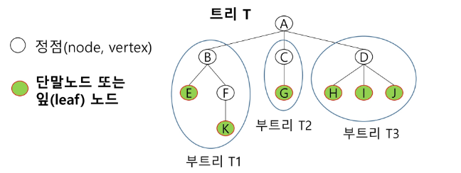
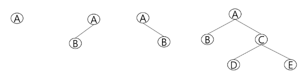

# Tree

## 트리의 개념
- 비선형 구조
- 원소들 간에 1:n 관계를 가지는 자료 구조
- 원소들 간에 계층관계를 가지는 계층형 자료구조
- 상위 원소에서 하위 원소로 내려가면서 확장되는 트리 모양의 구조

<선형/비선형>
큐, 스택, 덱, 연결리스트
=> 선형구조
딕셔너리, set, 해쉬, 그래프(트리 포함)
=> 비선형 구조, 순서X, idx 사용제한

* 그래프: 일상적으로 실제 세상의 데이터를 코드로 표현할 때,
대부분 연결 관계를 가짐, 이 때 이 관계를 표현하는 자료구조가 그래프
예: 주식 차트

### 트리의 정의
1) 한 개 이상의 노드로 이루어진 유한집합
2) 노드 중 최상위 노드를 root라고 함
3) 나머지 노드들은 n(>=0) 개의 분리 집합 T1~Tn으로 분리될 수 있음
4) T1~Tn은 각각 하나의 트리가 되며(*재귀적 정의*), 루트의 부 트리(subtree)라고 함

### 트리의 용어 정리
* node: 트리의 원소
* edge: 노드를 연결하는 선, 부모 노드와 자식 노드를 연결

* root node: 트리의 시작 노드
* sibling node: 같은 부모 노드의 자식 노드들
* 조상 노드: 간선을 따라 루트 노드까지 이르는 경로에 있는 노드 노들
* subtree: 부모 노드와 연결된 간선을 끊었을 때 생성되는 트리
* 자손 노드: 서브 트리에 있는 하위 레벨의 노드들
* 직계 관계: 1개의 간선으로 연결된 노드, 부모 또는 자손으로 구분

※ 형제 노드끼리의 연결은 할 수 없음 -> Cycle이 없음

※ 한 노드가 두 부모 노드를 가질 수 없음

* Degree
  - 노드의 차수: 노드에 연결된 자식 노드의 수
  - 트리의 차수: 트리에 있는 노드의 차수 중에서 가장 큰 값
  - 단말 노드(리프 노드): 차수가 0인 노드, 자식 노드가 없는 노드

* 높이
  - 노드의 높이: 루트에서 노드에 이르는 간선의 수(노드의 레벨)
  - 트리의 높이: 트리에 있는 노드의 높이 중에서 가장 큰 값, 최대 레벨

## 이진트리
- 모든 노드들이 최대 2개(0~2개 가능)의 서브트리를 갖는 특별한 형태의 트리
- left child node, right child node

### 정의