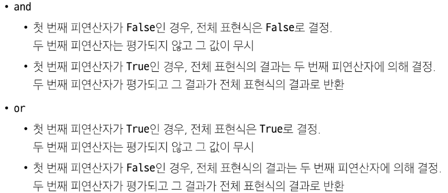

# GIT

## 기본 개념

### git을 쓰는 이유
1. git(로컬저장소) --- github, gitlab(원격저장소) 

2. bash를 쓰려고
    왜 개발자들은 bash를 더 많이 쓸까?
    bash는 위, 아래 방향키로 전에 입력했던 명령어들 재사용
    bash는 tab키를 이용해서 자동완성
    즉, **간편한 명령어**와 **편리한 개발환경** 보유

### Interface(리모컨과 유사)

1. GUI(graphic user interface)

2. TUI(Text User Interface)
    **Command Line Interface --- CLI**

### 깃의 영역
- local : working directory ->(add) staging area -> (commit) repository
    (push & pull/clone)
- github : remote repository

## 사용 방법

### 실행 방법
    git을 작동할 폴더에 들어가서 우클릭 -> open with bash

### 기본 문법
- git 시작 : git init
- git 종료 : rm -rf .git 또는 폴더에서 .git 폴더 삭제

- 파일 생성 : touch a.txt
- 파일 삭제 : rm a.txt
- 현재 디렉토리의 파일 목록 확인 : ls
- 폴더 생성 : mkdir new_folder
- 폴더 삭제 : rm -r new_folder

### cd 활용
- "~" : Home directory
- cd : 작업중인 디렉토리 변경
- cd ~ : 홈 디렉토리로 가기
- cd - : 뒤로 가기
- cd .. : 상위 디렉토리로 가기 
- cd ./~ => 상대 경로 (.이 현재 디렉토리를 의미)
    절대경로 : 전체 주소 작성
    상대경로 : 현재 디렉토리를 기준으로 상대적 위치
- start a.txt : 특정 문서 열기

### push 방법
- git config --global user.name "깃 사용자 이름"
- git config --global user.email "깃 메일 주소"
- git add . : 해당 디렉토리 모든 파일 add
- git status : commit할 준비 되었는지 확인(add 되었는지 확인)
- get remote add origin URL : origin이라는 이름으로 remote 연결
- get remote -v : remote 상태 확인
- git commit -m "" : 메시지와 함께 commit
- git push origin +master

### clone/pull 방법
- git clone URL : 클론
- git pull origin master : pull

# mark down 활용하기 

## 헤더 형식 알아보기

헤더 : #갯수에 따라 글씨 크기 다름
# 헤더적기 1
## 헤더적기 2
### 헤더적기 3
#### 헤더적기 4

---

## ordered / unordered 리스트

### ordered 리스트 적기
--> 순서가 있는 리스트

1. 엔터를 눌러보세요.
2. 엔터를 누르고 탭을 눌러보세요.
   1. 탭을 누르면 2-1
3. 두 번 엔터 누르면 3 

### unordered 리스트 적기
--> 순서가 없는 리스크

* -기호 또는 +기호 또는 *기호 모두 상관 없음
- 엔터를 여러번
+ *(애스터리스크 / asterisk)

마크다운에 한계가 있으므로, 깔끔하게만 작성한다고 생각

## 작성 기능

### 굵게 표현하기
- __굵은 글씨__
- **굵은 글씨**

    글 중간에 넣으려면 무조건 **로 사용

    글 중간에 **굵은 글씨** 넣기

### 기울기
- _기울기 글씨*
- *기울기 글씨*

    글 중간에 *기울기 글씨*를 넣기

### 굵게 및 기울임
- ___둘 다 하려면 이렇게___
_ 세 번 or * 세 번

### 취소선
- ~~물결물결~~

### 수평선
"-" 세 번
---

## 기타 작성 기능

### 체크리스크 만들기
- [X] 토스트
- [ ] 당근
- [ ] 양파
- [ ] 라면

### 코드블럭(중요!) --> 백틱 3번
- 프로그래밍 언어마다 다른 가독성으로 표시해줌.
- 다른 데서도 사용 많이함

```python
print('hello world')
```

```C
#include<studio.h>
int mail()
{

}
```

### 링크 URL 걸기
[네이버](https://www.naver.com)

markdown 공식 문서를 참고하여 추후 사용하면 댐

### 이미지 걸기
# Lee-jonghwa


7/12


# git 심화


```
git log --oneline : commit의 로그를 알 수 있으면서도 hash값을 알 수 있음 
```

**Hash 값(식별값)이란?**
- commit의 고유한 값 --> 변경 불가
- 커밋 메시지를 수정할 때 해시값 필요

## commit 메시지 수정

```
git commit --amend
```
- vim 에디터로 들어가짐
- 메시지 수정 후 저장 -> esc -> :wq(아래창 입력)
- 메시지 저장 X -> esc -> :q!
- 아무것도 수정하지 않았을 때 -> :q (수정사항이 있으면 사용 못함)

메시지는 수정 하지 않더라도 해시값은 변경됨(시간이 변경되기 때문)

** vim editor에서 instert키 누르면 아래 창에 insert 뜨고 메시지 수정하기 편해짐


## revert & reset

### git revert : 특정 커밋을 없던 일로 만듦

vim eidtor에서 종료하면 커밋과 함께 해당 파일도 삭제됨

```
git revert 없앨 commit hash 앞 네글자
```
(hash값은 --amend로 확인 후 작성)

주의 : revert한 commit은 없었던 일로 되는데, 기존 커밋은 삭제되지 않고 새로운 커밋 작성이 됨
--> git log로 확인


### git reset : 이전 commit으로 되돌리기

#### 1. --soft

    : commit에 기록된 내역을 삭제하나 staging area에 남아 있음(폴더에서 add가 된 상태)
    즉, 해당 commit까지 commit 내역을 삭제하고 add 해둠

```
git reset --soft 해시값
```

#### 2. --mixed

    : commit에 기록된 내역을 삭제하나 working directory에 남아 있음(폴더에만 남은 상태)
    즉, 해당 commit까지 commit 내역을 삭제하고, 폴더에 파일을 남김

```
git reset --mixed 해시값
```

#### 3. --hard

    : commit에 기록된 내역을 모두 삭제
    즉, 해당 commit까지 commit 내역이 삭제되면서, 모든 상태를 초기화 함

```
git reset --hard 살릴 마지막 commit hash값
```


## staging area에서 working directory로 되돌리는 방법

### git 저장소에 commit이 없을 때
: 프레임워크를 커밋할 때 API를 넣거나 .gitignore을 하지 않았다면?!

```
git rm --cached 뺄 파일
```

### git 저장소에 commit이 있을 때

```
git restore --staged 뺄 파일
```


# Python Basic Syntax 1

## 참고 1 : VS코드 단축키
- 전체 블록 지정 : ctrl + a
- 한 줄 블록 지정 : ctrl + l
- 커서 이동 시 : Home, End
- 동시에 여러 개의 커서 생성 : alt + 마우스 왼쪽 / ctrl + alt + 방향키
- 한 줄 복사 붙여넣기 : alt + shift + 방향키 (드래그 필요 없음)
- 뒤로가기 : ctrl + z
- 앞으로가기 : ctrl + y, ctrl + shift + z
- 터미널 열기 : ctrl + j, ctrl + `
- 사이드바 열기 : ctrl + b
- 편집기 종료 : ctrl + w
- settings : ctrl + ,
- 찾기 : ctrl + f
- 전체 검색(폴더 내 파일 전체 검색) : ctrl + shift + f


## 참고 2 : 프로그래밍이란 ?

길찾기의 기준에서
길을 적어주는 것 : 프로그램 작성
그 길을 따라 가는 것 : 프로그램 실행
사거리에서 우회전 등 : 기초 연산
=> 더 복합적인 연산도 많음

**새 연산을 정의하고 조합해 유용한 작업 수행하여 문제를 해결하는 강력한 방법**

파이썬은 논리구조를 구현하는 데 유리함

### 인터프리터 -> 명령어를 기계어로 바꿔주는 역할
파이썬에서 알아서 함

#### 인터프리터 활용 방법

shell -> 한 번에 한 명령어 씩 입력(git bash와 유사)

git bash에서 $python -i로 하면 파이썬 할 수 있음
=> 단일 문장을 테스트 하긴 좋지만 여러 문장 하긴 어려움
=> 끝 땐 exit()

py파일 하기
파이썬 켤 때 위치를 설정할 필요 있음
```$ python 01-basic.py```
-> bash terminal에서 작동 시키는 법
하지만 경로가 바뀌기 때문에 실습시 잘 사용하지 X

#### 값, 표현식, 평가

3 + 5 = 8 일 때,
표현식은 3 + 5
값은 8
= 은 평가
평가는 순차적으로 진행되는 것이 원칙

- 문장(statement) : 실행 가능한 동작을 기술(조건문 등)

### Type : 어떤 종류인지, 어떻게 처리되어야 하는지 정의
타입은 값(피연산자)과 값에 적용할 수 있는 연산(연산자)으로 나뉨
=> 타입에 맞는 연산이 다르기 때문에 나뉘어야 각각에 맞는 연산을 할 수 있음

#### 시퀀스 타입
- 요소들의 순서가 있음(인덱싱 가능)
- 문자열(불변 시퀀스 타입) parsing의 형태로 문제 출제 가능성 있음(인덱스, 슬라이싱 등)


#### 비시퀀스 타입
- 요소들의 순서가 없음(인덱싱 불가)
- 알고리즘 문제 풀 때 거의 안 씀
- 길이를 알 수는 잆음


## 연산자
/, //, \% : 알고리즘 문제 풀 때 가장 많이 나오는 연산자


## 변수
변수 : 값을 참조(저장)하기 위한 이름
변수 할당 : 표현식을 통해 변수에 값을 저장

"=" : 할당연산자, 대입 연산자
a = 36.5
a : 변수
36.5 : 객체 -> 메모리 주소 값을 가지고 있음.

'할당문'의 순서는 뒤에서 앞으로 -> 값을 변수에 할당하다.
변수에 재할당(갈아끼움)을 할 수도 있음

## 객체(Object)
타입을 갖는 메모리 주소 내 값
-> 값이 들어있는 상자


### 할당문
값은 컴퓨터 내부 메모리에 저장됨.
변수는 그 메모리의 주소를 가지게 됨. => 변수는 값을 "참조"한다.
존재하는 경우에는 새 변수를 생성, 존재했던 변수라면 새로운 메모리 주소 가짐.

변수가 달라진다고 하더라도 값이 달라지진 않는다.(재할당이 필요함)

변수 -> 숫자로 시작할 수 없음

## Data Types

### int(integer)
- ***2진수(0b), 8진수(0o), 16진수(0x) 표현 가능***
  진수 별로 바꾸는 문제가 있을 수 있음. 중요!
- print(0b10) / print(0o30) / print(0x10)

### float
정확한 값이 아닌 실수에 대한 근삿값으로 표현
--> 유한 정밀도(무한대 숫자를 저장하기 어려움으로 인한 이유)
==> floating point rounding error(부동소수점 에러) : 실수를 2진수로 변환하는 과정에서 발생하는 오차
여러 모듈(decimal 등)을 활용해서 오차를 해결함

***양의 무한대, 음의 무한대***
양의 무한대 : float('inf')
음의 무한대 : float('-inf')

**ctrl + 매서드 클릭하면 해당 매서드의 설명 볼 수 있음**

지수를 사용
예 : 3.14 = 314e-2

## Sequence Types

#### 특징
- 순서 : 정렬과는 다름
- 인덱싱 : 순서에 대한 번호를 가지고 있음
- 슬라이싱 : 부분적인 값 추출 가능
- 길이 : 값의 개수(길이) 구할 수 있음
- 반복 : 반복문 사용

### str(string)
문자열 : 문자들의 순서가 있는 '변경 불가능한' 자료

#### Escape Sequence
일반적인 문법 규칙을 잠시 탈출

\와 함께 사용
- "\n" : 줄바꿈
- "\t" : 탭
- "\\" : 역슬래시
- "\'" : 작은 따옴표
- '\"' : 큰 따옴표

#### 포맷팅하는 3가지 방법
- % 연산자
- .format매서드
- f-string

``` 
name = input()
age = int(input())
height = float(input())

# %연산자
print('저의 이름은 %s이고, 나이는 %d세, 키는 %.2fcm 입니다' %(name, age, height))
# .format() 매서드
print('저의 이름은 {}이고, 나이는 {}세, 키는 {:.2f}cm 입니다'.format(name,age,height))
# f-string : 가장 많이 사용하는 방법
print(f'저의 이름은 {name}이고, 나이는 {age}세, 키는{height:.2f}cm 입니다')
#.nf : 소수점 n자리까지 표시
- f-string : 문자열에 파이썬 표현식의 값을 삽입 가능
```


```
bugs = 'roaches'
counts = 13
area = 'living room'

# Debugging roaches 13 living room
print(f'Debugging {bugs} {counts} {area}')
```

#### 문자열 시퀀스 특징
문자열 -> 하나의 문자가 아니라, 다섯개의 문자가 순서대로 나열된 것

```
my_str = 'hello'

# 인덱싱
print(my_str[1]) # e

# 슬라이싱
print(my_str[2:4]) # ll

# 길이 == 요소의 갯수
print(len(my_str)) # 5
```
**공백도 하나의 값으로 취급**


#### 인덱스
**파이썬은 다른 언어와 다르게 음수 인덱스를 허용함**

#### 슬라이싱
범위를 지정하여 해당 범위 값을 포함하는 새로운 시퀀스 생성

~이상, ~미만이라 생각하거나 문자를 자르는 선이라고 생각하면 좋음

- 특정 범위 지정하여 추출
```my_str[0:2]```
- 시작 범위만 지정하여 추출
```my_str[3:]```
- 끝 범위만 지정하여 추출
```my_str[:3]```
- step을 지정하여 추출
```my_str[0:5:2]```
=> 0 ~ 4까지 2칸 단위로 추출
- 음수를 사용하여 추출
```my_str[::-1]```

#### 변경 불가능한 문자열
문자열 값을 변경하는 시도를 하면 오류 뜸

```
my_str = 'hello'

my_str[1] = 'z'
```

이미 메모리에 하나의 문자열이 담겨있기 때문에, 바꾸는 게 불가능
--> 변수에 재할당 필요


### Python Style Guide
https://peps.python.org/pep-0008/

- 변수명을 최대한 직관적으로!
- 공백은 4칸
- 한 줄의 길이는 79자 제한
- _을 사용하여 함수, 변수, 속성 이름 작성 -> snake_case
- 함수 정의나 클래스 정의 등 블록 사이에는 빈 줄 추가


#### 구글링


검색어
- 영어로 검색 best
- 완벽한 문장이 아니어도 좋음, 키워드만 정확하게!

신뢰할 수 있는 출처
공식 문서
- 프로그래밍 언어 공식 문서 및 라이브러리 문서
커뮤니티 사이트
- Stack Overflow, GitHub Issues 등 개발자 커뮤니티

#### AI
- AI가 제시하는 솔루션의 가치를 확인하기 어려우므로, 기본 개념을 다지는 것은 필요함!
  스스로 다양한 문제 해결하려는 노력 필요
- ```논리적 사고력```과 ```문제해결 능력```이 중요
- 보조 수단으로서의 활용 방안 고민 필요
  
#### 주석
- 임시로 코드 비활성 (함수는 pass 많이 씀)
- ***다른 개발자나 자신에게 코드의 의도나 동작을 설명하는데 도움***

Python Tutor
공부할 때 사용하면 조음!


0716

### List

***list : 여러 개의 값을 순서대로 저장하는 변경 가능한 시퀀스 자료형***

#### 리스트 특징
- 0개 이상의 객체를 포함, 데이터 목록 저장
- []로 표기
- 어떤 자료형도 데이터로 저장할 수 있음
- 요소가 가변적임

***리스트 요소로 있는 리스트 안의 시퀀스도 인덱싱할 수 있음***

```
# 중첩된 리스트
my_list = [1, 2, 3, ['python', 'hello', 100]]
print(len(my_list))
print(my_list[3][1])
print(my_list[3][1][-1])

# 리스트는 가변
my_list = [1, 2, 3]
my_list[0] = 100
print(my_list) # [100, 2, 3]
```

### Tuple

***tuple : 여러 개의 값을 순서대로 저장하는 변경 불가능한 시퀀스 자료형***

#### tuple의 특징
- 0개 이상의 객체를 포함한 데이터 목록 저장
- ()로 표기
- 데이터는 어떤 자료형도 저장할 수 있음
- 하나의 요소만 가지고 있을 땐 (a,)로 표기해야함
  **쉼표가 없으면 int로 됨**
- 요소가 불변적임
- 재할당은 동일
- 튜플은 불변 특성을 사용해서 안전하게 여러개의 값을 전달, 그룹화, 다중할당 등에 주로 사용 ==> 파이썬 내부동작에 주로 사용되며 개발자가 직접 사용할 일은 잘 없음.
- 알고리즘 시 방향 배열할 때 종종 사용

```
x, y = (10, 20)

print(x)
print(y)

# 파이썬은 쉼표를 튜플 생성자로 사용하여 괄호는 생략 가능
x, y = 10, 20
```

방향 배열 활용 시
```
상하좌우 표현
dy = [-1, 1, 0, 0]
dx = [0, 0, 1, -1]

directions = [(0, 1), (0, -1), (1, 0), (-1, 0)]
```
### Range

***range : 연속된 "정수" 시퀀스를 생성하는 변경 불가능한 자료형***

#### range 표현
- range(시작 값, 끝 값, 증가 값)
- range(n) : 0부터 n-1까지 1씩 증가하는 숫자 시퀀스
  **range(n)은 숫자 n개를 생성하는 표현-> n은 빠짐**
- range(n, m) : n부터 m-1까지 1씩 증가하는 숫자 시퀀스
- range(n, m, s)
  1) n < m 
   n부터 m - 1까지 s씩 증가 (m 미포함)
  2) n > m
   n부터 m + 1까지 s씩 감소 (m 미포함)

#### range 특징
- 증가 값이 없으면 1씩 증가
- 증가 값이 음수이면 감소 / 양수이면 증가
- 증가 값이 0이면 에러
- 증가 값이 음수이면 시작 값 > 끝 값
- 증가 값이 양수이면 시작 값 < 끝 값

```
my_range_1 = range(5)
my_range_2 = range(1, 10)

print(my_range_1)  # range(0, 5)
print(my_range_2)  # range(1, 10)
```

## Non-sequence Types

### Dict

***dict : key-value 쌍으로 이루어진 "순서와 중복이 없는" "변경 가능"한 자료형***

#### dictionary 표현
- key는 변경 불가능한 자료형 사용
- value는 모든 자료형 사용
- {}로 표기

#### dictionary 특징
- key는 변경 불가
- key를 통해 value에 접근
- value는 모든 자료형 사용
- {}로 표기
- API 소통에서 기본적인 형태로 사용

#### 예제 : 중첩된 딕셔너리

```
my_dict = {
    'a1' : {'b1':1, 'b2':2, 'b3':3},
    'a2' : {'b1':4, 'b2':5, 'b3':6},
    'a3' : {'b1':7, 'b2':8, 'b3':9},
}

# 8을 출력할 때
print(my_dict['a3']['b2'])
print(my_dict.get('a3').get('b2'))
```

[국가1, 국가2, ... ,국가 108]
{국가명 : 국가1, 국가명 : 국가2, ...}

한국을 찾으세요

처음부터 순차적으로 갈 수 밖에 없음 -> 시간이 오래 걸림
딕셔너리를 활용하면 키로 검색하면 끝


### Set(집합자료형)

**set : 순서와 중복이 없는 변경 가능한 자료형**

#### set의 특징
- {}로 표현 -> dict와 겹치게 됨
  a = {}과 같이 빈 내용으로 생성하면 dict로 됨
- 수학에서의 집합과 동일한 연산 처리 가능
- 순서와 중복 x ==> 리스트의 중복 값 처리할 때 사용할 수 있으나, 순서는 다시 맞추어야 함

```
my_set_1 = set() # 빈 set 만들기
my_set_2 = {1, 2, 3}
my_set_3 = {1, 1, 1}
print(my_set_1)  # set()
print(my_set_2)  # {1, 2, 3}
print(my_set_3)  # {1}

# 합집합
print(my_set_1 | my_set_2)  # {1, 2, 3, 6, 9}
# 차집합
print(my_set_1 - my_set_2)  # {1, 2}
# 교집합
print(my_set_1 & my_set_2)  # {3}
```

#### 예시 : 로또 번호 6개 선택 코드
```
import random

lotto_set = set()
while len(lotto_set) < 6: # 중복은 사라지기 때문에 len() 사용
  number = random.randint(1, 45)
  #append와 유사
  lotto_set.add(number)
  #순서 상관 없고 중복 불가여야 하기 때문에 set로 활용

lotto_list = list(lotto_set)
print(sorted(lotto_list))
```

## Other Types

### None

- 값이 없음을 표현하는 자료형
- **비어있다는 뜻이 아님**
- 변수를 할당 했는데, 현재는 값이 없을 때 사용

```
variable = None
print(variable)  # None
```

### Boolean

boolean : 참(True)과 거짓(False)을 표현하는 자료형

- 비교 / 논리 연산의 평가 결과로 사용
- 조건 / 반복문과 주로 사용

```
bool_1 = True
bool_2 = False
print(bool_1)  # True
print(bool_2)  # False
print(3 > 1)  # True
print('3' != 3)  # True
```

## Collection

- 여러 개의 항목 또는 요소를 담는 자료 구조


### 불변과 가변의 차이
```
# mutable (가변)
my_list = [1, 2, 3]
my_list[0] = 100

# immutable (불변)
my_str = 'hello'
my_str[0] ='z'
```

## Type Conversion

한 데이터 타입을 다른 데이터 타입으로 변환하는 과정
암시적 형변환과 명시적 형변환으로 나뉨

### 암시적 형변환(Implicit Type Conversion)

파이썬이 자동으로 수행하는 형변환

#### 예시
- 정수와 실수의 연산에서 정수가 실수로 변환
- Boolean과 Numeric Type에서만 가능
```
print(3 + 5.0) # 8.0
print(True + 3) # 4
print(True + False) # 1
```

### 명시적 형변환(Explicit Type Conversion)

프로그래머가 직접 지정하는 형변환

#### 예시
- str -> int / float : 형식에 맞는 숫자만 가능
   ***(소수 int 하면 소수점 버림)***
```
print(int('1')) # 1
print(int('3.5')) # ValueError
print(int(3.5)) # 3
print(float('3.5')) # 3.5
```
- int / float -> str : 형식에 상관없이 가능

```
print(str(1) + '등') # 1등
```

## 연산자

### 산술 연산자


### 복합 연산자


### 비교 연산자


#### is 비교 연산자
- 메모리 내에서 같은 객체를 참조하는지 확인(값의 주소도 같아야 함)
- == 는 동등성(equality), is는 식별성(identity)
- 값을 비교하는 == 와 다름
- None 이나 Boolean을 비교할 때 많이 씀

```
# 비교 연산자
print(3 > 6)  # False
print(2.0 == 2)  # True
print(2 != 2)  # False
print('HI' == 'hi')  # False
print(1 == True)  # True

# SyntaxWarning: "is" with a literal. Did you mean "=="?
# ==은 값(데이터)을 비교하는 것이지만 is는 레퍼런스(주소)를 비교하기 때문
# 아래 조건은 항상 False이기 때문에 is 대신 ==를 사용해야 한다는 것을 알림
print(1 is True)  # False
print(2 is 2.0)  # False
print(0 == None) # False
print(1 == True)  # True
print(2 == 2.0)  # True
```

### 논리 연산자


### 단축평가

논리 연산에서 두 번째 피연산자를 평가하지 않고 결과를 결정하는 동작
두 번째 연산과 상관없이 결과가 동일할 때 해당

```
# 단축 평가

# 문자와 정수는 연산하는 방법이 다름
# "" == False

vowels = 'aeiou'

# and는 모두 True 여야 True -> 연산의 뒷 부분을 알아야 함.
 -> 앞이 True 면 뒤가 출력됨
# or은 하나만 True여도 True -> 앞이 True면 앞이 출력 => 단축 평가
#괄호 안 부터 평가 -> 'a' and 'b' -> 둘 다 값이 있으니 True로 평가됨. 나오는 건 'b'

#'b' in vowels로 처리 되므로 False

print(('a' and 'b') in vowels)  # False
print(('b' and 'a') in vowels)  # True

print(3 and 5)  # 5 -> 평가 5까지
print(3 and 0)  # 0 -> 평가 0까지
print(0 and 3)  # 0 --> 단축평가
# and 는 첫 값에서 false가 나오면 의미가 없어지므로 종료됨 --> 0에서 멈춤
print(0 and 0)  # 0 --> 단축평가

print(5 or 3)  # 5
# or 는 둘 중 하나가 True가 나오면 되므로 True가 나오면 멈춤 --> 5에서 멈춤
print(3 or 0)  # 3 --> 단축평가
print(0 or 3)  # 3
print(0 or 0)  # 0 --> 뒤의 0

print(7 and 3) # 3
print(7 and 0) # 0
print(0 and 7) # 0
print(5 or 3) # 5
print(0 or 3) # 3

#and 일 때는 앞이 False 일 때 전체 결과 False, 뒤의 조건 평가하지 않음 -> 단축평가
#or일 때는 앞이 True일 때 전체 결과 True, 뒤의 조건 평가하지 않음 -> 단축평가
```



#### 사용 이유
- 코드 실행을 최적화하고, 불필요한 연산을 피할 수 있도록 함.

### 멤버십 연산자
- 특정 값이 시퀀스나 다른 컬렉션에 속하는지 여부를 확인
- 딕셔너리의 경우는 key로 사용할 수 있음


### 시퀀스형 연산자


```
# 시퀀스형 연산자

print('Gildong' + ' Hong')  # Gildong Hong
print('hi' * 5)  # hihihihihi

print([1, 2] + ['a', 'b'])  # [1, 2, 'a', 'b']
print([1, 2] * 2)  # [1, 2, 1, 2]
```

#### 연산자의 우선순위


#### 복사 : 할당, 얕은 복사, 깊은 복사
```
# 1. 할당 : 원본 변경 x
list1 = [1, 2, 3, 4, 5]
list2 = list1
list2[0] = 5

print(id(list1),id(list2))
print(list1, list2)

# 2. 얕은 복사(copy()) : 객체 안에 객체가 있는 경우 원본 변경 o(메모리 주소 같음) 객체 자체의 메모리주소는 다름
list1 = [1, 2, [3, 4]]
list2 = list1.copy()
list2[2][0] = 5

print(id(list1),id(list2))
print(id(list1[2]),id(list2[2]))
print(list1, list2)

# 3. 깊은 복사 (deepcopy()) : 원본 변경x, 메모리주소는 다름
import copy

list1 = [1, 2, [3, 4]]
list2 = copy.deepcopy(list1)
list2[2][0] = 5

print(id(list1),id(list2))
print(id(list1[2]),id(list2[2]))
print(list1, list2)


```