# GIT

## 기본 개념

### git을 쓰는 이유
1. git(로컬저장소) --- github, gitlab(원격저장소) 

2. bash를 쓰려고
    왜 개발자들은 bash를 더 많이 쓸까?
    bash는 위, 아래 방향키로 전에 입력했던 명령어들 재사용
    bash는 tab키를 이용해서 자동완성
    즉, **간편한 명령어**와 **편리한 개발환경** 보유

### Interface(리모컨과 유사)

1. GUI(graphic user interface)

2. TUI(Text User Interface)
    **Command Line Interface --- CLI**

### 깃의 영역
- local : working directory ->(add) staging area -> (commit) repository
    (push & pull/clone)
- github : remote repository

## 사용 방법

### 실행 방법
    git을 작동할 폴더에 들어가서 우클릭 -> open with bash

### 기본 문법
- git 시작 : git init
- git 종료 : rm -rf .git 또는 폴더에서 .git 폴더 삭제

- 파일 생성 : touch a.txt
- 파일 삭제 : rm a.txt
- 현재 디렉토리의 파일 목록 확인 : ls
- 폴더 생성 : mkdir new_folder
- 폴더 삭제 : rm -r new_folder

### cd 활용
- "~" : Home directory
- cd : 작업중인 디렉토리 변경
- cd ~ : 홈 디렉토리로 가기
- cd - : 뒤로 가기
- cd .. : 상위 디렉토리로 가기 
- cd ./~ => 상대 경로 (.이 현재 디렉토리를 의미)
    절대경로 : 전체 주소 작성
    상대경로 : 현재 디렉토리를 기준으로 상대적 위치
- start a.txt : 특정 문서 열기

### push 방법
- git config --global user.name "깃 사용자 이름"
- git config --global user.email "깃 메일 주소"
- git add . : 해당 디렉토리 모든 파일 add
- git status : commit할 준비 되었는지 확인(add 되었는지 확인)
- get remote add origin URL : origin이라는 이름으로 remote 연결
- get remote -v : remote 상태 확인
- git commit -m "" : 메시지와 함께 commit
- git push origin +master

### clone/pull 방법
- git clone URL : 클론
- git pull origin master : pull

# mark down 활용하기 

## 헤더 형식 알아보기

헤더 : #갯수에 따라 글씨 크기 다름
# 헤더적기 1
## 헤더적기 2
### 헤더적기 3
#### 헤더적기 4

---

## ordered / unordered 리스트

### ordered 리스트 적기
--> 순서가 있는 리스트

1. 엔터를 눌러보세요.
2. 엔터를 누르고 탭을 눌러보세요.
   1. 탭을 누르면 2-1
3. 두 번 엔터 누르면 3 

### unordered 리스트 적기
--> 순서가 없는 리스크

* -기호 또는 +기호 또는 *기호 모두 상관 없음
- 엔터를 여러번
+ *(애스터리스크 / asterisk)

마크다운에 한계가 있으므로, 깔끔하게만 작성한다고 생각

## 작성 기능

### 굵게 표현하기
- __굵은 글씨__
- **굵은 글씨**

    글 중간에 넣으려면 무조건 **로 사용

    글 중간에 **굵은 글씨** 넣기

### 기울기
- _기울기 글씨*
- *기울기 글씨*

    글 중간에 *기울기 글씨*를 넣기

### 굵게 및 기울임
- ___둘 다 하려면 이렇게___
_ 세 번 or * 세 번

### 취소선
- ~~물결물결~~

### 수평선
"-" 세 번
---

## 기타 작성 기능

### 체크리스크 만들기
- [X] 토스트
- [ ] 당근
- [ ] 양파
- [ ] 라면

### 코드블럭(중요!) --> 백틱 3번
- 프로그래밍 언어마다 다른 가독성으로 표시해줌.
- 다른 데서도 사용 많이함

```python
print('hello world')
```

```C
#include<studio.h>
int mail()
{

}
```

### 링크 URL 걸기
[네이버](https://www.naver.com)

markdown 공식 문서를 참고하여 추후 사용하면 댐

### 이미지 걸기
# Lee-jonghwa


7/12


# git 심화


```
git log --oneline : commit의 로그를 알 수 있으면서도 hash값을 알 수 있음 
```

**Hash 값(식별값)이란?**
- commit의 고유한 값 --> 변경 불가
- 커밋 메시지를 수정할 때 해시값 필요

## commit 메시지 수정

```
git commit --amend
```
- vim 에디터로 들어가짐
- 메시지 수정 후 저장 -> esc -> :wq(아래창 입력)
- 메시지 저장 X -> esc -> :q!
- 아무것도 수정하지 않았을 때 -> :q (수정사항이 있으면 사용 못함)

메시지는 수정 하지 않더라도 해시값은 변경됨(시간이 변경되기 때문)

** vim editor에서 instert키 누르면 아래 창에 insert 뜨고 메시지 수정하기 편해짐


## revert & reset

### git revert : 특정 커밋을 없던 일로 만듦

vim eidtor에서 종료하면 커밋과 함께 해당 파일도 삭제됨

```
git revert 없앨 commit hash 앞 네글자
```
(hash값은 --amend로 확인 후 작성)

주의 : revert한 commit은 없었던 일로 되는데, 기존 커밋은 삭제되지 않고 새로운 커밋 작성이 됨
--> git log로 확인


### git reset : 이전 commit으로 되돌리기

#### 1. --soft

    : commit에 기록된 내역을 삭제하나 staging area에 남아 있음(폴더에서 add가 된 상태)
    즉, 해당 commit까지 commit 내역을 삭제하고 add 해둠

```
git reset --soft 해시값
```

#### 2. --mixed

    : commit에 기록된 내역을 삭제하나 working directory에 남아 있음(폴더에만 남은 상태)
    즉, 해당 commit까지 commit 내역을 삭제하고, 폴더에 파일을 남김

```
git reset --mixed 해시값
```

#### 3. --hard

    : commit에 기록된 내역을 모두 삭제
    즉, 해당 commit까지 commit 내역이 삭제되면서, 모든 상태를 초기화 함

```
git reset --hard 살릴 마지막 commit hash값
```


## staging area에서 working directory로 되돌리는 방법

### git 저장소에 commit이 없을 때
: 프레임워크를 커밋할 때 API를 넣거나 .gitignore을 하지 않았다면?!

```
git rm --cached 뺄 파일
```

### git 저장소에 commit이 있을 때

```
git restore --staged 뺄 파일
```


# Python Basic Syntax 1

## 참고 1 : VS코드 단축키
- 전체 블록 지정 : ctrl + a
- 한 줄 블록 지정 : ctrl + l
- 커서 이동 시 : Home, End
- 동시에 여러 개의 커서 생성 : alt + 마우스 왼쪽 / ctrl + alt + 방향키
- 한 줄 복사 붙여넣기 : alt + shift + 방향키 (드래그 필요 없음)
- 뒤로가기 : ctrl + z
- 앞으로가기 : ctrl + y, ctrl + shift + z
- 터미널 열기 : ctrl + j, ctrl + `
- 사이드바 열기 : ctrl + b
- 편집기 종료 : ctrl + w
- settings : ctrl + ,
- 찾기 : ctrl + f
- 전체 검색(폴더 내 파일 전체 검색) : ctrl + shift + f


## 참고 2 : 프로그래밍이란 ?

길찾기의 기준에서
길을 적어주는 것 : 프로그램 작성
그 길을 따라 가는 것 : 프로그램 실행
사거리에서 우회전 등 : 기초 연산
=> 더 복합적인 연산도 많음

**새 연산을 정의하고 조합해 유용한 작업 수행하여 문제를 해결하는 강력한 방법**

파이썬은 논리구조를 구현하는 데 유리함

### 인터프리터 -> 명령어를 기계어로 바꿔주는 역할
파이썬에서 알아서 함

#### 인터프리터 활용 방법

shell -> 한 번에 한 명령어 씩 입력(git bash와 유사)

git bash에서 $python -i로 하면 파이썬 할 수 있음
=> 단일 문장을 테스트 하긴 좋지만 여러 문장 하긴 어려움
=> 끝 땐 exit()

py파일 하기
파이썬 켤 때 위치를 설정할 필요 있음
```$ python 01-basic.py```
-> bash terminal에서 작동 시키는 법
하지만 경로가 바뀌기 때문에 실습시 잘 사용하지 X

#### 값, 표현식, 평가

3 + 5 = 8 일 때,
표현식은 3 + 5
값은 8
= 은 평가
평가는 순차적으로 진행되는 것이 원칙

- 문장(statement) : 실행 가능한 동작을 기술(조건문 등)

### Type : 어떤 종류인지, 어떻게 처리되어야 하는지 정의
타입은 값(피연산자)과 값에 적용할 수 있는 연산(연산자)으로 나뉨
=> 타입에 맞는 연산이 다르기 때문에 나뉘어야 각각에 맞는 연산을 할 수 있음

#### 시퀀스 타입
- 요소들의 순서가 있음(인덱싱 가능)
- 문자열(불변 시퀀스 타입) parsing의 형태로 문제 출제 가능성 있음(인덱스, 슬라이싱 등)


#### 비시퀀스 타입
- 요소들의 순서가 없음(인덱싱 불가)
- 알고리즘 문제 풀 때 거의 안 씀
- 길이를 알 수는 잆음


## 연산자
/, //, \% : 알고리즘 문제 풀 때 가장 많이 나오는 연산자


## 변수
변수 : 값을 참조(저장)하기 위한 이름
변수 할당 : 표현식을 통해 변수에 값을 저장

"=" : 할당연산자, 대입 연산자
a = 36.5
a : 변수
36.5 : 객체 -> 메모리 주소 값을 가지고 있음.

'할당문'의 순서는 뒤에서 앞으로 -> 값을 변수에 할당하다.
변수에 재할당(갈아끼움)을 할 수도 있음

## 객체(Object)
타입을 갖는 메모리 주소 내 값
-> 값이 들어있는 상자


### 할당문
값은 컴퓨터 내부 메모리에 저장됨.
변수는 그 메모리의 주소를 가지게 됨. => 변수는 값을 "참조"한다.
존재하는 경우에는 새 변수를 생성, 존재했던 변수라면 새로운 메모리 주소 가짐.

변수가 달라진다고 하더라도 값이 달라지진 않는다.(재할당이 필요함)

변수 -> 숫자로 시작할 수 없음

## Data Types

### int(integer)
- ***2진수(0b), 8진수(0o), 16진수(0x) 표현 가능***
  진수 별로 바꾸는 문제가 있을 수 있음. 중요!
- print(0b10) / print(0o30) / print(0x10)

### float
정확한 값이 아닌 실수에 대한 근삿값으로 표현
--> 유한 정밀도(무한대 숫자를 저장하기 어려움으로 인한 이유)
==> floating point rounding error(부동소수점 에러) : 실수를 2진수로 변환하는 과정에서 발생하는 오차
여러 모듈(decimal 등)을 활용해서 오차를 해결함

***양의 무한대, 음의 무한대***
양의 무한대 : float('inf')
음의 무한대 : float('-inf')

**ctrl + 메서드 클릭하면 해당 매서드의 설명 볼 수 있음**

지수를 사용
예 : 3.14 = 314e-2

## Sequence Types

#### 특징
- 순서 : 정렬과는 다름
- 인덱싱 : 순서에 대한 번호를 가지고 있음
- 슬라이싱 : 부분적인 값 추출 가능
- 길이 : 값의 개수(길이) 구할 수 있음
- 반복 : 반복문 사용

### str(string)
문자열 : 문자들의 순서가 있는 '변경 불가능한' 자료

#### Escape Sequence
일반적인 문법 규칙을 잠시 탈출

\와 함께 사용
- "\n" : 줄바꿈
- "\t" : 탭
- "\\" : 역슬래시
- "\'" : 작은 따옴표
- '\"' : 큰 따옴표

#### 포맷팅하는 3가지 방법
- % 연산자
- .format매서드
- f-string

``` python
name = input()
age = int(input())
height = float(input())

# %연산자
print('저의 이름은 %s이고, 나이는 %d세, 키는 %.2fcm 입니다' %(name, age, height))
# .format() 매서드
print('저의 이름은 {}이고, 나이는 {}세, 키는 {:.2f}cm 입니다'.format(name,age,height))
# f-string : 가장 많이 사용하는 방법
print(f'저의 이름은 {name}이고, 나이는 {age}세, 키는{height:.2f}cm 입니다')
#.nf : 소수점 n자리까지 표시
- f-string : 문자열에 파이썬 표현식의 값을 삽입 가능
```


```python
bugs = 'roaches'
counts = 13
area = 'living room'

# Debugging roaches 13 living room
print(f'Debugging {bugs} {counts} {area}')
```

#### 문자열 시퀀스 특징
문자열 -> 하나의 문자가 아니라, 다섯개의 문자가 순서대로 나열된 것

```python
my_str = 'hello'

# 인덱싱
print(my_str[1]) # e

# 슬라이싱
print(my_str[2:4]) # ll

# 길이 == 요소의 갯수
print(len(my_str)) # 5
```
**공백도 하나의 값으로 취급**


#### 인덱스
**파이썬은 다른 언어와 다르게 음수 인덱스를 허용함**

#### 슬라이싱
범위를 지정하여 해당 범위 값을 포함하는 새로운 시퀀스 생성

~이상, ~미만이라 생각하거나 문자를 자르는 선이라고 생각하면 좋음

- 특정 범위 지정하여 추출
```my_str[0:2]```
- 시작 범위만 지정하여 추출
```my_str[3:]```
- 끝 범위만 지정하여 추출
```my_str[:3]```
- step을 지정하여 추출
```my_str[0:5:2]```
=> 0 ~ 4까지 2칸 단위로 추출
- 음수를 사용하여 추출
```my_str[::-1]```

#### 변경 불가능한 문자열
문자열 값을 변경하는 시도를 하면 오류 뜸

```python
my_str = 'hello'

my_str[1] = 'z'
```

이미 메모리에 하나의 문자열이 담겨있기 때문에, 바꾸는 게 불가능
--> 변수에 재할당 필요


### Python Style Guide
https://peps.python.org/pep-0008/

- 변수명을 최대한 직관적으로!
- 공백은 4칸
- 한 줄의 길이는 79자 제한
- _을 사용하여 함수, 변수, 속성 이름 작성 -> snake_case
- 함수 정의나 클래스 정의 등 블록 사이에는 빈 줄 추가


#### 구글링


검색어
- 영어로 검색 best
- 완벽한 문장이 아니어도 좋음, 키워드만 정확하게!

신뢰할 수 있는 출처
공식 문서
- 프로그래밍 언어 공식 문서 및 라이브러리 문서
커뮤니티 사이트
- Stack Overflow, GitHub Issues 등 개발자 커뮤니티

#### AI
- AI가 제시하는 솔루션의 가치를 확인하기 어려우므로, 기본 개념을 다지는 것은 필요함!
  스스로 다양한 문제 해결하려는 노력 필요
- ```논리적 사고력```과 ```문제해결 능력```이 중요
- 보조 수단으로서의 활용 방안 고민 필요
  
#### 주석
- 임시로 코드 비활성 (함수는 pass 많이 씀)
- ***다른 개발자나 자신에게 코드의 의도나 동작을 설명하는데 도움***

Python Tutor
공부할 때 사용하면 조음!


0716

### List

***list : 여러 개의 값을 순서대로 저장하는 변경 가능한 시퀀스 자료형***

#### 리스트 특징
- 0개 이상의 객체를 포함, 데이터 목록 저장
- []로 표기
- 어떤 자료형도 데이터로 저장할 수 있음
- 요소가 가변적임

***리스트 요소로 있는 리스트 안의 시퀀스도 인덱싱할 수 있음***

```python
# 중첩된 리스트
my_list = [1, 2, 3, ['python', 'hello', 100]]
print(len(my_list))
print(my_list[3][1])
print(my_list[3][1][-1])

# 리스트는 가변
my_list = [1, 2, 3]
my_list[0] = 100
print(my_list) # [100, 2, 3]
```

### Tuple

***tuple : 여러 개의 값을 순서대로 저장하는 변경 불가능한 시퀀스 자료형***

#### tuple의 특징
- 0개 이상의 객체를 포함한 데이터 목록 저장
- ()로 표기
- 데이터는 어떤 자료형도 저장할 수 있음
- 하나의 요소만 가지고 있을 땐 (a,)로 표기해야함
  **쉼표가 없으면 int로 됨**
- 요소가 불변적임
- 재할당은 동일
- 튜플은 불변 특성을 사용해서 안전하게 여러개의 값을 전달, 그룹화, 다중할당 등에 주로 사용 ==> 파이썬 내부동작에 주로 사용되며 개발자가 직접 사용할 일은 잘 없음.
- 알고리즘 시 방향 배열할 때 종종 사용

```python
x, y = (10, 20)

print(x)
print(y)

# 파이썬은 쉼표를 튜플 생성자로 사용하여 괄호는 생략 가능
x, y = 10, 20
```

방향 배열 활용 시
```python
상하좌우 표현
dy = [-1, 1, 0, 0]
dx = [0, 0, 1, -1]

directions = [(0, 1), (0, -1), (1, 0), (-1, 0)]
```
### Range

***range : 연속된 "정수" 시퀀스를 생성하는 변경 불가능한 자료형***

#### range 표현
- range(시작 값, 끝 값, 증가 값)
- range(n) : 0부터 n-1까지 1씩 증가하는 숫자 시퀀스
  **range(n)은 숫자 n개를 생성하는 표현-> n은 빠짐**
- range(n, m) : n부터 m-1까지 1씩 증가하는 숫자 시퀀스
- range(n, m, s)
  1) n < m 
   n부터 m - 1까지 s씩 증가 (m 미포함)
  2) n > m
   n부터 m + 1까지 s씩 감소 (m 미포함)

#### range 특징
- 증가 값이 없으면 1씩 증가
- 증가 값이 음수이면 감소 / 양수이면 증가
- 증가 값이 0이면 에러
- 증가 값이 음수이면 시작 값 > 끝 값
- 증가 값이 양수이면 시작 값 < 끝 값

```python
my_range_1 = range(5)
my_range_2 = range(1, 10)

print(my_range_1)  # range(0, 5)
print(my_range_2)  # range(1, 10)
```

## Non-sequence Types

### Dict

***dict : key-value 쌍으로 이루어진 "순서와 중복이 없는" "변경 가능"한 자료형***

#### dictionary 표현
- key는 변경 불가능한 자료형 사용
- value는 모든 자료형 사용
- {}로 표기

#### dictionary 특징
- key는 변경 불가
- key를 통해 value에 접근
- value는 모든 자료형 사용
- {}로 표기
- API 소통에서 기본적인 형태로 사용

#### 예제 : 중첩된 딕셔너리

```python
my_dict = {
    'a1' : {'b1':1, 'b2':2, 'b3':3},
    'a2' : {'b1':4, 'b2':5, 'b3':6},
    'a3' : {'b1':7, 'b2':8, 'b3':9},
}

# 8을 출력할 때
print(my_dict['a3']['b2'])
print(my_dict.get('a3').get('b2'))
```

[국가1, 국가2, ... ,국가 108]
{국가명 : 국가1, 국가명 : 국가2, ...}

한국을 찾으세요

처음부터 순차적으로 갈 수 밖에 없음 -> 시간이 오래 걸림
딕셔너리를 활용하면 키로 검색하면 끝


### Set(집합자료형)

**set : 순서와 중복이 없는 변경 가능한 자료형**

#### set의 특징
- {}로 표현 -> dict와 겹치게 됨
  a = {}과 같이 빈 내용으로 생성하면 dict로 됨
- 수학에서의 집합과 동일한 연산 처리 가능
- 순서와 중복 x ==> 리스트의 중복 값 처리할 때 사용할 수 있으나, 순서는 다시 맞추어야 함

```python
my_set_1 = set() # 빈 set 만들기
my_set_2 = {1, 2, 3}
my_set_3 = {1, 1, 1}
print(my_set_1)  # set()
print(my_set_2)  # {1, 2, 3}
print(my_set_3)  # {1}

# 합집합
print(my_set_1 | my_set_2)  # {1, 2, 3, 6, 9}
# 차집합
print(my_set_1 - my_set_2)  # {1, 2}
# 교집합
print(my_set_1 & my_set_2)  # {3}
```

#### 예시 : 로또 번호 6개 선택 코드
```python
import random

lotto_set = set()
while len(lotto_set) < 6: # 중복은 사라지기 때문에 len() 사용
  number = random.randint(1, 45)
  #append와 유사
  lotto_set.add(number)
  #순서 상관 없고 중복 불가여야 하기 때문에 set로 활용

lotto_list = list(lotto_set)
print(sorted(lotto_list))
```

## Other Types

### None

- 값이 없음을 표현하는 자료형
- **비어있다는 뜻이 아님**
- 변수를 할당 했는데, 현재는 값이 없을 때 사용

```python
variable = None
print(variable)  # None
```

### Boolean

boolean : 참(True)과 거짓(False)을 표현하는 자료형

- 비교 / 논리 연산의 평가 결과로 사용
- 조건 / 반복문과 주로 사용

```python
bool_1 = True
bool_2 = False
print(bool_1)  # True
print(bool_2)  # False
print(3 > 1)  # True
print('3' != 3)  # True
```

## Collection

- 여러 개의 항목 또는 요소를 담는 자료 구조


### 불변과 가변의 차이
```python
# mutable (가변)
my_list = [1, 2, 3]
my_list[0] = 100

# immutable (불변)
my_str = 'hello'
my_str[0] ='z'
```

## Type Conversion

한 데이터 타입을 다른 데이터 타입으로 변환하는 과정
암시적 형변환과 명시적 형변환으로 나뉨

### 암시적 형변환(Implicit Type Conversion)

파이썬이 자동으로 수행하는 형변환

#### 예시
- 정수와 실수의 연산에서 정수가 실수로 변환
- Boolean과 Numeric Type에서만 가능
```python
print(3 + 5.0) # 8.0
print(True + 3) # 4
print(True + False) # 1
```

### 명시적 형변환(Explicit Type Conversion)

프로그래머가 직접 지정하는 형변환

#### 예시
- str -> int / float : 형식에 맞는 숫자만 가능
   ***(소수 int 하면 소수점 버림)***
```python
print(int('1')) # 1
print(int('3.5')) # ValueError
print(int(3.5)) # 3
print(float('3.5')) # 3.5
```
- int / float -> str : 형식에 상관없이 가능

```python
print(str(1) + '등') # 1등
```

## 연산자

### 산술 연산자


### 복합 연산자


### 비교 연산자


#### is 비교 연산자
- 메모리 내에서 같은 객체를 참조하는지 확인(값의 주소도 같아야 함)
- == 는 동등성(equality), is는 식별성(identity)
- 값을 비교하는 == 와 다름
- None 이나 Boolean을 비교할 때 많이 씀

```python
# 비교 연산자
print(3 > 6)  # False
print(2.0 == 2)  # True
print(2 != 2)  # False
print('HI' == 'hi')  # False
print(1 == True)  # True

# SyntaxWarning: "is" with a literal. Did you mean "=="?
# ==은 값(데이터)을 비교하는 것이지만 is는 레퍼런스(주소)를 비교하기 때문
# 아래 조건은 항상 False이기 때문에 is 대신 ==를 사용해야 한다는 것을 알림
print(1 is True)  # False
print(2 is 2.0)  # False
print(0 == None) # False
print(1 == True)  # True
print(2 == 2.0)  # True
```

### 논리 연산자
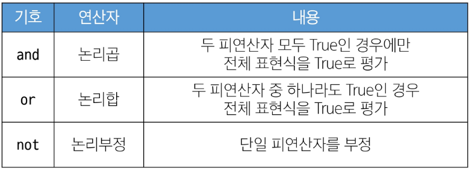

### 단축평가

논리 연산에서 두 번째 피연산자를 평가하지 않고 결과를 결정하는 동작
두 번째 연산과 상관없이 결과가 동일할 때 해당

```python
# 단축 평가

# 문자와 정수는 연산하는 방법이 다름
# "" == False

vowels = 'aeiou'

# and는 모두 True 여야 True -> 연산의 뒷 부분을 알아야 함.
 -> 앞이 True 면 뒤가 출력됨
# or은 하나만 True여도 True -> 앞이 True면 앞이 출력 => 단축 평가
#괄호 안 부터 평가 -> 'a' and 'b' -> 둘 다 값이 있으니 True로 평가됨. 나오는 건 'b'

#'b' in vowels로 처리 되므로 False

print(('a' and 'b') in vowels)  # False
print(('b' and 'a') in vowels)  # True

print(3 and 5)  # 5 -> 평가 5까지
print(3 and 0)  # 0 -> 평가 0까지
print(0 and 3)  # 0 --> 단축평가
# and 는 첫 값에서 false가 나오면 의미가 없어지므로 종료됨 --> 0에서 멈춤
print(0 and 0)  # 0 --> 단축평가

print(5 or 3)  # 5
# or 는 둘 중 하나가 True가 나오면 되므로 True가 나오면 멈춤 --> 5에서 멈춤
print(3 or 0)  # 3 --> 단축평가
print(0 or 3)  # 3
print(0 or 0)  # 0 --> 뒤의 0

print(7 and 3) # 3
print(7 and 0) # 0
print(0 and 7) # 0
print(5 or 3) # 5
print(0 or 3) # 3

#and 일 때는 앞이 False 일 때 전체 결과 False, 뒤의 조건 평가하지 않음 -> 단축평가
#or일 때는 앞이 True일 때 전체 결과 True, 뒤의 조건 평가하지 않음 -> 단축평가
```


#### 사용 이유
- 코드 실행을 최적화하고, 불필요한 연산을 피할 수 있도록 함.

### 멤버십 연산자
- 특정 값이 시퀀스나 다른 컬렉션에 속하는지 여부를 확인
- 딕셔너리의 경우는 key로 사용할 수 있음


### 시퀀스형 연산자


```python
# 시퀀스형 연산자

print('Gildong' + ' Hong')  # Gildong Hong
print('hi' * 5)  # hihihihihi

print([1, 2] + ['a', 'b'])  # [1, 2, 'a', 'b']
print([1, 2] * 2)  # [1, 2, 1, 2]
```

#### 연산자의 우선순위


#### 복사 : 할당, 얕은 복사, 깊은 복사
```python
# 1. 할당 : 원본 변경 x
list1 = [1, 2, 3, 4, 5]
list2 = list1
list2[0] = 5

print(id(list1),id(list2))
print(list1, list2)

# 2. 얕은 복사(copy()) : 객체 안에 객체가 있는 경우 원본 변경 o(메모리 주소 같음) 객체 자체의 메모리주소는 다름
list1 = [1, 2, [3, 4]]
list2 = list1.copy()
list2[2][0] = 5

print(id(list1),id(list2))
print(id(list1[2]),id(list2[2]))
print(list1, list2)

# 3. 깊은 복사 (deepcopy()) : 원본 변경x, 메모리주소는 다름
import copy

list1 = [1, 2, [3, 4]]
list2 = copy.deepcopy(list1)
list2[2][0] = 5

print(id(list1),id(list2))
print(id(list1[2]),id(list2[2]))
print(list1, list2)
```

# Python Functions

## 개요 
***함수 : 특정 작업을 수행하기 위한 재사용 가능한 코드 묶음***

### 함수를 사용하는 이유
- 코드 중복 방지
- 재사용성을 높이고, 코드의 가독성과 유지보수성(디버깅->함수 출력에 breakpoint 걸면 함수 내부 디버깅 가능) 향상
  ==> 반복문의 길이를 줄일 수 있음.
  ==> 알고리즘 문제 풀이시 자주 사용하게 됨

## 함수의 구조


```python
# 함수 정의
def greet(name): # 함수명(매개변수)
    """입력된 이름(name) 값에
    인사를 하는 메세지('Hello, ')를 만드는 함수
    """        message = 'Hello, ' + name
    return message
# 함수 호출 및 반환 값 할당
result = greet('Alice') # 함수명(함수인자)
print(result)
```

### 함수의 정의
- def 키워드로 시작
- 함수 이름 작성
- ()안에 매개변수(parameter) 정의 -> 함수에 전달되는 값

### 함수 body
- ":" 다음에 들여쓰기 된 코드 블록
- 함수가 실행될 때 수행되는 코드

### Docstring
- body 앞에 선택적으로 작성 가능한 함수에 대한 설명법, 가이드

### 함수 반환 값
- 필요한 경우 결과 반환
- return 반환할 값
- return 문은 함수의 실행을 종료하고 결과를 호출

  (안 붙이더라도 자동으로 return None을 붙여 줌 => 무조건 값이 반환됨)

***print의 Return 은?***
- Print는 Return이 None임
- -> print는 출력을 하는 거지 값을 반환을 하는 게 아님
- Return과 출력은 다름

```python
def make_sum(pram1, pram2):
    """이것은 두 수를 받아
    두 수의 합을 반환하는 함수입니다.
    >>> make_sum(1, 2)
    3
    """
    return pram1 + pram2


result = make_sum(100, 30)
print(result) # 130

return_value = print(result)
print(return_value) # None
```

```python
def my_func() :
    print('hello')

result = my_func()
print(result)

# 출력값
# hello
# None  # my_func을 출력하기 때문에 None
```

### 함수 호출(Function Call)
- 함수를 실행하기 위해 함수의 이름을 사용하여 함수의 코드 블록을 실행하는 것
- 이름과 ()을 통해 호출
- 필요한 경우 인자(argument) 전달 필요
- 전달된 argument는 parameter에 대입

## 함수의 유형

매개 변수의 유무, 반환 값의 유무에 따라 총 4가지의 경우가 생김

## 매개변수와 인자

- 매개변수(parameter) : 함수를 "정의"할 때, 함수가 받을 값을 나타내는 변수
  
  위치에 대한 이름일 뿐, 기능을 하지는 않음
- 인자(argument) : 함수를 "호출"할 때, 실제로 전달되는 값

```python
def add_numbers(x, y): #매개변수
	result = x + y
	return result


a = 2
b = 3
sum_result = add_numbers(a, b) #인자 
print(sum_result)
```

### 인자의 종류

#### 1. 위치 인자(Positional Arguements)

- 위치 인자 : 함수 호출 시 인자의 위치에 따라 전달되는 인자

  ***위치 인자는 함수 호출 시 반드시 값을 전달해야 함***

```python
def greet(name, age):
    print(f'안녕하세요, {name}님! {age}살이시군요.')

greet('Alice', 25) #안녕하세요, Alice님! 25살이시군요.
greet(25, 'Alice') #안녕하세요, 25님! Alice살이시군요.
# 동작에는 전혀 영향 없음, 잘 사용하려면 Docstring이 필요
greet('Alice') #TypeError: greet() missing 1 required positional argument: 'age'
```

#### 2. 기본 인자 값(Default Arguement Values)
- 함수 정의에서 parameter에 기본 값을 할당하는 것
- 함수 호출시 인자를 전달하지 않으면, 기본값이 매개변수에 할당
  
  (전달하면 그 값으로 반영)

```python
def greet(name, age = 30):
    print(f'안녕하세요, {name}님! {age}살이시군요')

greet('Bob') #안녕하세요, Bob님! 30살이시군요
greet('Charlie', 40) #안녕하세요, Charlie님! 40살이시군요
```

#### 3. 키워드 인자(Keword Arguements)
- 함수 호출 인자의 이름과 함께 값을 전달 하는 인자
- 매개변수와 인자를 일치시키지 않고, 특정 매개변수에 값을 할당할 수 있음
- 인자의 순서는 중요하지 않으며, 인자의 이름을 명시하여 전달
  
  ***단, 호출 시 키워드 인자는 위치 인자 뒤에 위치해야 함.***

```python
def greet(name, age):
    print(f'안녕하세요, {name}님! {age}살이시군요')

greet(name = 'Dave', age = 35) #안녕하세요, Dave님! 35살이시군요
greet(age = 35, name = 'Dave') #안녕하세요, Dave님! 35살이시군요
greet(age = 35, 'Dave') # positional argument follows keyword argument
# 첫 위치에서 age 칸을 소진했기 때문에, 'Dave' 인자가 들어갈 공간이 없음
```

#### 4. 임의의 인자 목록(Arbitrary Arguements List)
- 정해지지 않은 개수의 인자를 처리하는 인자
- 함수 정의시 *매개변수* 앞에 "\*"를 붙여 사용, 여러개의 인자를 *tuple*로 처리

```python
def calculate_sum(*args): #임의의 인자 사용시 args(arguments) 관습적 사용
    print(args)
    print(type(args)) # <class 'tuple'>

calculate_sum(1, 100, 5000, 30) #(1, 100, 5000, 30)

def calculate_sum(prams,*args): #임의의 인자 사용시 args(arguments) 관습적 사용
    print(args)
    print(type(args)) # <class 'tuple'>
## 위치 인자는 임의 인자 뒤에 올 수 없음.
## 앞에 위치인자가 오면 그 개수만큼 인자를 들고 감

calculate_sum(1, 100, 5000, 30) #(100, 5000, 30)
```

#### 5. 임의의 키워드 인자 목록(Arbitrary Keyword Arguements List)
- 정해지지 않은 개수의 키워드 인자를 처리
- 함수 정의 시 매개변수 앞에 "**"를 붙여 사용
- 여러 개의 인자를 dictionary로 묶어 처리

```python
def print_info(**kwargs):
    print(kwargs)

print_info(name = 'Eve', age = 30) # {'name': 'Eve', 'age': 30}
```

#### 함수 인자 권장 작성 순서
- 위치 -> 기본 -> 가변 -> 가변 키워드
- 호출 시 인자를 전달하는 과정에서 혼란을 줄일 수 있음

  ***모든 상황에 적용되는 절대적인 규칙은 아님***
```python
def func(pos1, pos2, default_arg='default', *args, **kwargs):
    print('pos1:', pos1)
    print('pos2:', pos2)
    print('default_arg:', default_arg)
    print('args:', args)
    print('kwargs:', kwargs)


func(1, 2, 3, 4, 5, 6, key1='value1', key2='value2')
#{'name': 'Eve', 'age': 30}
#pos1: 1
#pos2: 2
#default_arg: 3
#args: (4, 5, 6)
#kwargs: {'key1': 'value1', 'key2': 'value2'}
```

## 재귀 함수(Recursion Function)

재귀 함수 : 함수 내부에서 자기 자신을 호출하는 함수

#### 주요 예시 : 팩토리얼(피보나치도 가능)
- factorial 함수는 자신을 재귀적으로 호출하여 입력된 숫자 n의 팩토리얼을 계산
- 재귀 호출은 n이 0이 될 때까지 반복, 종료 조건(Base case)을 설정하여 재귀 호출 멈춤
- 재귀 호출의 결과를 이용하여 문제를 작은 단위의 문제로 분할,
  
  분할된 문제들의 결과를 조합하여 최종 결과 도출


```python
def factorial(n):
    # 종료 조건: n이 0이면 1을 반환
    if n == 0:
        return 1
    else:
        # 재귀 호출: n과 n-1의 팩토리얼을 곱한 결과를 반환
        return n * factorial(n - 1)

print(factorial(5))  # 120
```

### 재귀 함수의 특징
- 자기 자신을 호출(재귀 호출)
- 특정 알고리즘 식을 표현할 때 변수 사용이 줄어들고, 코드 가독성이 높아짐
  
  *반드시 그렇진 않음*
- 1개 이상의 base case(기저 조건, 종료 조건)가 존재하고 수렴하도록 작성
- 종료 조건을 명확하게 하고, 반복되는 호출이 종료 조건(기저 조건)을 향하도록 해야 함. -> 무한 호출 주의

### 재귀 함수를 사용하는 이유
- 문제의 자연스러운 표현 : 복잡한 문제를 간결하고 직관적으로 표현 가능
- 코드 간결성
- 수학적 문제 해결

## 내장 함수(Built-in function)

내장 함수 : 파이썬이 기본적으로 제공하는 함수(별도 import 불필요)
** 참고(파이썬 공식문서) : https://docs.python.org/ko/3.9/library/functions.html

내장 함수와 메서드 차이
- 내장함수는 별도의 import 없이 사용 가능
- 메서드는 클래스 내부에 정의된 함수(객체를 통해 호출)

```python
# 내장함수 예시
len(list)
max(list)
min(list)
sum(int)
sorted(list, reverse = True)

# 메서드 예시
list.append()
str.upper()
dict.keys()
```
### map 함수

- 함수 구조 : map(function, iterable)
- iterable : 반복 가능한 객체(요소), 순회 가능한 데이터구조(예 : collection 등)
- iterable의 모든 요소에 함수를 적용하고, 그 결과를 map object로 반환
- 첫 위치인자가 함수이므로 적용할 수 있는 case가 무궁무진

```python
numbers = [1, 2, 3]
result = map(str, numbers)

print(result)  # <map object at 0x00000239C915D760>
print(list(result))  # ['1', '2', '3']

# 문자열 '1 2 3'이 입력되었을 때
numbers1 = input().split() #input -> 문자열 상태 / split -> 리스트로 바꿔줌
print(numbers1)  # ['1', '2', '3'] #문자열 상태

numbers2 = map(int, input().split())
print(type(numbers2)) # <class 'map'>
print(numbers2)  # <map object at 0x000001AD56592F40>

numbers2 = list(map(int, input().split())) 
print(numbers2)  # [1, 2, 3] # 위 리스트 요소에 모두 int 함수 실행
#list를 해야하는 이유는 map을 쓰면 map object가 되기 때문
```

### zip 함수

- 함수 구조 : zip(*iterables)
- 임의의 iterable을 모아 튜플을 원소로 하는 zip object를 반환
- 여러 개의 리스트를 동시에 조회할 때 활용
- 2차원 리스트(행렬)의 같은 컬럼(열) 요소를 동시에 조회할 때

```python
girls = ['jane', 'ashley']
boys = ['peter', 'jay']
pair = zip(girls, boys)
print(pair)  # <zip object at 0x000001C76DE58700>
print(list(pair))  # [('jane', 'peter'), ('ashley', 'jay')]

kr_scores = [10, 20, 30, 50]
math_scores = [20, 40, 50, 70]
en_scores = [40, 20, 30, 50]

for student_scores in zip(kr_scores, math_scores, en_scores):
    print(student_scores)

```

## 함수와 Scope

#### Python의 범위(scope)
- 함수는 코드 내부에 local space를 생성하며, 그 외 공간인 global space로 구분

### 범위와 변수 관계

#### scope
- global scope : 코드 어디에서든 참조할 수 있는 공간
- local scope : 함수가 만든 scope(함수 내부에서만 참조 가능)

#### variable
- global variable : global scope에 정의된 변수
- local variable : local scope에 정의된 변수

```python
#예시

def func():
  num = 20
  print('local',num) # local 20

func() 

print('global', num ) # name 'num' is not defined

##num은 local scope에 존재해서 global scope에서 사용 불가
```

### 변수 수명주기(lifecycle)

변수의 수명 주기는 변수가 선언되는 위치와 scope에 따라 결정됨
1. built-in scope : 파이썬이 실행된 이후부터 영원히 유지
2. global scope : 모듈이 호출된 시점 이후 혹은 인터프리터가 끝날 때까지 유지
3. local : 함수가 호출될 때 생성, 함수가 종료될 때까지 유지

### 이름 검색 규칙(Name Resolution) - LEGB Rule

- 파이썬에서 사용되는 이름(식별자)들은 특정한 이름공간(namespace)에 저장되어 있음
- 같은 순서로 이름을 찾아나감(LEGB Rule)
  1. Local Scope : 지역 범위(현재 작업 중인 범위)
  2. Enclosed Scope : 노출 스코프, 지역 범위 한 단계 위 범위
  3. Global Scope : 최상단에 위치한 범위
  4. Built-in Scope : 모든 것을 담고 있는 범위(정의하지 않고 사용할 수 있는 모든 것)
- 함수 내에서는 바깥 scope의 변수에 접근 가능하나 수정은 할 수 없음

#### LEGB Rule 예시

```python
print(sum) # <built-in function sum>
print(sum(range(3))) # 3

sum = 5

print(sum) # 5
print(sum(range(3))) # TypeError: 'int' object is not callable

# sum이라는 이름을 global에서 활용하면서 built-in 함수를 활용하지 못하게 됨
# LEGB Rule에 따라 global에서 먼저 찾기 때문
# 그럴 경우 sum 변수 객체 삭제를 위해 del sum 입력 후 진행
```

```python
a = 1 # Global Scope
b = 2

def enclosed(): # Enclosed Scope
    a = 10
    c = 3

    def local(c): # Local Scope
        # inner_function에서 a, c에 접근할 때,
        # 우리는 enclosed scope에 있는 a, c에 접근한다
        print(a, b, c)  # 10 2 500

    local(500)
    print(a, b, c)  # 10 2 3


enclosed()

print(a, b)  # 1 2
```

```python
a, b, c = 1, 2, 3

def enclosed():
    # global 키워드를 사용하면 전역 범위와 공유
    global a, b, c
    a, b, c = 4, 5, 6

    def local(c):
        print(a, b, c) # 4 5 500

    local(500)
    print(a, b, c) # 4 5 6

enclosed()
print(a, b, c) # 4 5 6

```


### 'global' 키워드

- 변수의 scope를 전역 범위로 지정하기 위해 사용
- 일반적으로 함수 내에서 전역 변수를 수정하려는 경우 사용
- global 키워드 선언 전에 참조 불가
- 매개 변수 키워드 사용 불가

```python
num = 0 # global variables

def increment():
    global num  # local num를 전역 변수로 선언
    num += 1


print(num)  # 0
increment()
print(num)  # 1
```

```python
# 주의 사항 : 키워드 선언 전엔 참조 불가
num = 0 # global variables

def increment():
    # SyntaxError: name 'num' is used prior to global declaration
    print(num)
    global num  # local num를 전역 변수로 선언
    num += 1


# 매개변수에 global 키워드 사용 불가
num = 0 # global variables

def increment(num):
    # SyntaxError: name 'num' is parameter and global
    global num  # local num를 전역 변수로 선언
    num += 1
```

## Packing & Unpacking

### Packing

- Packing : 여러 개의 값을 하나의 변수에 시퀀스로 묶는 과정
- 변수에 담긴 값들은 하나의 튜플(tuple) 형태로 묶임

```python
packed_values = 1, 2, 3, 4, 5
print(packed_values) # (1, 2, 3, 4, 5)

```

#### "*"을 활용한 패킹

```python
numbers = [1, 2, 3, 4, 5]
a, *b, c = numbers

print(a)  # 1
print(b)  # [2, 3, 4]
# 남은 요소들을 리스트로 패킹하여 할당
print(c)  # 5


numbers = [1, 2, 3, 4, 5]
a, b, *c, d, e = numbers

print(a)  # 1
print(b)  # 2
print(c)  # [3]
# 남은 값이 하나여도 리스트로 할당
print(d)  # 4
print(e)  # 5
```

#### print 함수 분석
- 임의의 가변 인자를 작성할 수 있었던 이유
  => 인자 개수에 상관 없이 튜플 하나로 패킹되어 내부에서 처리됨.
```python
def my_func(*objects) :
    print(objects)
    print(type(objects))

my_func(1, 2, 3, 4, 5)
# (1, 2, 3, 4, 5)
# <class 'tuple'>


print('hello')
print('you', 'need', 'python', sep = "-") # you-need-python
print('hello', end = " ") # hello hi
print('hi')
```


### Unpacking

Unpacking : 패킹된 변수의 값을 개별적인 변수로 분리하여 할당하는 것

- 예시
```python
packed_values = 1, 2, 3, 4, 5

# 언패킹
a, b, c, d, e = packed_values
print(a, b, c, d, e)  # 1 2 3 4 5
```

#### "*"를 활용한 언패킹
"*"는 리스트의 요소를 언패킹하여 인자로 전달
```python
names = ["Kai", "Jane", "Bob"]
print(*names) # Kai Jane Bob
```

#### "**"를 활용한 언패킹

dictionary의 키-값 쌍을 언패킹하여 함수의 키워드 인자로 전달 
- 함수 호출 시에만 가능
- 매개변수와 인자의 key 값이 같아야 함

```python
def my_func(x, y, z):
    print(x, y, z)

dict_values = {'x' : 1, 'y' : 2, 'z' :3}
my_func(**dict_values) # 1 2 3
```

## 람다 표현식(Lambda Expressions)

- 익명 함수를 만드는 데 사용하는 표현식
- 한 줄로 간단한 함수를 정의하는 기능

### lambda 표현식 구조

```python
lambda 매개변수 : 표현식
```
- 매개변수 : 여러 개 매개변수가 있을 경우 쉼표 구분
- 표현식 : 함수의 실행되는 코드 블록으로, 결과값을 반환(return)하는 표현식

### lambda 함수 특징
- 표현식 안에 return 값이 있어야 함
- 명시성은 떨어짐
- 일회성 활용할 때 주로 사용 -> 함수 이름을 정할 필요가 없음

```python
# 기존 함수 방법 활용
def addition(x, y):
    return x + y

result = addition(3, 5)
print(result) # 8

# lambda 표현식으로 작성한 addition 함수
addition = lambda x, y: x + y

result = addition(3, 5)
print(result) # 8
```

### map 함수를 활용한 lambda 함수

```python
numbers = [1, 2, 3, 4, 5]

def square(x):
    return x ** 2

# lambda 미사용
squared1 = list(map(square, numbers))
print(squared1)

# lambda 사용
squared2 = list(map(lambda x : x**2, numbers))
print(squared2)
```

# Modules

## 개요
- 전체를 혼자 힘으로 하는 일이 매우 드문 일임
- 다른 프로그래머가 작성해둔 것을 잘 활용하는 것이 중요

### 모듈이란?

- 한 파일로 묶인 변수와 함수의 모음, 특정한 기능을 하는 코드가 작성되어 파이썬 내부에 저장되어 있는 단일 파이썬 파일(.py)***
- 언제든지 재사용 가능

### 모듈을 가져오는 방법

```python
# import

import math

print(math.pi) #3.14....
print(math.sqrt(4)) #2

# from
from math import sqrt

print(sqrt(4))
#모듈의 함수인지 내가 만든 함수인지 / 무슨 모듈의 함수 인건지 헷갈릴 수 있음
```

### 모듈 사용하기 : '. (dot)' 연산자 활용
- 점의 왼쪽 객체(모듈)에서 점의 오른쪽(함수/변수)을 찾아라는 의미
```python
# 모듈명. 변수명
print(math.pi)

# 모듈명. 함수명
print(math.sqrt(4))
```

### 주의사항
- 서로 다른 모듈이 같은 이름의 함수 제공할 경우 문제 발생
- 마지막에 import 된 이름으로 대체됨
- 모든 요소를 한 번에 호출하는 '*'는 사용 주의

### 'as' 키워드
- as 키워드를 사용하여 별칭(alias) 부여
- 두 개 이상의 모듈에서 동일한 이름의 변수, 함수, 클래스 등을 가져올 때 발생하는 이름 충돌 해결

```python

```

## Python Standard Library

파이썬 언어와 함께 제공되는 다양한 모듈과 패키지의 모음

- 라이브러리(Library) : 모듈과 패키지의 모음 ex) Pandas(데이터분석), Django(백엔드)
- 패키지(Package) : 연관된 모듈들을 하나의 디렉토리에 모아 놓은 것

### package 사용 목적

- 모듈들의 이름공간을 구분하여 충돌을 방지
- 모듈들을 효율적으로 관리하고 재사용할 수 있도록 돕는 역할

### package 사용하기

각 패키지의 모듈을 import 하여 사용하기

```python

from my_package.math import my_math
from my_package.statistics import tools

print(my_math.add(1, 2)) # 3
print(tools.mod(1, 2)) # 1

```

### 외부 패키지 사용

- PSL 내부 패키지 : 설치없이 바로 import
- 외부 패키지 : pip를 활용해 온라인에서 설치 후 import

- **pip : 외부 패키지를 설치하도록 도와주는 파이썬의 패키지 관리 시스템**
          PyPI(Python Package Index)에서 설치
          URL : https://pypi.org/


#### 패키지 설치 방법
- 패키지는 global에 설치됨 -> 실제로는 가상의 환경에 주로 만듦
- 최신버전 / 특정 버전 / 최소 버전을 명시하여 설치 가능

```python
$ pip install SomePackage # 최신
$ pip install SomePackage==1.0.5 # 특정
$ pip install SomePackage>=1.0.4 # 최소
```

### Requests 외부 패키지
- 용도 : 외부 API에 요청을 보내는 패키지
```python
$ pip install requests

import requests

url = 'https://random-data-api.com/api/v2/users'
response = requests.get(url).json()

print(response)
```
1. url 브라우저 입력 -> 크롬 확장 프로그램(json formatter) 설치
2. json 출력 결과를 복사해서 json viewer로 확인
   - dict 와의 json은 다름(dict형태로 넣으면 오류 뜸)

```python
#United States 출력해보기

import requests


url = 'https://random-data-api.com/api/v2/users'
response = requests.get(url).json()

print(response['address']['country'])
print(response.get('address').get('country'))
'''
United States
'''
```


## 참고 : 모듈 내부 살펴보기
- 내장함수 help를 사용해 모듈에 무엇이 들었는지 확인 가능

```python
help(math)
```

## 참고 : enumerate

- iterable 객체의 각 요소에 대해 인덱스와 함께 반환하는 내장함수
- 구조
```python
  enumerate(iterable, start = 0)
```
- 예시
```python

#예시
fruits = ['apple', 'banana', 'cherry']

for index, fruit in enumerate(fruits):
    print(f'인덱스 {index}: {fruit}')

'''
인덱스 0: apple
인덱스 1: banana
인덱스 2: cherry
'''

fruits = ['apple', 'banana', 'cherry']

for index, fruit in enumerate(fruits,2):
    print(f'인덱스 {index}: {fruit}')

'''
인덱스 2: apple
인덱스 3: banana
인덱스 4: cherry
'''
```

# 제어문(Control Statement)

***제어문 : 코드의 실행 흐름을 제어하는 데 사용하는 구문, 조건에 따라 코드 블록을 실행하거나 반복적으로 코드를 실행***

- 조건문 : if, elif, else
- 반복문 : for, while
- 반복문 제어 : break, continue, pass

## 조건문(Conditional Statement)

- 조건문 : 주어진 조건식을 평가하여, 해당 조건이 참(True)인 경우에만 코드블록을 실행하거나 건너뜀

### 조건문(if statement) 기본 구조
```python
'''
if 표현식:
  코드블록
elif 표현식:
  코드블록
else:
  코드블록
'''

# 예시
a = 5

if a > 3:
    print('3 초과')
else:
    print('3 이하')

print(a) # 3 초과 / 5


a = 3

if a > 3:
    print('3 초과')
else:
    print('3 이하')

print(a) # 3 이하 / 3
```

### 복수 조건문

조건식을 동시에 검사하는 것이 아니라 순차적으로 비교

```python
dust = 45

if dust > 150:
    print('매우 나쁨')
    if dust > 300:
        print('위험해요!')
elif dust > 80:
    print('나쁨')
elif dust > 30:
    print('보통')
else:
    print('좋음')
# 보통
```

### 중첩 조건문

```python
dust = 480

if dust > 150:
    print('매우 나쁨')
    if dust > 300:
        print('위험해요!')
elif dust > 80:
    print('나쁨')
elif dust > 30:
    print('보통')
else:
    print('좋음')
# 매우 나쁨
# 위험해요!
```

### 예시 : 윤달
```python
## 연도를 받아 윤달 판단하기
## 윤달이면 'leap year' 출력, 아니면 'common year' 출력

# 1. 윤년은 연도가4로 나누어 떨어지지만 100으로는 나누어 떨어지지 않는다.
# 2. 윤년은 연도가 400으로 나누어 떨어진다.

year = int(input())

if year % 4 == 0 :
  if year % 100 == 0:
    if year % 400 == 0:
      print('leap year')
    else:
      print('common year')
  else:
    print('leap year')
else:
    print('common year')

if (year % 4 == 0 and year % 100 != 0) or year % 400 == 0 :
  print('leap year')
else:
  print('common year')


```


## 반복문(Loop Statement)

주어진 코드 블록을 여러 번 반복해서 실행하는 구문

- for / while
- 특정 작업 반복 / 조건이 참인 동안 반복

### for 문

임의의 시퀀스의 항목들을 그 시퀀스에 들어있는 순서대로 반복

```python
# 반복문의 구조

```

**iterable: 반복문에서 순회할 수 있는 객체(시퀀스 객체, dict, set 등)

#### 작동 원리
- iterable의 첫 요소 ~ 마지막 요소가 순차적으로 반복 변수에 할당되고 코드블록 실행


#### 예시

1. 리스트

```python
items = ['apple', 'banana', 'coconut']

for item in items: # 순회하는 복수형의 단수형
    print(item)

'''
apple
banana
coconut
'''
```

2. 문자열

```python
## 문자열
country = 'Korea'

for char in country:
    print(char)
'''
K
o
r
e
a
'''
```

3. range

```python
## range
for i in range(5):
    print(i)
'''
0
1
2
3
4
'''
```
4. 딕셔너리
   
```python
## 딕셔너리
my_dict = {
    'x': 10,
    'y': 20,
    'z': 30,
}

for key in my_dict :
    print(key)  # 기본적으로 순회하면 key가 나옴
    print(my_dict[key])
'''
x
10
y
20
z
30
'''

## 인덱스로 리스트 순회
numbers = [4, 6, 10, -8, 5]

for i in range(len(numbers)):
    numbers[i] = numbers[i] * 2

print(numbers) # [8, 12, 20, -16, 10]
```

5. 중첩 반복문

- 중첩문이 호출되는 횟수(print 횟수) = len(inners) * len(outers)

```python
outers = ['A', 'B']
inners = ['c', 'd']

for outer in outers:        # 밖에 것이 한 번 돌려면 안의 것이 다 돌아야 함
    for inner in inners:
        print(outer, inner)

'''
A c
A c
B c
B d
'''

elements = [['A', 'B'],
            ['c', 'd']
]

for elem in elements:
    for item in elem:
        print(item)

'''
A
B
c
d
'''
```

### while 문

- 주어진 조건 식이 True인 동안 코드를 반복해서 실행
  == 조건식이 False가 될 때까지 반복
- 프로그램 종료 조건 필요
- 몇 번 도는지 알기 어려움

```python
# While 문의 구조

i = 1 # 초기식
while i < 11: #조건식
    print(i)
    i += 1 # 증감식

```

#### 예시

```python
while a < 3:
    print(a)
    a += 1

print('끝')

'''
0
1
2
끝
'''

number = int(input('양의 정수를 입력해주세요.: '))
while number <= 0:
    if number < 0:
        print('음수를 입력했습니다.')
    else:
        print('0은 양의 정수가 아닙니다.')
    number = int(input('양의 정수를 입력해주세요.: '))
print('잘했습니다!')

'''
양의 정수를 입력해주세요.: 0  
0은 양의 정수가 아닙니다.
양의 정수를 입력해주세요.: -1
음수를 입력했습니다.
양의 정수를 입력해주세요.: 3
잘했습니다!
'''

```

```python
# 중첩 for문 예제
# 정수 n을 입력받아 n단의 왼쪽 직각 이등변 삼각형을 그려보세요
n = int(input())

for i in range(1,n+1):
    print("*"*i)


n = int(input('n : '))
for i in range(n):
    for j in range(i + 1):
        print('*', end = '')
    print()
```


### 적절한 반복문 활용 방법

1. for
   - 반복 횟수가 명확히 정해진 경우
   - 예: 리스트, 튜플, 문자열 등과 같은 시퀀스 형식
2. while
   - 반복 횟수가 불명확, 조건에 따라 반복 종료할 경우
   - 예: 사용자의 입력을 받아서 특정 조건 충족시까지 반복

### 반복 제어

반복문 실행 중 일부만 실행하게 하기 위함

#### 반복 제어 키워드 및 예시
- break : 반복 즉시 중지
```python
for i in range(10):
    if i == 5:
        break
    else:
        print(i)

'''
0
1
2
3
4
'''

# break 예시 - "프로그램 종료 조건 만들기"
number = int(input('양의 정수를 입력해주세요.: '))
while number <= 0:
    if number == -9999:
        print('프로그램을 종료합니다.')
        break
    if number < 0:
        print('음수를 입력했습니다.')
    else:
        print('0은 양의 정수가 아닙니다.')
    number = int(input('양의 정수를 입력해주세요.: '))
print('잘했습니다!')


# break 예시 - "리스트에서 첫번째 짝수만 찾은 후 반복 종료하기"
numbers = [1, 3, 5, 6, 7, 9, 10, 11]
found_even = False # Flag variable

for number in numbers:
    if number % 2 == 0:
        print(f'첫 번째 짝수 {number}를 찾았습니다.')
        found_even = True
        break    

if found_even == False :
    print('짝수를 찾지 못함')

'''
1
3
5
7
9
'''
```

- continue : 다음 반복으로 건너 뜀

```python
numbers = [1, 2, 3, 4, 5, 6, 7, 8, 9, 10]


for number in numbers:
    if number % 2 == 0:
        continue
    print(number)
```

- pass : 아무런 동작하지 않고 넘어감
        에러를 막기 위해 잠깐 둘 경우 주로 사용--> 함수 작성에도 주로 사용

```python
for i in range(10):
    pass

if conditon:
  pass
else:
  표현식


while True:
  if condition:
    break
  elif condition:
    pass
  else:
    print('..')
```

### List Comprehension

- 간결하고 효율적인 리스트 생성 방법
- 가독성은 떨어짐 -> 남용하지 말자

```python
#List Comprehesion 구조
list(expression for 변수 in terable)
list(expression for 변수 in iterable if 조건식)

```
#### List Comprehension 예시

1. 기본 사용 예시
```python
# 사용 전
numbers = [1, 2, 3, 4, 5]
squared_numbers = []

for num in numbers:
    squared_numbers.append(num**2)

print(squared_numbers)


# 사용 후

squared_numbers = [num**2 for num in numbers]
squared_numbers2 = list(num**2 for num in numbers)
print(squared_numbers)
```

2. 2차원 배열 생성
```python
# List Comprehension 활용 예시 - "2차원 배열 생성 시 (인접행렬 생성 시)"
data1 = [[0] * (5) for _ in range(5)] # _ : 임시변수를 쓸 필요가 없을 경우
print(data1)
# 또는
data2 = [[0 for _ in range(5)] for _ in range(5)]
print(data2)

"""
[[0, 0, 0, 0, 0],
 [0, 0, 0, 0, 0],
 [0, 0, 0, 0, 0],
 [0, 0, 0, 0, 0],
 [0, 0, 0, 0, 0],]
"""

T = int(input())

for tc in range(1, T+1):
    N = int(input())
    arr = [list(map(int, input().split())) for _ in range(N)]
    print(f'{tc} {arr}')
```

#### 참고 : 리스트를 생성하는 방법 비교

1. loop
```python
result1 = []
for i in range(10):
    result1.append(i)
```


2. list comprehension

```python
result2 = [i for i in range(10)]
```

3. map

```python
result3 = list(map(lambda i: i, range(10)))

print(result1)
print(result2)
print(result3)
```

4. 성능 비교
   1. list comprehension
    - 대부분의 경우 가장 빠르고 파이썬스러운(Pythonic) 방법
   2. map
    - 특정 상황(예: 기존 함수를 사용할 때)에서 리스트 컴프리헨션과 비슷하거나 약간 더 빠를 수 있음
   3. loop
    - 일반적으로 가장 느리다고 알려져 있지만,
      python 버전이 올라가면서 다른 방식과 비슷하거나 때로는 더 나은 결과를 보이기도 함
    - 복잡한 로직이 필요한 경우에는 여전히 유용하게 사용될 수 있음 -> 명시적

   4. 결론
    - 성능 차이는 대부분의 경우 미미하므로, 
      코드의 가독성과 유지보수성을 고려하여 상황에 맞는 적절한 방법을 선택하는 것을 
      
# Data Structure

***자료 구조***
- 각 데이터의 효율적인 저장, 관리를 위한 구조를 나눠 놓은 것
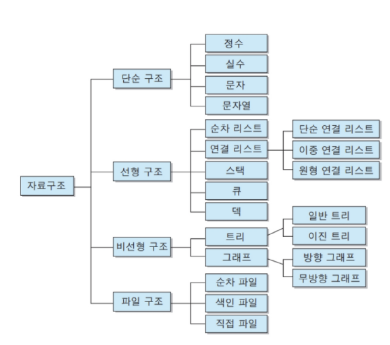
- 데이터 구조의 활용 : 문자열, 리스트, 딕셔너리 등 각 데이터 구조의 메서드를 호출하여 사용

## Method(메서드)
- 메서드: **객체에 속한** 함수(객체의 상태를 조작하거나 동작을 수행)

### 메서드의 특징
- 메서드는 클래스(class) 내부에 정의되는 "함수"
- 클래스는 파이썬에서 "타입을 표현하는 방법"
- 예 : help 함수로 str을 호출하면 class인 것을 확인 가능
- 데이터 타입별로 다양한 기능을 가진 메서드가 존재

### 메서드의 호출 방법
```python
# 데이터 타입 객체.메서드()
'hello'.capitalize()

# 문자열 메서드 예시
print('hello'.capitalize()) # Hello

# 리스트 메서드 예시
numbers = [1, 2, 3]
numbers.append(4)

print(numbers) = [1, 2, 3, 4]
```

## Sequence Data Structure : stirng

### 문자열 조회 / 탐색 및 검증 메서드

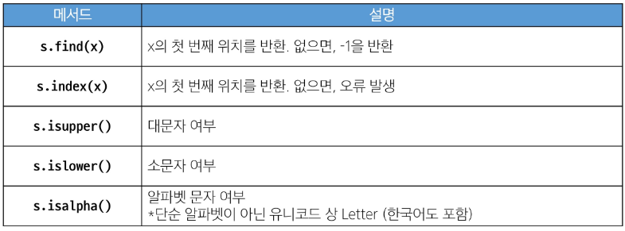

#### 1. .find(x)
- x의 첫 번째 위치를 반환.
- 없으면 -1을 반환
```python
text = 'banana'
print(text.find('a')) # 1
print(text.find('z')) # -1
```

#### 2. index(x)
- x의 첫 번째 위치를 반환.
- 없으면 오류 발생
- try - except시 활용
```python
text = 'banana'
print(text.index('a')) # 1
print(text.index('z')) # ValueError: substring not found

try:
except ValueError:
    print("문자를 찾을 수 없습니다")
## if else와 유사, except는 오류 발생시 조건

```

#### 3. isupper()
***is ~ 함수의 경우 반환값은 True / False**
- 문자열이 모두 대문자로 이루어져있는지 여부 확인 (True/False)
```python
string1 = 'HELLO'
string2 = 'Hello'
print(string1.isupper()) # True
print(string2.isupper()) # False
```

#### 4. islower()
- 문자열이 모두 소문자로 이루어져있는지 여부 확인 (True/False)
```python
print(string1.islower()) # False
print(string2.islower()) # False
```

#### 5. isalpha()
- 문자열이 알파벳으로만 이루어져있는지 여부 확인 (True/False)
- 단순 알파벳이 아닌 유니코드 상 Letter

```python
string1 = 'hello'
string2 = '123heis'
print(string1.isalpha()) # True
print(string2.isalpha()) # False
```


### 문자열 조작 메서드 (새 문자열 반환)

#### 1. .replace(old, new[,count])
***[]로 표현된 것은 "선택인자"***
- 바꿀 대상 글자를 새로운 글자로 바꿔서 반환
```python
text = 'Hello, world, world, world!'
new_text = text.replace('world', 'Python')
count_new_text = text.replace('world', 'Python', 1)
print(text) # Hello, world, world, world!
print(new_text) # Hello, Python, Python, Python!
print(count_new_text) # Hello, Python, world, world! ==> count는 바꾸는 갯수
```

#### 2. .strip([chars])
- 문자열의 시작과 끝에 있는 공백 혹은 특정 문자를 제거
```python
text = '  Hello, world!  '
new_text = text.strip()
print(text) #   Hello, world!
print(new_text) # Hello, world!
```

#### 3. .split(sep=None, maxsplit=-1)
- 공백이나 특정 문자를 기준으로 분리
```python
text = 'Hello, world!'
words = text.split(',')
words2 = text.split()
print(words) # ['Hello', ' world!']
# 공백을 지운 게 아니기 때문에 공백은 남아 있음
print(words2) # ['Hello,', 'world!']
# 공백을 기준으로 나뉨, ','는 살아 있음
```

#### 4. 'separator'.join(iterable)
- 구분자(separator)로 iterable의 문자열을 연결한 "문자열"을 반환
```python
words = ['Hello', 'world!']
text = '-'.join(words)
print(text) # Hello-world!


my_list = ['my', 'name', 'is', 'jonghwa']

print(' '.join(my_list)) # my name is jonghwa
print(*my_list) # my name is jonghwa
```

#### 5. capitalize
- 가장 앞글자만 대문자로 변경
- 앞 글자를 제외한 모든 글자 소문자로 변경

#### 6. title()
- 문자열 앞에 공백이 있으면 첫 글자는 대문자, 나머지는 소문자 변환

#### 7. upper()
- 문자열 전체 대문자로 변경

#### 8. lower()
- 문자열 전체 소문자로 변경

#### 9. swapcase()
- 문자열 전체 대<->소문자 변경

```python
# capitalize
text = 'heLLo, woRld!'
new_text1 = text.capitalize()
print(new_text1) # Hello, world!

# title
new_text2 = text.title()
print(new_text2) # Hello, World!

# upper
new_text3 = text.upper()
print(new_text3) # HELLO, WORLD!

# lower
new_text4 = text.lower()
print(new_text4) # hello, world!

# swapcase
new_text5 = text.swapcase()
print(new_text5) # HEllO, WOrLD!
```

***참고 : 메서드는 이어서 사용 가능***

```python
text = 'heLLo, woRLd!'
new_text = text.swapcase().replace('l', 'z')
print(new_text) # HEzzO, WOrzD!
```
## Sequence Data Structure : list

### 리스트 값 추가 및 삭제 메서드
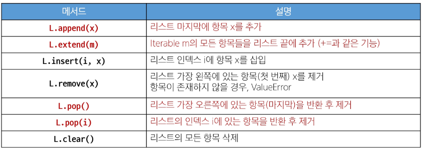

#### 1. .append(x)
- 리스트 마지막에 항목 x(항목 하나)를 추가
- append는 인자를 하나만 받을 수 있음(,로 두 개를 넣을 수 없음)

```python
my_list = [1, 2, 3]
my_list.append(4)
print(my_list) # [1, 2, 3, 4]
print(my_list.append(4)) # None
# => append의 반환이 없다는 뜻(원본을 이미 바꿨기 때문에 반환이 필요 없음)
```

#### 2. .extend(m)
- iterable 'm'에 있는 모든 항목들을 리스트 끝에 추가('+='와 같음)
- iterable을 풀어냄(리스트 시 리스트 전체가 하나의 요소로 들어가지 않음)
- extend는 인자를 하나만 받을 수 있음(,로 두 개를 넣을 수 없음)

```python
my_list = [1, 2, 3]
my_list.extend([4, 5, 6])
print(my_list) # [1, 2, 3, 4, 5, 6]

my_list.extend(5)
print(my_list) # TypeError: 'int' object is not iterable
## int와 같은 iterable이 아닌 요소는 넣을 수 없음

my_list.append([9, 9, 9])
print(my_list) # [1, 2, 3, 4, 5, 6, [9, 9, 9]]
## 리스트를 통째로 넣을 땐 append 사용
```


#### 3. .insert(i,x)
- 리스트 인덱스 i에 항목 x를 삽입

```python
my_list = [1, 2, 3]
my_list.insert(1, 5)
print(my_list)  # [1, 5, 2, 3]
```

#### 4. .remove(x)
- 리스트 가장 왼쪽에 있는 항목의 첫 번째 x를 제거
- 항목이 존재하지 않을 경우 ValueError
```python
my_list = [1, 2, 3, 2, 2, 2]
my_list.remove(2)
print(my_list) # [1, 3, 2, 2, 2]
```

#### 5. .pop()
- 리스트 가장 오른쪽에 있는 항목(마지막)을 반환 후 제거
- 인자를 입력시 해당 인덱스에 있는 항목을 반환 후 제거
```python
my_list = [1, 2, 3, 4, 5]
item1 = my_list.pop()
item2 = my_list.pop(0)

print(item1) # 5
print(item2) # 1
print(my_list) # [2, 3, 4]


queue = [1, 2, 3, 4, 5]
first_element = queue.pop(0)
print(first_element) # 1 
## pop(x) 는 알고리즘 문제 풀 때 사용X
## 시간복잡도의 문제 --> 첫 x+1 번째 요소를 제거하고 나머지 요소를 한 칸씩 인덱스를 앞으로 당김
## 시간복잡도가 O(n) --> 시간 초과 발생


#해결시 덱 모듈 사용
from collections import deque
queue = deque([1, 2, 3, 4, 5])
first_element = queue.popleft()
print(first_element) # 1
# 시간복잡도가 O(1)
```

#### 6. .clear
- 리스트의 모든 항목 삭제
```python
my_list = [1, 2, 3]
my_list.clear()

print(my_list) # []
```

### 리스트 탐색 및 정렬 메서드
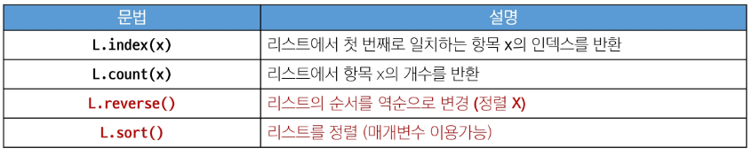

#### 1. .index(x)
- 리스트에서 첫 번째로 일치하는 항목 x의 인덱스를 반환

```python
my_list = [1, 2, 3]
index = my_list.index(2)
print(index) # 1
```

#### 2. .count(x)
- 리스트에서 항목 x의 개수를 반환
```python
my_list = [1, 2, 2, 3, 3, 3]
counting_number = my_list.count(3)
print(counting_number) # 3
```

#### 3. .reverse()
- 리스트의 순서를 역순으로 변경(정렬 X)
```python
my_list = [1, 3, 2, 8, 1, 9]
my_list.reverse()
print(my_list) # [9, 1, 8, 2, 3, 1]
print(my_list.reverse()) # None
```

#### 4. .sort()
- 원본 리스트를 오름차순/내림차순으로 정렬
```python
# sort
my_list = [3, 2, 100, 1]
my_list.sort()
print(my_list) # [1, 2, 3, 100]

# sort(내림차순 정렬)
my_list.sort(reverse=True)
print(my_list) # [100, 3, 2, 1]


### sort와 sorted 차이

numbers = [3, 1, 4, 1, 5, 9, 2]
numbers.sort()
print(numbers) # [1, 1, 2, 3, 4, 5, 9]
numbers.sort(reverse= True)
print(numbers) # [9, 5, 4, 3, 2, 1, 1]

numbers = [3, 1, 4, 1, 5, 9, 2]
sorted_numbers1 = sorted(numbers)
print(sorted_numbers1) # [1, 1, 2, 3, 4, 5, 9]
sorted_numbers2 = sorted(numbers, reverse=True)
print(sorted_numbers2) # [9, 5, 4, 3, 2, 1, 1]


# 차이 1 : sort는 원본 변경 O, sorted는 원본 변경 X
# 차이 2 : sort는 반환값 X, sorted는 반환값 O


```

## 데이터 타입과 복사
- 데이터의 분류에 따라 복사 방법이 다름
- "변경 가능한 데이터 타입"과 "변경 불가능한 데이터 타입"을 나누어 확인 필요

### 1. 할당
- 리스트 할당 연산자(=) 활용시 복사는 해당 객체에 대한 객체 참조를 복사
1) 가변
```python
a = [1, 2, 3, 4]
b = a # b가 a의 주소를 받음
b[0] = 100

print(a) # [100, 2, 3, 4]
print(b) # [100, 2, 3, 4]

## --> 값이 복사된 것이 주소가 복사가 됨 --> 할당
```

2) 불변

```python
a = 20
b = a
b = 10 # 불변한 값이기 때문에, 같은 주소에 다른 값을 둘 수 없음.

print(a) # 20
print(b) # 10
```

### 2. 얕은 복사
- 복사한 객체의 값을 변경하는 것은 원본에 영향을 미치지 않음

```python
a = [1, 2, 3]
b = a[:] # 슬라이싱은 새로운 리스트를 반환
c = a.copy()

print(a, b, c) # [1, 2, 3] [1, 2, 3] [1, 2, 3]

b[0] = 100
c[0] = 999
print(a, b, c) # [1, 2, 3] [100, 2, 3] [999, 2, 3]
```

***얕은 복사의 한계***
- 슬라이싱으로 생성된 객체는 원본 객체와 독립적 존재
- 내부 객체의 주소는 같기 때문에 리스트 내 리스트는 함께 변경됨
```python
a = [1, 2, [3, 4, 5]]
b = a[:]
b[2][1] = 100
print(a) # [1, 2, [3, 100, 5]]
print(b) # [1, 2, [3, 100, 5]]


b[0] = 999
print(a) # [1, 2, [3, 100, 5]]
print(b) # [999, 2, [3, 100, 5]]
```

### 3. 깊은 복사
- 중첩된 리스트 순회 시 원본 조작하고 싶지 않을 때 사용
- 전체 객체가 다른 주소를 활용하여 독립적으로 존재

```python
import copy
a = [1, 2, [3, 4, 5]]
b = copy.deepcopy(a)

b[2][1] = 100

print(a)
print(b)
```

## 문자 유형 판별 메서드
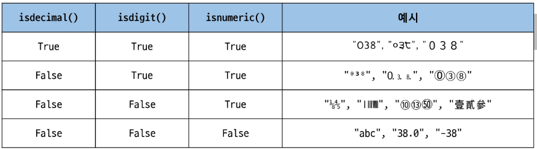
### 1. isdecimal()
- 문자열이 모두 숫자 문자로만 이루어져 있어야 True
### 2. isdigit()
- 유니코드 숫자도 인식
- 예 : ①도 인식
### 3. isnumeric()
- 추가적인 유니코드 인식(분수, 지수, 루트 등)

```python
# isdecimal() : 가장 엄격한 기준을 적용, 오직 일반적인 십진수 숫자(0-9)만 True로 인식
print("isdecimal() 메서드 예시:")
print("'12345'.isdecimal():", '12345'.isdecimal()) # True
print("'123.45'.isdecimal():", '123.45'.isdecimal()) # False
print("'-123'.isdecimal():", '-123'.isdecimal()) #False
print("'Ⅳ'.isdecimal():", 'Ⅳ'.isdecimal()) # False
print("'½'.isdecimal():", '½'.isdecimal()) # False
print("'²'.isdecimal():", '²'.isdecimal()) # False
print()

# isdigit() : 일반 숫자뿐만 아니라 지수 표현(²)도 True로 인식
print("isdigit() 메서드 예시:")
print("'12345'.isdigit():", '12345'.isdigit()) # True
print("'123.45'.isdigit():", '123.45'.isdigit()) # False
print("'-123'.isdigit():", '-123'.isdigit()) # False
print("'Ⅳ'.isdigit():", 'Ⅳ'.isdigit()) # False
print("'½'.isdigit():", '½'.isdigit()) # False
print("'²'.isdigit():", '²'.isdigit()) # True
print()

# isnumeric() : 일반 숫자, 로마 숫자, 분수, 지수 등 다양한 형태의 숫자 표현을 True로 인식
print("isnumeric() 메서드 예시:")
print("'12345'.isnumeric():", '12345'.isnumeric()) # True
print("'123.45'.isnumeric():", '123.45'.isnumeric()) # False
print("'-123'.isnumeric():", '-123'.isnumeric()) #False
print("'Ⅳ'.isnumeric():", 'Ⅳ'.isnumeric()) # True
print("'½'.isnumeric():", '½'.isnumeric()) # True
print("'²'.isnumeric():", '²'.isnumeric()) # True
```

## Non-Sequence Data Structure : Dicitonary

- 딕셔너리 : 고유한 항목들의 정렬되지 않은 컬렉션

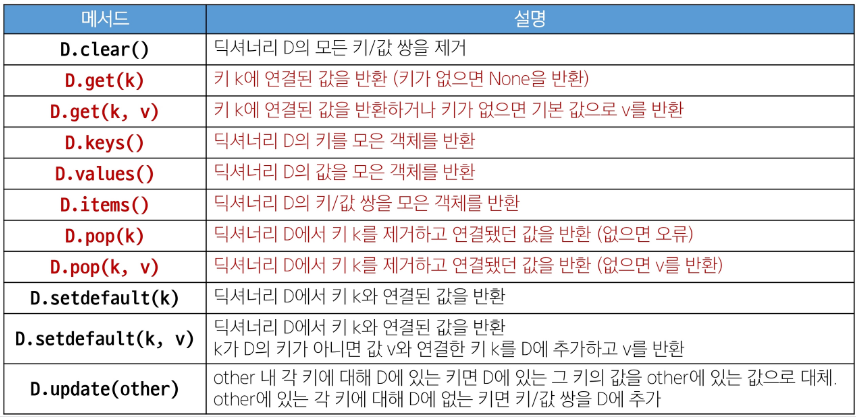

### 1. .clear()
- 딕셔너리의 모든 키/값 쌍을 제거
- 리스트에도 사용 가능

```python
# clear
person = {'name': 'Alice', 'age': 25}
person.clear()
print(person)
```

### 2. .get(key[, default])
- 키와 연결된 값을 반환하거나 키가 없으면 "None 혹은 기본 값"을 반환
- 일반적으로 key가 없을 때 dict[key]는 Error가 뜸
``` python
# get
person = {'name': 'Alice', 'age': 25}

print(person.get('name')) # Alice
print(person.get('country')) # None
print(person.get('country','unknown')) # unknown
print(person['contry']) # KeyError: 'contry'
print(person) # {'name': 'Alice', 'age': 25}
person['country'] = 'unknown'
print(person) # {'name': 'Alice', 'age': 25, 'country': 'unknown'}
# 키가 없는 값을 get 한다고 해서 딕셔너리에 추가 되는 것은 아님
```

### 3. .keys()
- 딕셔너리의 키를 모은 객체를 반환

``` python
# keys
person = {'name': 'Alice', 'age': 25}
print(person.keys()) # dict_keys(['name', 'age'])
## 리스트 형태 유사 -> 시퀀스 데이터 --> iterable
print(type(person.keys())) # <class 'dict_keys'>

for item in person.keys():
    print(item)
'''
name
age
'''
```

### 4. .values()
- 딕셔너리의 값을 모은 객체 반환

``` python
# values
person = {'name': 'Alice', 'age': 25}
print(person.values()) # dict_values(['Alice', 25])

for item in person.values():
    print(item)
'''
Alice
25   
'''
```

### 5. .items()
- 딕셔너리 키/쌍 값을 모은 객체를 반환(튜플형태)

``` python
# items
person = {'name': 'Alice', 'age': 25}
print(person.items()) #dict_items([('name', 'Alice'), ('age', 25)])

for item in person.items():
    print(item)
'''
('name', 'Alice')
('age', 25)
'''
# 튜플 형태

for key, value in person.items():
    print(key, value)
'''
name Alice
age 25
'''
# unpacking 활용
```

### 6. .pop(key[,default])
- 키를 제거하고 연결됐던 값을 반환
- 키나 값이 없으면 에러나 default 반환
- 리스트는 인덱스와 관련하여 pop사용, 하지만 딕셔너리는 인덱스가 없기에 전혀 다름

``` python
# pop
person = {'name': 'Alice', 'age': 25}

print(person.pop('age')) # 25
print(person) # {'name': 'Alice'}
print(person.pop('country', None)) # None
# 순회하는 딕셔너리에서 팝 사용할 때 유용할 듯
print(person.pop('country')) # KeyError: 'country'
```
### 7. .setdfault(key[,default])
- get 메서드 기능 + a
- 키와 연결된 값을 반환
- 키가 없다면 default와 연결한 키를 "딕셔너리에 추가하고 default를 반환" 

``` python
# setdefault
person = {'name': 'Alice', 'age': 25}

print(person.setdefault('country', 'KOREA')) # KOREA
print(person) # {'name': 'Alice', 'age': 25, 'country': 'KOREA'}
# 값 반환 + 원본 추가
```

### 8. .update([other])
- other(여러개를 넣을 수 있음)가 제공하는 키/값 쌍으로 딕셔너리를 갱신
- 기존 키를 덮어씀
- 키와 값 쌍이 들어가야함
``` python
# update
person = {'name': 'Alice', 'age': 25}
other_person = {'name': 'Jane', 'gender': 'Female'}

person.update(other_person)
print(person) # {'name': 'Jane', 'age': 25, 'gender': 'Female'}

person.update(age=50, country='KOREA')
print(person) #{'name': 'Jane', 'age': 50, 'gender': 'Female', 'country': 'KOREA'} 
# 키워드 인자로 넣을 때 키 인자는 문자열로 하지 않음 주의!

a = {}
b = {'name' : 'Alice', 'age' : 25}

a.update(b)
print(a)
b['name'] = 'Harry'
print(a)

# 빈 딕셔너리에 다른 딕셔너리를 update 하면 깊은 복사?
# 애초에 a와 b는 다른 메모리 주소를 가짐 --> 복사라는 개념으로 보기 어려움
```


## Non-Sequence Data Structure : Set

- set : "고유(중복x)"한 항목들의 "정렬되지 않은" 컬렉션
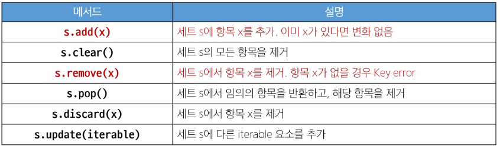

--> add와 update는 리스트 메서드 append와 extend의 차이와 유사

### 1. .add(x)
- 세트에 x를 추가
``` python
# add
my_set = {'a', 'b', 'c', 1, 2, 3}

my_set.add(4)
print(my_set)
# 여러 번 시행 시 순서 바뀜
# {1, 'c', 3, 2, 'a', 'b', 4}
# {1, 2, 3, 'a', 4, 'c', 'b'}

my_set.add(4)
print(my_set) # {1, 2, 3, 'a', 4, 'c', 'b'}
# 두 번 add한다고 해서 같은 값이 두 번 들어가는 것은 아님
# (중복값제거)
```
### 2. .clear()
- 세트의 모든 항목을 제거

``` python
# clear
my_set = {'a', 'b', 'c', 1, 2, 3}
my_set.clear()
print(my_set) # set()
```

### 3. .remove(x)
- 세트에서 항목 x를 제거
  
``` python
# remove
my_set = {'a', 'b', 'c', 1, 2, 3}

my_set.remove(2)
print(my_set) # {1, 3, 'b', 'a', 'c'}

my_set.remove(10)
print(my_set) # KeyError: 10
```

### 4. .pop()
- 세트에서 임의의 요소를 제거하고 반환
- 리스트와 다르게 인덱스 지정 하기 어려움

``` python
# pop
my_set = {'a', 'b', 'c', 1, 2, 3}
element = my_set.pop()
print(element)
# 규칙성 없이 빠짐
# 1
# a
# c
```

### 5. .discard(x)
- 세트에서 x를 제거
- remove와 달리 에러 없음

```python
# discard
my_set = {'a', 'b', 'c', 1, 2, 3}

my_set.discard(2)
print(my_set) # {1, 3, 'b', 'a', 'c'}

my_set.discard(10)
print(my_set.discard(10)) # None
```

### 6. .update(iterable)
- 세트에 다른 iterable 요소를 추가

```python
# update
my_set = {'a', 'b', 'c', 1, 2, 3}

my_set.update([1, 4, 5])
print(my_set) # {1, 2, 3, 'c', 4, 5, 'b', 'a'}
```

### 세트의 집합 메서드

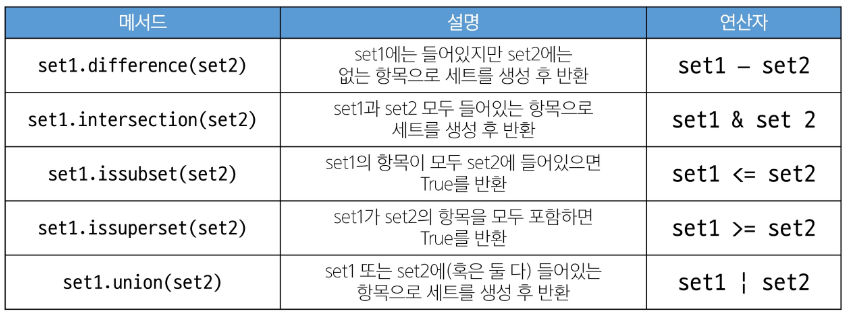

#### 1. set1.difference(set2); set1 - set2
#### 2. set1.intersection(set2); set1 & set2
#### 3. set1.issubset(set2); set1 <= set2
#### 4. set1.issuperset(set2); set1 >= set2
#### 5. set1.union(set2); set1 | set2
```python

# 집합 메서드 예시
set1 = {0, 1, 2, 3, 4}
set2 = {1, 3, 5, 7, 9}
set3 = {0, 1}

print(set1.difference(set2)) # {0, 2, 4}
print(set1.intersection(set2)) # {1, 3}
print(set1.issubset(set2)) # False
print(set3.issubset(set1)) # True
print(set1.issuperset(set2)) # False
print(set1.issuperset(set3)) # True
print(set1.union(set2)) # {0, 1, 2, 3, 4, 5, 7, 9}
## 결과가 정렬된 건 아님
```

### 참고: Hash Table

해시 테이블: 해시 함수를 사용하여 변환한 값을 색인(Index)으로 삼아,
키(Key)와 데이터(Value)를 저장하는 자료구조
데이터를 효율적으로 저장하고 검색하기 위해 사용 -> 리스트보다 딕셔너리가 검색 속도 빠름
딕셔너리에서 키로 자료를 찾을 수 있는 원리가 해시

#### 1. 해시테이블 원리
- 키를 해시 함수를 통해 해시 값으로 변환
- 해시 값을 인덱스로 테이블에 데이터를 저장하거나 검색
- 해시 함수(키와 값을 연결짓는 함수)는 파이썬이 재실행될 때마다 갱신됨
  주피터노트북은 재실행 되더라도 갱신되지 않음
  --> pop을 계속 반복하더라도 같은 값이 나오게 됨
- 해시함수를 거치면 값의 인덱스를 바로뽑을 수 있음

#### 2. 해시의 정의
- 임의의 크기를 가진 데이터(key)를 고정된 크기의 고유한 값(index)으로 변환하는 것
- 고유한 값은 주로 해당 데이터를 식별하는데 사용
  - 일종의 '지문' 역할을 하여 데이터를 고유하게 식별
- 파이썬에서는 해시 함수를 사용하여 데이터를 해시값으로 변환하며
  '정수'로 이루어짐

#### 3. 해시 함수의 정의
- 임의의 길이의 데이터를 입력받아, 고정된 길이의 데이터(해시 값)를 출력하는 함수
- 주로 해시 테이블 자료구조에 사용, 매우 빠른 데이터 검색을 위한 컴퓨터 소프트웨어에서 유용히 사용

#### 4. set의 요소 & dictionary의 키와 해시테이블의 관계
- 파이썬에서 세트의 요소와 딕셔너리의 키는 해시 테이블을 이용하여 중복되지 않은 고유한 값을 저장
- 세트 내의 각 요소는 해시 함수를 통해 해시 값으로 변환, 해시 값을 기반으로 해시 테이블에 저장
- 딕셔너리의 키는 고유해야 하므로, 키를 해시 함수를 통해 해시값으로 변환하여 해시테이블에 저장
  - 딕셔너리의 키가 빠른 탐색 속도를 제공하며 중복된 값을 허용하지 않는 이유

set print시 -> 나오는 순서는 테이블의 순서가 다름 -> 다시 실행 시 해시 함수 변경으로 인한 print 순서가 달라짐

set union 시 오름차순대로 출력이 되었던 이유
: 정수는 해시테이블에 동일하게 뿌려짐


#### 5. 파이썬에서의 해시함수
- 파이썬에서 해시 함수의 동작 방식은 객체의 타입에 따라 달라짐
- 정수와 문자열은 서로 다른 타입으로 해시 값을 계산하는 방법도 달라짐
- 같은 정수는 항상 그 정수와 같은 해시 값을 가짐(저장에 가장 효율적이기 때문)
- 문자열이 가변적이고 유니코드 코인트 포인트 등에 따라 해시값이 매번 달라짐

#### 6. set의 pop메서듸 결과와 해시테이블의 관계
- set의 pop에서 임의의 요소를 제거하고 반환
- 실행할 때마다 다른 요소를 얻는다는 의미에서 "무작위"가 아니라, "임의"라는 의미에서 무작위
  By "arbitrary" the docs don't mean "random"
- 해시테이블에 나타나는 순서

#### 7. hashable
- hash() 함수의 인자로 전달해서 결과를 반환 받을 수 있는 객체
- 대부분의 불변형 데이터 타입은 hashable
- tuple의 경우 불변형이지만 해시 불가능한 객체를 참조할때는 tuple 자체도 해시 불가
- 가변형 데이터는 값이 변경될 수 있기 때문에, 해시 값이 변경될 가능성 있음 -> 해시 테이블의 무결성 유지 불가
- 안정성과 예측 가능성 유지

```python
# 튜플에 가변형 데이터가 들어있는 경우
# TypeError: unhashable type: 'list'
print(hash((1, 2, [3, 4])))
# TypeError: unhashable type: 'list'
print(hash([1, 2, 3]))
# TypeError: unhashable type: 'list'
my_set = {[1, 2, 3], 1, 2, 3, 4, 5}
# TypeError: unhashable type: 'set'
my_dict = {{3, 2}: 'a'}
```

### 참고: 파이썬 문법 규격
- 확장 BNF(Extended Backus-Naur Form) 표기법 : 프로그래밍 언어의 문법을 표현하기 위한 표기법의 확대버전, 메타기호를 추가
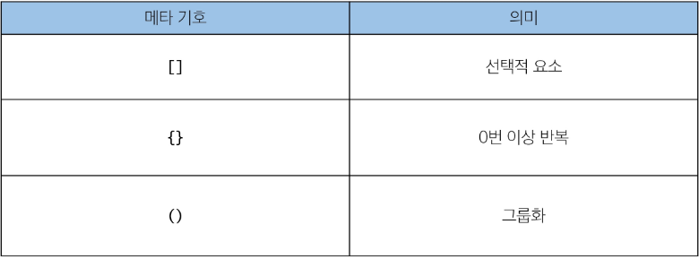
- 서로 다른 프로그래밍 언어, 데이터 형식, 프로토콜 등의 문법을 통일하여 정의

---

- 예시

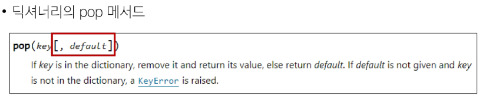


# OOP (Object Oriented Programing)

## OOP의 배경

### Procedural Programming(절차 지향 프로그래밍)
- 프로그램을 '데이터'와 '절차'로 구성하는 방식의 프로그래밍 패러다임
- '데이터'와 데이터를 처리하는 '함수'로 분리되어 있음
- 함수 호출의 흐름이 중요
- 코드의 순차적인 흐름과 함수 호출에 의해 프로그램 진행
- 실제로 실행되는 내용이 중요
- 데이터를 재사용하기 보다는 처음부터 끝까지 실행되는 결과물이 중요한 방식

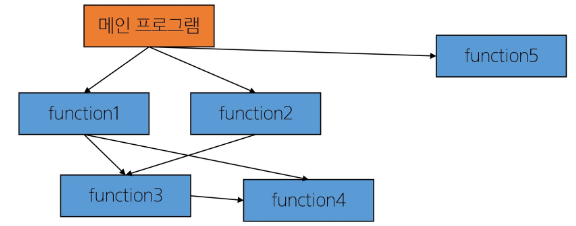

### 소프트웨어 위기(Software Crisis)
- 하드웨어의 발전으로 컴퓨터 복잡성이 증가에 따라 소프트웨어에 발생한 충격

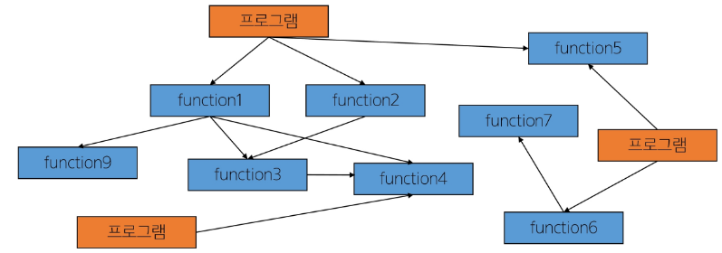


***객체 지향 프로그래밍(Object Oriented Programming)***
- 데이터와 데이터를 조작하는 메서드(메시지)를 하나의 객체(클래스)로 묶어 관리하는 방식의 프로그래밍 패러다임
- 객체 간 상호작용과 메시지 전달이 중요


## Class

- 클래스 : 파이썬에서 타입을 표현하는 방법
          객체를 생성하기 위한 설계도, 데이터와 기능을 함께 묶는 방법 제공
예 : str이라는 클래스에 => 문자열의 데이터('a','b' 등)와 그를 활용하는 메서드(capitalized 등)를 포함
- 객체(Object) : 클래스에서 정의한 것을 토대로 메모리에 할당된 것
                 '속성(변수)'과 '행동(메서드)'으로 구성된 모든 것

### Instance
- 인스턴스 : 클래스의 속성과 행동을 기반으로 생성된 개별 객체
            sub class 라고 생각할 수도 있음
            객체라고 봐도 무방, 표현시 ~클래스의 인스턴스
            예 : 아이유는 가수의 인스턴스다.

#### 클래스와 객체의 비교
```python
name = 'Alice"

print(type(name)) # <class 'str'>
```
- 변수 name의 타입은 str 클래스
  -> 변수 name은 str클래스의 인스턴스다.
  => 우리가 사용했던 데이터 타입은 모두 클래스.

- 결국 문자열 타입의 변수는 str 클래스로 만든 인스턴스

```python
print(help(str))

'''
class str(object)
 |  str(object='') -> str
 |  str(bytes_or_buffer[, encoding[, errors]]) -> str
 |
 |  Create a new string object from the given object. If encoding or
 |  errors is specified, then the object must expose a data buffer
-- More  --
'''
```

#### 인스턴스와 메서드

**"데이터 타입(클래스)의 객체(인스턴스)"**
**하나의 객체는 특정 타입의 인스턴스다.**

#### 객체 정리

- type: 어떤 연산자(operator)와 조작(method)이 가능한가?
- attribute(속성): 어떤 상태(데이터)를 가지는가?
- method(조작법): 어떤 행위(함수)를 가지는가?

***Object = Attribute + method***

### 클래스 개념

- class : 파이썬에서 타입을 표현하는 방법
- 객체를 생성하기 위한 설계로도서, 데이터와 기능을 함께 묶는 방법 제공
- 클래스 이름은 파스칼 케이스(Pascal Case) 방식으로 작성
  *함수는 Snake Case(snake_case)로 작성

```python
# 클래스 정의
class Person:
    blood_color = 'red'  # attribute, 클래스 변수(속성)

    def __init__(self, name):  # method
        self.name = name
    # init : initialization; 초기화이자 시작/생성
    # 인스턴스가 생성될 때 자동 생성

    def singing(self):  # 인스턴스 method
        return f'{self.name}가 노래합니다.'


# 실제로 행동하는 건 class가 아닌 인스턴스(클래스는 blueprint!)

# 인스턴스 생성
singer1 = Person('iu')
# 생성될 때부터 person으로 클래스 정의

# (인스턴스) 메서드 호출
print(singer1.singing()) # iu가 노래합니다.


# 속성(변수) 접근
print(singer1.blood_color) # red


# 인스턴스 변수
print(singer1.name) # iu
```

### 클래스 구성요소

#### 1. 생성자 메서드
- 객체를 생성할 때 "자동으로 호출되는" 메서드
- __init__이라는 이름의 메서드로 정의, 객체의 초기화 담당
- 인스턴스를 생성하고 필요한 초기값을 설정
#### 2. 인스턴스 변수
- 인스턴스(객체)마다 별도로 유지되는 변수
- 인스턴스마다 독립적인 값을 가지며, 인스턴스가 생성될 때마다 초기화됨

#### 3. 클래스 변수
- 클래스 내부에 선언된 변수
- 클래스로 생성된 모든 인스턴스들이 공유하는 변수

#### 4. 인스턴스
- 각각의 인스턴스에서 호출할 수 있는 메서드
- 인스턴스 변수에 접근하고 수정하는 작업 수행

### 클래스 변수와 인스턴스 변수

* 예 : 클래스 변수를 활용한 인원수 확인
```python
class Person:
    # 클래스 변수 count
    count = 0

    def __init__(self, name):
        # 인스턴스 변수 name
        self.name = name
        Person.count += 1

person1 = Person('iu')
person2 = Person('BTS')

print(Person.count)  # 2
```

* 예: 클래스 변수와 인스턴스 변수
```python
class Circle:
    pi = 3.14

    def __init__(self, r):
        self.r = r

c1 = Circle(5)
c2 = Circle(10)

print(c1.r) # 5
print(c2.r) # 10

# c1.pi -> c1에서 pi변수가 있는지 확인
# -> 찾으러 클래스로 들어감 -> 클래스 변수 출력

print(Circle.pi) # 3.14
print(c1.pi) # 3.14
print(c2.pi) # 3.14

c2.pi = 5 # 인스턴스 변수 생성
print(Circle.pi) # 3.14
print(c1.pi) # 3.14
print(c2.pi) # 5

Circle.pi = 5 # 클래스 변수 변경
print(Circle.pi) # 5
print(c1.pi) # 5
print(c2.pi) # 5
```

## 메서드

### 1. instance method
#### 정의
- 클래스로부터 생성된 각 인스턴스에서 호출할 수 있는 메서드
- 인스턴스의 상태를 조작하거나 동작을 수행

#### 구조
- 첫 번째 매개변수(위치인자)로 인스턴스 자신(self)을 전달받음
```python
class MyClass:

    def instance_method(self,arg1,...):
        pass

# self는 매개변수의 이름이며 다른 이름으로 설정 가능하나,
# self로 인스턴스 메서드임을 알 수 있기 때문에 바꾸지 말 것
```

#### self의 동작원리
```python
# python에서 upper 사용
'hello'.upper() # --> 데이터 중심(객체 지향)
# upper method의 동작 원리
str.upper('hello') # --> 함수 중심(절차 지향)

#즉 앞에 있는 데이터(변수)가 self가 됨
```
- str 클래스가 upper 메서드를 호출했고, 그 첫 번째 인자로 문자열 인스턴스가 들어감.
- 인스턴스 메서드의 첫 매개변수가 반드시 자기자신이 됨
- 객체 지향 방식의 메서드 표현은 단축형 호출이라고도 함
- 문자열 객체가 어딘가의 함수로 들어가는 것이 아닌, **객체 스스로 메서드를 호출**하여 코드 동작하는 표현

### 2. constructor method (생성자 메서드)
- 인스턴스 객체가 생성될 때 자동으로 호출되는 메서드
- 인스턴스 변수들의 초기값 설정

* 인스턴스 메서드, 생성자 메서드 예시
```python
class Person:
    
    def __init__(self, name):
        self.name = name
        # 왼쪽 name = instance 변수
        # 오른쪽 name : 생성자 메서드의 매개변수 이름
        print('인스턴스가 생성되었습니다.')

    def greeting(self): # 인자가 필요하면 self를 먼저 쓰고 씀
        print(f'안녕하세요. {self.name}입니다.')
        # 그냥 name으로 하면 존재하지 않는다고 뜸.

person1 = Person('지민') # 인스턴스가 생성되었습니다.
person1.greeting() # 안녕하세요. 지민입니다.
```

### 3. 클래스 메서드
- 클래스가 호출하는 메서드
- 클래스 변수를 조작하거나 클래스 레벨의 동작을 수행

#### 클래스 메서드 구조
- @classmethod 데코레이터를 사용하여 정의
  *데코레이터 : 함수의 기능을 추가하는 함수
- 호출 시, 첫 번째 인자로 해당 메서드를 호출하는 클래스(cls)가 전달됨

```python
class MyClass:

    @classmethod
    def class_method(cls, arg1, ...):
        pass
# cls는 매개변수의 이름이며 다른 이름으로 설정 가능하나,
# cls로 클래스 메서드임을 알 수 있기 때문에 바꾸지 말 것
```

### 4. Static method(정적 메서드)
- 클래스, 인스턴스와 상관없이 독립적으로 동작하는 메서드
- 주로 클래스와 관련 있지만 인스턴스와는 상호작용 불필요


#### 정적 메서드 구조
- @staticmethod 데코레이터 사용하여 정의
- 호출시 필수적으로 작성해야 할 매개변수가 없음
- 객체 상태나 클래스상태를 수정할 수 없으며, 기능만을 위한 메서드

```python
class StringUtils:

    def __init__(self):
        pass

    @staticmethod
    def reverse_string(string):
        return string[::-1]
    
    @staticmethod
    def capitalize_string(string):
        return string.capitalize()
    
text = 'hello, world'

result1 = StringUtils.reverse_string(text)
result2 = StringUtils.capitalize_string(text)
 
print(result1) # dlrow ,olleh
print(result2) # Hello, world
```


### 메서드 정리

* 인스턴스 메서드
- 인스턴스의 상태를 변경하거나, 해당 인스턴스의 특정 동작 수행

* 클래스 메서드
- 인스턴스 상태에 의존하지 않는 기능 정의
- 클래스 변수를 조작하거나 클래스 레벨의 동작 수행

* 스태틱 메서드
- 클래스 및 인스턴스와 관련이 없는 일반적인 기능 수행

==> 세 가지를 분별하는 건 "데코레이터"

* 클래스가 사용해야 하는 것
  - 클래스 메서드
  - 스태틱 메서드

* 인스턴스가 사용해야 하는 것
  - 인스턴스 메서드

***클래스와 인스턴스는 모든 메서드를 호출 할 수 있으나 구별하여 사용**
- 각자의 메서드는 명확한 목적에 따라 설계됨
- 클래스와 인스턴스 각각 올바른 메서드만 사용하기
- 캡슐화 한다면 각각을 사용하게 강제성 부여 가능하긴 함

## 참고 : 인스턴스와 클래스 간 이름 공간
- 클래스를 정의하면, 클래스와 해당하는 이름 공간 생성
- 인스턴스를 만들면, 인스턴스 객체가 생성, 독립적인 이름공간 생성
- 인스턴스에서 특정 속성에 접근하면, 인스턴스 -> 클래스 순으로 탐색

```python
class Person:
    name = 'unknown'

    def talk(self):
        print(self.name)

p1 = Person()
p1.talk()  # unknown

# p2 인스턴스 변수 설정 전/후
p2 = Person()
p2.talk()  # unknown
p2.name = 'Kim'
p2.talk()  # Kim

print(Person.name)  # unknown
print(p1.name)  # unknown
print(p2.name)  # Kim
```

- 독립적인 메모리 공간 -> 서로의 연관성이 없도록 만들어 충돌 방지 -> 독립적 동작 보장
- 코드의 가독성, 유지보수성, 재사용성을 높이는데 도움을 줌

## 참고 : 매직메서드
- 인스턴스 메서드
- 특정상황에 자동으로 호출
- Double underscore(__) 사용하여 표현
- 스페셜 메서드라고도 부름
- 예시
  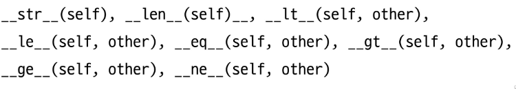

```python
class Circle:
    def __init__(self, r):
        self.r = r

    def __str__(self):
        return f'원의 반지름: {self.r}'
    ### 내장함수 print에 의해 호출되어 객체 출력을 문자열 표현으로


c1 = Circle(10)
c2 = Circle(1)

print(c1)  # 원의 반지름: 10
print(c2)  # 원의 반지름: 1
```

## 참고 : 데코레이터
- 다른 함수의 코드를 유지한 채로 수정하거나 확장하기 위해 사용되는 함수
```python
# 데코레이터 정의
def my_decorator(func):
    def wrapper():
        # 함수 실행 전에 수행할 작업
        print('함수 실행 전')
        # 원본 함수 호출
        result = func()
        # 함수 실행 후에 수행할 작업
        print('함수 실행 후')
        return result
    return wrapper


# 데코레이터 사용
@my_decorator
def my_function():
    print('원본 함수 실행')
my_function()

"""
함수 실행 전
원본 함수 실행
함수 실행 후
"""
```