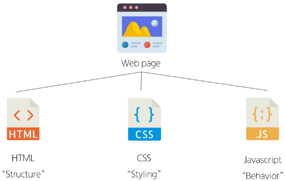
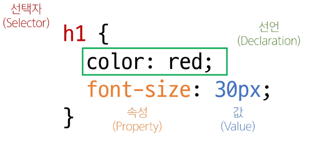
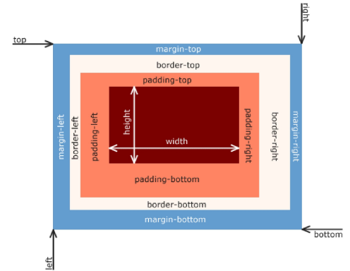
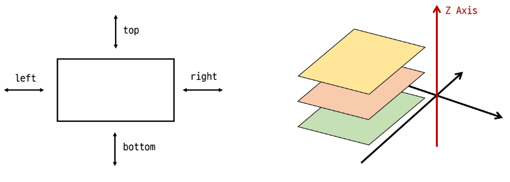
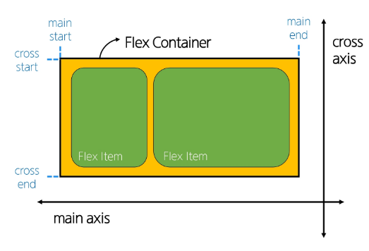
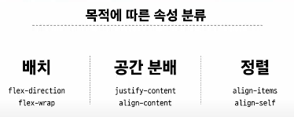
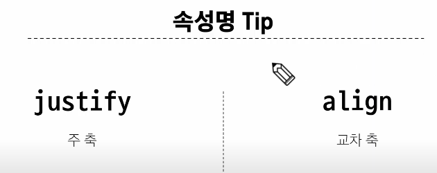
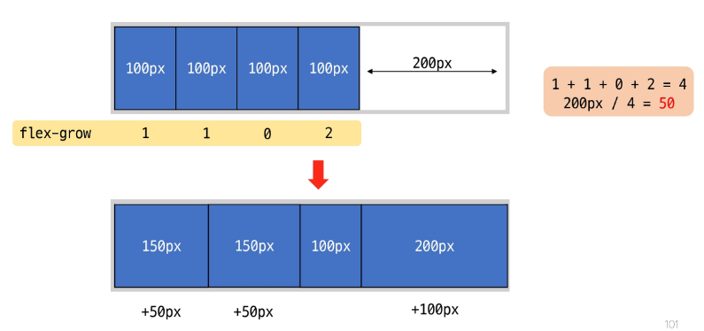

# WEB
- WWW(World Wide Web): 인터넷으로 연결된 컴퓨터들이 정보를 공유하는 거대한 정보공간
- Web 기술: Web site, Web application을 통해 사용자들이 정보를 검색하고 상호작용하는 기술
- Web site: 여러 개의 Web page가 모인 것으로, 사용자들에게 정보나 서비스를 제공하는 공간
- Web page: HTML, CSS 등의 웹 기술을 이용하여 만들어진 Web Site를 구성하는 하나의 요소



# 웹 구조화(HTML)

- HTML(HyperText Markup Language): 웹페이지의 "의미"와 "구조"를 정의하는 단어
- HyperText: 웹 페이지를 다른 페이지로 연결하는 링크, 참조를 통해 다른 문서로 즉시 접근
  - Hypertext의 특징: 비선형성, 상호연결성, 사용자 주도 탐색
- Markup Language: 태그 등을 이용하여 "문서나 데이터"의 "구조"를 명시하는 언어
  - 예: HTML, Markdown

## HTML의 구조

***"! + tab" 하면 기본 뼈대를 작성해줌***

1) !DOCTYPE html: 해당 문서가 html임을 나타냄

2) html /html: 전체 페이지의 콘텐츠 포함 --> 웹 페이지를 구성하는 모든 내용

3) title /title: 브라우저 탭 및 즐겨찾기 시 표시되는 제목

4) head /head
   - HTML 문서에 관련된 설명, 설정 등 컴퓨터가 식별하는 메타데이터
   - ***사용자에게 보이지 않음***

5) body /body

    - HTML 문서의 내용을 나타냄
    - 페이지에 표시되는 모든 콘텐츠 작성
    - 한 문서에 ***하나의 body 요소***만 존재

### HTML Element
- 하나의 요소는 여는 태그와 닫는 태그, 그 안의 내용으로 구성됨
- 닫는 태그는 태그 이름 앞에 슬래시가 포함됨 -> meta와 같이 닫는 태그가 없는 경우도 존재

### HTML Attribute
- 사용자가 원하는 기준에 맞도록 요소를 설정하고나 다양한 방식으로 요소의 동작을 조절하기 위한 값
- 목적
  - 나타내고 싶지 않지만 추가적인 기능과 내용 담고 싶을 때 사용
  - CSS에서 스타일 적용을 위해 해당 요소를 선택하기 위한 값으로 활용
- ""를 사용
- href --> a(anchor)의 필수 속성
- img --> 닫는 태그는 없음(텍스트가 필요 없기 때문), src(source) 필수 요구 / alt -> 시각장애인의 스크린 리더 사용할 때


### HTML Structure
- h1~6: 단순히 텍스트 크기만 큰 것이 아닌, 문서의 최상위 제목이라는 의미 부여 ==> 의미가 문법적인 기능을 가지진 않음 but 암묵적인 rule을 정할 수 있음
- p
- list: ol(순서가 있는 부모태그), ul(순서가 없는 부모태그), li(내부 리스트)
- Emphasis & Importance: em, strong


# 웹 스타일링(CSS)
- CSS(Cascading Style Sheet): 웹페이의 디자인과 레이아웃을 구성하는 언어 


- CSS Layout: 각 요소의 "위치"와 "크기"를 조정하여 웹 페이지의 디자인을 결정

## CSS 적용방법
1. Inline 스타일: HTML 요소 안에 style 속성 값으로 작성
2. Internal 스타일: head 태그 안에 style 태그에 작성
3. External 스타일: 별도 CSS 파일 생성 후 HTML link 태그 사용

## CSS Selectors
- HTML 요소를 선택하여 스타일을 적용할 수 있도록 하는 선택자

### 선택자의 종류
1) 기본 선택자
   - 전체(*) 선택자: HTML 모든 요소 선택
   - 요소(tag) 선택자: 지정한 모든 태그 선택
   - 클래스(class) 선택자: '.' 사용, 클래스 속성을 가진 모든 요소 선택
   - 아이디(id) 선택자: '#', 주어진 아이디 속성을 가진 요소, 문서에는 주어진 아이디를 가진 요소가 하나만 있어야 함
   - 속성(attr) 선택자 등

2) 결합자(Combinators)
   - 자손 결함자(" "(space))
      - 첫 번째 요소의 자손 요소들 선택
      - 예: p span 은 p 안에 있는 모든 span 선택
   - 자식 결합자(">")
      - 첫 번째 요소의 직계 자식만 선택
      - 예: ul > li은 ul안에 있는 li를 모두 선택
  

### 명시도
- 결과적으로 요소에 적용할 CSS 선언을 결정하기 위한 알고리즘
- CSS Selector에 내재되어 있는 가중치에 맞게 계산하여 결정
  - 동일한 요소를 가리키는 2개 이상의 규칙이 있는 경우 -> 가장 높은 명시도를 가진 Selector가 승리
- 명시도의 순서
  Importance(!important) - Inline style - 선택자(id - class - 요소) - 소스 코드 선언 순서

### Cascade(계단식)
- 한 요소에 동일한 가중치를 가진 선택자가 적용될 때, CSS에서 마지막에 나오는 선언이 사용


### CSS 속성 2가지 분류
- 상속되는 속성: Text 관련
- 상속되지 않는 속성: 배치 관련

**상속하지 않을 때 -> .outerbox > :not(.inner_box)**와 같이 작성

#### 0819 강사님 팁

"""
nav>ul>li*5>a

style nav {background-color: gray; padding: 10px 0}

padding은 요소 안의 여백
margin은 요소 밖의 여백
"""


## CSS Box Model
- HTML 요소를 감싸는 사각형 상자 모델
- content, padding, border, margin으로 구성

### 박스 배치 타입
* 좌측 상단부터 시작 -> 오른쪽 또는 아래로 진행
- Block box: 외부 / 아래로 표기, 새로운 태그를 만들 때 새 줄에서 시작
    - div, p, h1, h2
- Inline box: 내부 / 오른쪽으로 표기, 태그의 줄이 바뀌지 않음
    - span, a, strong

### 박스 표시 타입
#### Outer display type
- 박스의 외부를 처리
- 박스가 문서 흐름에서 어떻게 동작할지를 결정

1) block
```html
.index{
  display: block;
}
```
- 항상 새로운 행으로 나뉨
- width와 height 속성 사용 가능
- padding, margin, border로 인해 다른 요소를 상자로부터 밀어냄
- widht 속성을 지정하지 않으면 박스는 inline 방향으로 사용 가능한 공간 모두 차지(상위 컨테이너 너비 100%)
- 대표적인 block 타입 태그: h1~6, p, div


2) Inline

```html
.index{
  display: block;
}
```
- 새로운 행으로 넘어가지 않음
- width와 height 속성 x
- 수직방향: padding, margin, border가 적용되지만 다른 요소 밀어내지 못함
- 수평방향: padding, margin, border가 적용되어 다른 요소 밀어냄
- 대표적인 inline 태그: a, img, span, strong, em

#### Inner display type: 박스의 내부를 처리
- 박스 내부의 요소들이 어떻게 배치될지를 결정
- 속성: flex

#### 기타 display 속성
1) inline-block
  - inline과 block 요소 사이의 중간 지점을 제공하는 display 값
  - width와 height 속성
  - padding, margin 및 border로 인해 다른 요소가 상자에서 밀림
  - 새로운 행으로 넘어가지 않음
  ==> 요소가 줄바꿈 되는 것을 원하지 않으면서 너비와 높이를 적용하고 싶은 경우에 사용
2) none

### 박스 구성 요소

- Content: 콘텐츠가 표시되는 영역
- Padding: 콘텐츠 주위에 위치하는 공백
- Border: 콘텐츠와 패딩을 감싸는 테두리
- Margin: 이 박스와 다른 요소 사이의 공백, 가장 바깥쪽 영역

### shorthand 속성
- 속성을 한 버번에 설정하기 위함

1) border: 굵기, 종류, 색을 순서에 상관없이 작성
```html
border: 2px solid black;
```
2) margin & padding: 4방향의 속성을 각각 지정하지 않고 한 번에 지정
```html
<!-- 4개 - 상/우/하/좌 -->
<!-- 3개 - 상/좌우/하-->
<!-- 3개 - 상/좌우/하-->
<!-- 3개 - 상/좌우/하-->

```

### box-sizing 속성
CSS 기본은 content박스를 중심으로 사이즈를 정함 -> 실제 박스 크기와는 차이가 생김 --> 박스 사이즈를 border를 기준으로 설정하기 위한 것이 box-sizing


## CSS Position

- CSS Position: 요소를 Normal Flow에서 제거하여 다른 위치로 배치하는 것

### Position 이동 방향


### Position 유형
1) Static
  - 요소를 Normal Flow에 따라 배치
  - top, right, bottom, left 속성이 적용되지 않음
  - 기본 값
2) Relative
  - 요소를 **Normal Flow에 따라 배치**
  - 자신의 원래 위치(static)를 기준으로 이동
  - top, right, bottom, left 속성이 적용
  - 다른 요소의 레이아웃에 영향 주지 않음
3) Absolute
  - Normal Flow 에서 요소를 **제거**
  - 가장 가까운 ***relative 부모 요소***를 기준으로 이동
    - 만족하는 부모 요소가 없다면 body 태그 기준
  - top, right, bottom, left 속성이 적용
  - 문서에서 요소가 차지하는 공간이 없어짐
4) Fixed
  - 요소를 Normal Flow에서 제거
  - 현재 화면영역(Viewport)을 기준으로 이동
  - 스크롤해도 항상 같은 위치에 유지
  - top, right, bottom, left 속성이 적용
  - 문서에서 요소가 차지하는 공간이 없어짐
5) Sticky
  - relative와 fixed의 특성을 결합한 속성
  - 스크롤 위치가 임계점에 도달하기 전에는 relative처럼 동작
  - 특정 임계점에 도달하면 fixed처럼 동작하여 고정
  - 만약 다음 sticky 요소가 나오면 다음 sticky 요소가 이전 sticky 요소를 대체

### z-index
  - 요소의 쌓임 순서(stack order)를 정의하는 속성
  - 정수 값을 사용해 z축 순서를 지정
  - 값이 클수록 요소가 위에 쌓이게 됨
  - static이 아닌 요소에만 적용

#### z-index의 특징
  - 기본값 auto
  - 부모 요소의 z-index값에 영향을 받음
  - 같은 부모 내에서만 z-index 값을 비교
  - 부모보다 위로 올라갈 수 없음
  - 값이 같으면 HTML 문서 순서대로 쌓임

## CSS Flexbox
- CSS Flexbox: 요소를 행과 열 형태로 배치하는 1차원 레이아웃 방식
  ==> 공간 배열 및 정렬을 진행함

### Flexbox 구성 요소


  1) main axis(주 축)
   - flex item 들이 배치되는 기본 축
   - main start에서 시작해서 main end방향으로 배치
  2) cross axis(교차 축)
   - main axis에 수직인 축
  3) flex container
   - display: flex; 혹은 display: inline-flex;가 설정
   - 1차 자식 요소들이 Flex item이 됨
   - flex 속성 값들을 사용하여 자식 요소 Flex Item 들을 배치하는 주체 ==> item 값을 수정하는 게 X
  4) flex item: Flex Container 내부에 레이아웃되는 항목

### Flexbox 속성 목록

#### 1. Flex Container 관련 속성

#### 2. Flex Item 관련 속성





flex grow -> 남은 여백 값을 주어진 값에 따라 나누어 분배


flex-basis가 width보다 우월